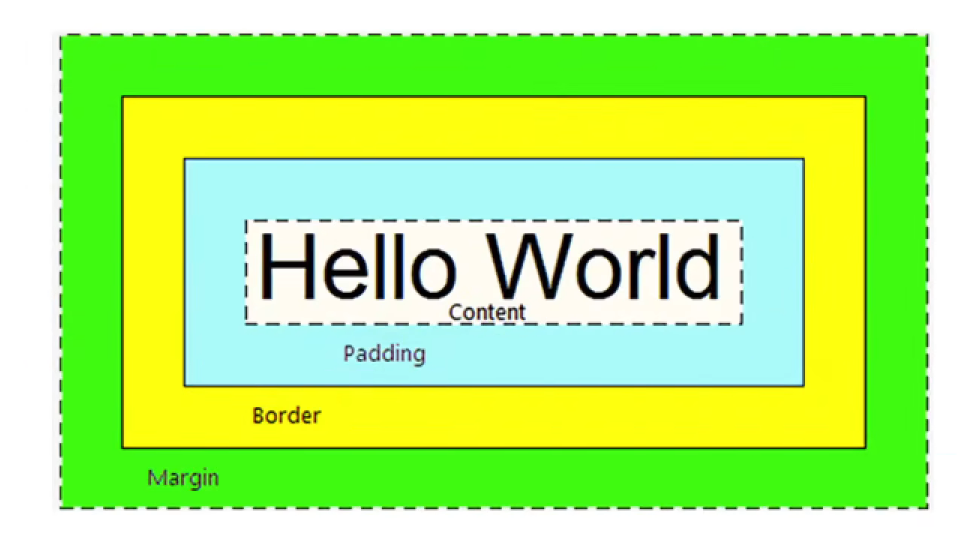
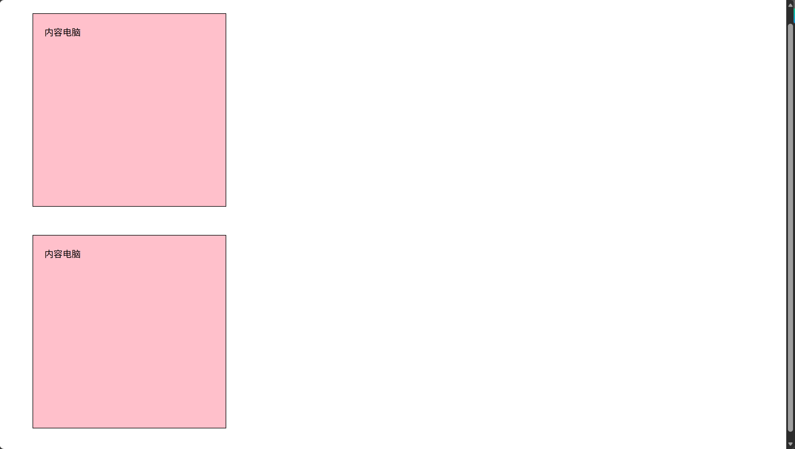
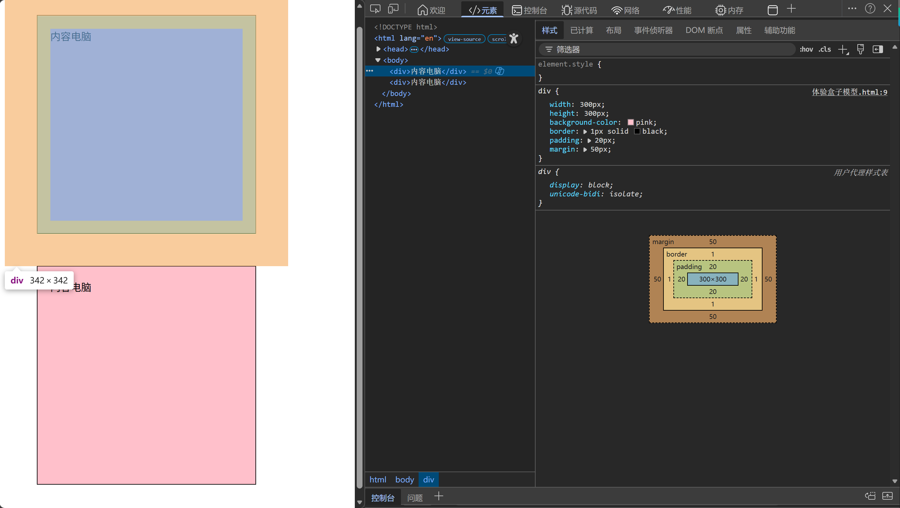
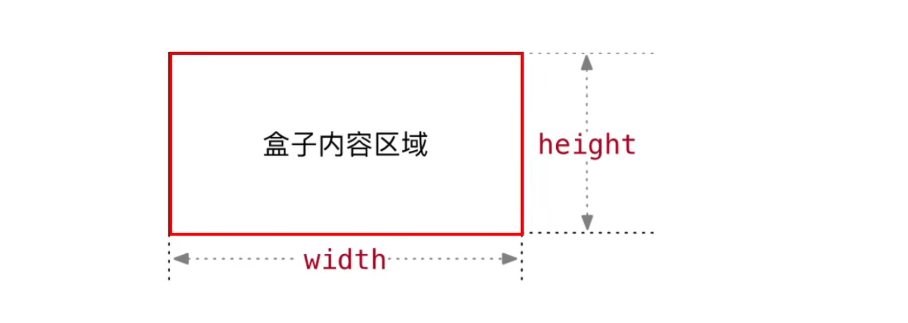
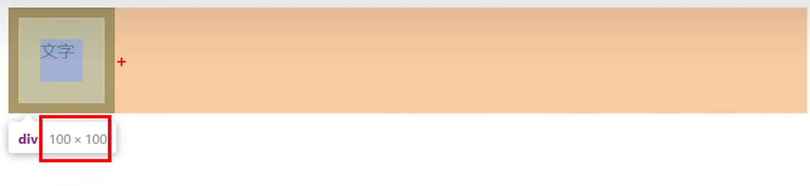
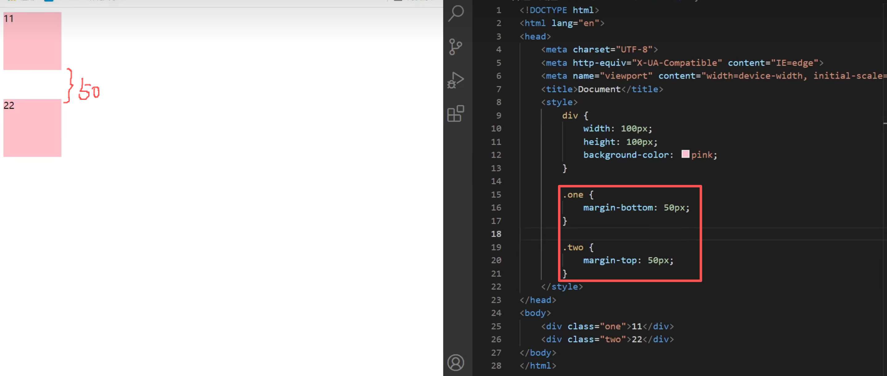
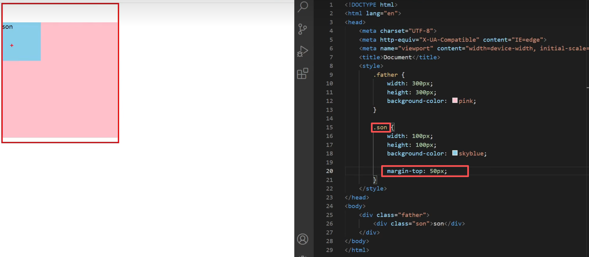

## pxcook软件的使用
### 设计模式
1. 拖进来的图片格式是.png之类的
2. 点尺子量尺寸
3. 点吸管吸取颜色
### 开发模式
1. 拖进来的图片是.psd格式
2. 直接点图标会显示尺寸、颜色、间距等等
3. 甚至还会给出css代码

## 盒子模型
### 盒子模型的介绍
1. 盒子的概念
（1）页面中的每一个标签，都可看做是一个“盒子”，通过盒子的视角更方便的进行布局
（2）浏览器在渲染(显示)网页时，会将网页中的元素看做是一个个的矩形区域，我们也形象的称之为**盒子**
2. 盒子模型
CSS 中规定每个盒子分别由:
（1）内容区域(content)、
（2）内边距区域(padding)、
（3）边框区域(border)、
（4）外边距区域(margin)构成，
这就是**盒子模型**

3. 示例代码：
```html
<!DOCTYPE html>
<html lang="en">
<head>
    <meta charset="UTF-8">
    <meta name="viewport" content="width=device-width, initial-scale=1.0">
    <title>Document</title>
    <style>
        div
            {
                width: 300px;
                height: 300px;
                background-color: pink;
                /* 边框线 == 纸箱子 */
                border: 1px solid black;
                /* 内边距 == 填充泡沫，出现在内容和盒子边缘之间 */
                padding: 20px;
                /* 外边距 == 纸箱子之间的距离 */
                margin: 50px;
            }
    </style>
</head>
<body>
    <div>内容电脑</div>
    <div>内容电脑</div>
</body>
</html>
```
4. 效果：


### 浏览器检查效果

蓝色：内容；
绿色：内边距；
橙色：外边距

### 内容的宽度和高度
1. 作用:利用 width 和 height 属性默认设置是盒子**内容区域**的大小
2. 属性:width/height
3. 常见取值:数字+px

4. 代码示例：
```html
<style>
    div {
        width: 200px;
        height: 200px;
        background-color: pink;
    }
</style>
```

### 边框(border)
#### border连写形式
1. 属性名:border
2. 属性值:单个取值的连写，取值之间以空格隔开
如:border :10px solid red;
- 10px: 边框线大小
- solid：实线
- red: 颜色
3. 快捷键:bd +tab
4. 代码示例：
```html
<style>
    div {
        /* 不分先后顺序 */
        /* 实线 */
        border: 5px solid red;
        /* 虚线 */
        border: 5px dashed black;
        /* 点线 */
        border: 5px dotted #000;
    }
</style>
```

#### border单方向设置
1. 场景:只给盒子的某个方向单独设置边框
2. 属性名:border-方位名词
3. 属性值:连写的取值
4. 代码示例：
```html
<style>
    div {
        border-left: 5px solid red;
        border-right: 5px solid red;
        border-top: 5px solid red;
        border-bottom: 5px solid red;
    }
</style>
```

#### border单个属性(拓展，少用)
1. 作用:给设置边框粗细、边框样式、边框颜色效果
2. 单个属性:
|作用|属性名|属性值|
|---|---|---|
|边框粗细|border-width|数字+px|
|边框样式|border-style|实线 solid、虚线 dashed 、点线 dotted|
|边框颜色|border-color|颜色取值|


### 内边距padding
```html
<style>
    di{
    /* 添加了4个方向的内边距啊 */
    padding: 50px;
    /* 复合属性，最多取4个值：上，右，下，左 (从上开始，顺时针转一圈，没有的看对面)*/
    padding: 10px 20px 40px 80px;
    /* 三值：上 左右 下 */
    padding: 10px 40px 80px;
    /* 两值: 上下 左右*/
    padding: 10px 80px;
    }
</style>
```

### 尺寸计算
#### 盒子会被撑大
1. **border**会上下左右撑大盒子的尺寸
2. 比如：
（1）原来内容宽高是：400px 400px
（2）加了border: 10px
（3）尺寸就变成了：420px 420px
3. 同理，**padding**也会撑大盒子的尺寸

#### CSS3盒模型(自动内减)
1. 需求:盒子尺寸300*300，背景粉色，边框10px实线黑色，上下左右20px的内边距，如何完成?
- 给盒子设置border或padding时，盒子会被撑大，如果不想盒子被撑大?
（1）解决方法1:手动内减
- 操作:自己计算多余大小，手动在内容中减去
- 缺点:项目中计算量太大，很麻烦
（2）解决方法2:自动内减
- 操作:给盒子设置属性**box-sizing:border-box**;即可
- 优点:浏览器会自动计算多余大小，自动在内容中减去
- 代码：
```html
<style>
    div {
        width: 100px;
        height: 100px;
        border: 10px solid black;
        padding: 10px;

        box-sizing: border-box;
    }
</style>
```
- 效果



### 外边距margin
```html
<style>
    div {
        width: 100px;
        height: 100px;
        border: 10px solid black;
        padding: 10px;
        /* margin和padding的写法一模一样 */
        margin: 50px;
        margin-left: 100px;
        margin: 10px 50px;
    }
</style>
```

### 清除默认内外边距
1. 场景:浏览器会默认给部分标签设置默认的margin和padding，但一般在项目开始前需要先清除这些标签默认的margin和padding,后续自己设置
- 比如:body标签默认有margin:8px
- 比如:p标签默认有上下的margin
- 比如:ul标签默认由上下的margin和padding-left
2. 解决方法:
（1）淘宝网代码(并集选择器)：
```html
<style>
    blockquote, body, button, dd, dl, dt, fieldset, form, h1, h2, h3, h4, h5, h6, hr, input, legend, li, ol, p, pre, td, textarea, th, ul {
        margin: 0;
        padding: 0;
    }
</style>
```
（2）京东代码（全选）：
```html
<style>
    * {
        margin: 0;
        padding: 0;
    }
</style>
```

### 版心居中
1. 版心指的是网页的有效内容
2. 版心在网页中一般都是水平居中
3. 代码：
```html
<style>
    div {
        /* 上下是0，左右是auto计算，保证水平居中 */
        margin: 0 auto;  
    }
</style>
```


### 外边距折叠现象
#### 合并现象
1. 场景: **垂直布局**的块级元素，上下的margin会合并
2. 结果: 最终两者距离为margin的最大值
3. 解决方法:避免就好，只给其中一个盒子设置margin即可.


### 塌陷现象
1. 场景:互相嵌套的块级元素，子元素的margin-top会作用在父元素上
2. 结果:导致父元素一起往下移动

3. 解决方法:
(1)给父元素设置border-top或者padding-top(分隔父子元素的margin-top)
```html
<style>
    .father {
        /* 但会增加边框线 */
        border: 1px solid #000; 
        /* 或者 */
        padding-top: 50px;
    }
    .son {
        margin-top: 50px;
    }
</style>
```
(2)最完美的解法：**给父元素设置overflow:hidden**
```html
<style>
    .father {
        overflow: hidden;
    }
    .son {
        margin-top: 50px;
    }
</style>
```
(3)转换成行内块元素
```html
<style>
    .son {
        margin-top: 50px;
        display: inline-block;
    }
</style>
```
(4)设置浮动


### 行内元素的内外边距问题
1. 通过margin或padding改变行内标签的位置，垂直方向无法生效
- 行内标签的margin-top和margin-botton不生效
- 行内标签的padding-top和padding-bottom不生效
2. 解决方法：设置**行高**
```html
<style>
    span {
        line-height: 100px;
    }
</style>
```