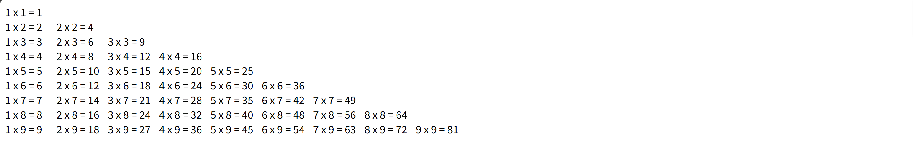
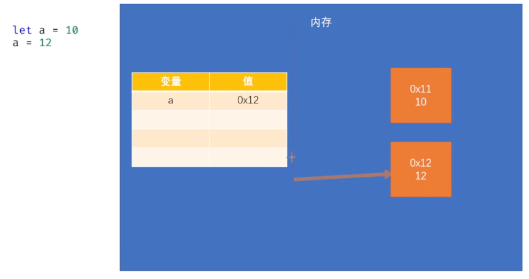
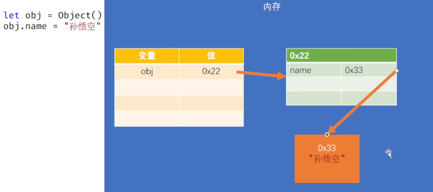
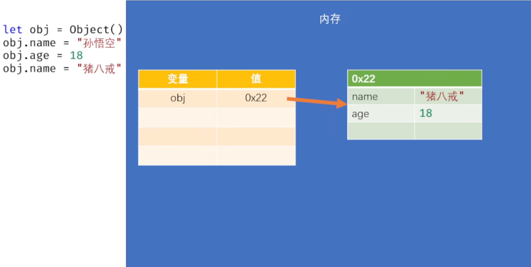
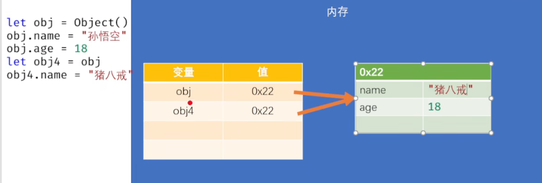
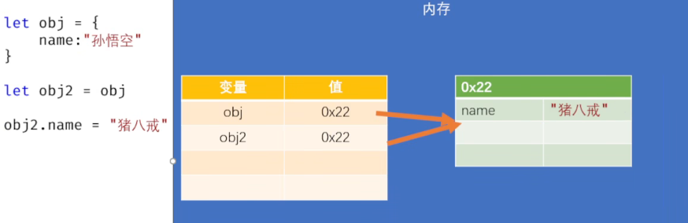
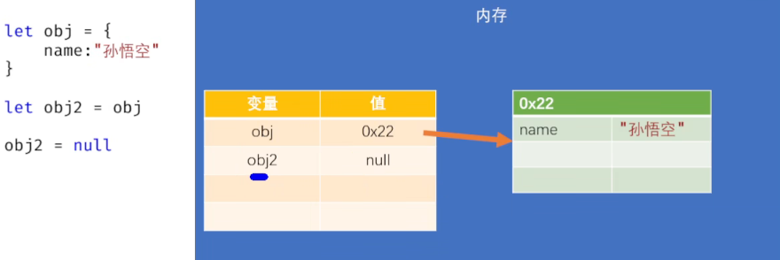
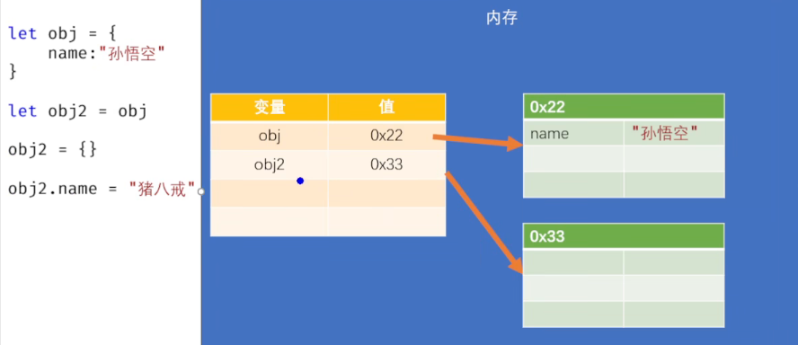

## 流程控制
流程控制语句可以用来改变程序执行的顺序
1. 条件判断语句
2. 条件分支语句
3. 循环语句
### 代码块
1. 使用{}来创建代码块，代码块可以用来对代码进行分组。一个代码块中的代码，要么都执行，要么都不执行
2. let 和 var
（1）let声明的变量具有作用域，块内声明的变量没办法在块外访问
（2）使用var声明的变量不具有作用域

### 条件分支
#### if 语句
1. if(条件表达式)
        语句
2. （）为true才执行
3. 多行代码语句要用{}
4. （）里不是布尔值会先转换为布尔值

#### if-else 语句
prompt()可以用来获取用户输入的内容
```html
<script>
    let age = +prompt("请输入一个整数:")
    if(age>=100){
        alert('长寿')
    }else if(age>=80){
        alert('80')
    }else if(age>=60){
        alert('退休')
    }else if(age>=18){
        alert('成年')
    }else {
        alert('未成年')
    }
</script>
```

#### 练习
1. 练习1:获取一个用户输入的整数，然后通过程序显示这个数是奇数还是偶数
```html
<!DOCTYPE html>
<html lang="en">
<head>
    <meta charset="UTF-8">
    <meta name="viewport" content="width=device-width, initial-scale=1.0">
    <title>Document</title>
    <script>
        // 获取一个用户输入的整数，然后通过程序显示这个数是奇数还是偶数

        let num = + prompt("请输入一个整数：");// 也可以通过parseInt()来转换为整数，或者Number()来转换为数值
        if(num % 2 === 0){
            alert(num + "是偶数");
        } else if (num % 2 === 1 ){
            alert(num + "是奇数");
        } else {
            alert("请输入一个整数"); //输入的不是数值，比如NaN，也可以通过isNaN()来判断；或者输入小数
        }

    </script>
</head>
<body>
    
</body>
</html>
```

2. 练习2：从键盘输入小明的期末成绩:当成绩为100时，'奖励一辆BMW'；当成绩为[80-99]时，‘奖励一台iphone'；当成绩为[60-79]时，‘奖励一本参考书'；其他时，什么奖励也没有
```html
<!DOCTYPE html>
<html lang="en">
<head>
    <meta charset="UTF-8">
    <meta name="viewport" content="width=device-width, initial-scale=1.0">
    <title>Document</title>
    <script>
        //从键盘输入小明的期末成绩
        let score = + prompt("请输入小明的期末成绩："); 
        //检查score是否合法
        if(isNaN(score) || score < 0 || score > 100){
            alert("请输入一个有效的成绩！");
        } else {
            if(score==100){
                alert('汽车一辆');
            }else if(score >= 80){
                alert('手机一部');
            }else if(score >= 60){
                alert('参考书一本');
            } else {
                alert('什么都没有');
            }
        }
    </script>
</head>
<body>
    
</body>
</html>
```

3. 练习3:大家都知道，男大当婚，女大当嫁。那么女方家长要嫁女儿，当然要提出一定的条件:
（1）高:180cm以上;
（2）富:1000万以上;
（3）帅:500以上;
如果这三个条件同时满足，则:我一定要嫁给他'
如果三个条件有为真的情况，则:'嫁吧，比上不足，比下有余。
如果三个条件都不满足，则:'不嫁!"
```html
<!DOCTYPE html>
<html lang="en">
<head>
    <meta charset="UTF-8">
    <meta name="viewport" content="width=device-width, initial-scale=1.0">
    <title>Document</title>
    <script>
        // 获取男生的数据（身高，财富，颜值）
        let height = + prompt("请输入男生的身高（cm）：");
        let wealth = + prompt("请输入男生的财富（万元）：");
        let face = + prompt("请输入男生的颜值（像素）：");

        if(isNaN(height) || isNaN(wealth) || isNaN(face)){
            alert("请输入有效的数据！");
        } else {
            if(height >= 180 && wealth >= 1000 && face >= 500){
                alert("我一定要嫁给他");
            } else if (height >= 180 || wealth >= 1000 || face >= 500){
                alert("好吧，比上不足比下有余");
            } else {
                alert("不嫁！");
            }
        }
    </script>
</head>
<body>
    
</body>
</html>
```

#### switch 语句
1. 语法：
```html
switch(表达式){
    case 表达式:
        代码...
    case 表达式:
        代码...  
}
```
2. 依次全等比较，为true则从当前**开始执行（后面的也会执行），可以使用break来结束**，否则找到true为止
3. default，相当于else
4. 和if-else的功能一样，switch更适合于多种情况的比较5. 例子
```html
<script>
    let num = +prompt("请输入一个数字");
    switch(num){
        case 1:
            alert('壹');break
        case 2:
            alert('贰');break
        case 3:
            alert('叁');break
        case 4:
            alert('肆');break;
        dafault:
            alert('无)
    }
</script>
```

### 循环语句
三种：while, do-while, for
#### while 语句
1. 语法
```html
while(条件表达式){
    语句...
}
```
2. 执行流程：先对条件表达式进行判断，如果结果为true，则执行循环体，执行完毕，继续判断如果为true，则再次执行，继续判断，如此重复直到条件表达式结果为false时，循环结束
3. 写一个循环，要有三个条件：
（1）初始化表达式（初始化变量）
（2）条件表达式（设置循环运行的条件）
（3）更新表达式

#### do-while 循环
1. 语法：
```html
do{
    语句...
}while(条件表达式)
```
2. 执行顺序:
会**先执行do后的循环体**，执行完毕后，会对while后的条件表达式进行判断，如果为false，则循环终止；如果为true，则继续执行循环体，以此类推
3. 和while的区别:
while语句是先判断再执行，do-while语句是先执行再判断。常用的还是while
4. 实质的区别:
do-whie语句可以确保**循环至少执行一次**

#### for循环
1. for循环和while没有本质区别，都是用来反复执行代码
2. 不同点就是语法结构，for循环更加清晰
3. 语法
```html
for(初始化表达式;条件表达式;更新表达式){
    语句...
}
```
4. 执行流程:
（1）执行初始化表达式，初始化变量
（2）执行条件表达式，判断循环是否执行(true执行，false终止)
（3）判断结果为true，则执行循环体
（4）执行更新表达式，对初始化变量进行修改
（5）重复（2），直到判断为false为止
5. 使用let在for循环内部声明的变量，只能在for内部访问；而用var声明的变量可以在for外部访问
6. 创建死循环：
（1）while(1){}
（2）for(;;){}

#### 练习
1. 练习1: 假设银行存款的年利率为5%，问1000存多少年可以变成5000
```html
<!DOCTYPE html>
<html lang="en">
<head>
    <meta charset="UTF-8">
    <meta name="viewport" content="width=device-width, initial-scale=1.0">
    <title>Document</title>
    <script>
        // 假设银行存款的年利率为5%，问1000存多少年可以变成5000
        let money = 1000;
        let year = 0;
        while(money < 5000){
            money += money * 0.05;
            year++;
        }
        alert("需要存" + year + "年");
    </script>
</head>
<body>
    
</body>
</html>
```

2. 练习2：求100以内所有3的倍数（个数和总和）
```html
<script>
    // 求100以内所有3的倍数（个数和总和）
    // 100以内所有的数
    let count = 0; // 3的倍数的个数
    let sum = 0; // 3的倍数的总和
    for(let i = 1; i <= 100; i++){//或i=3;i<=100;i+=3
        // 获取3的倍数
        if(i % 3 === 0){
            // console.log(i);
            count++;
            sum += i;
        }
    }
    console.log("个数：" + count);
    console.log("总和：" + sum);
</script>
```

3. 练习3：求1000以内的水仙花数
水仙花数：一个n位数(n>=3)，各个位上数字的n次幂之和还等于这个数
eg: 153 -> 1+125+27= 153
（1）计算获取个位、十位、百位数字
```html
<script>
    // 求1000以内的水仙花数
    for(let i = 100; i < 1000; i++){
        // 获取个位、十位、百位
        let bai = parseInt(i / 100); // 或者Math.floor(i / 100)
        let shi = parseInt((i-bai*100)/10);
        let ge = i % 10;         
        // 判断是否是水仙花数
        if(ge ** 3 + shi ** 3 + bai ** 3 === i){
            console.log(i);
        }
    }
</script>
```
（2）转换为字符串，用索引来获取个位十位百位
```html
<script>
for(let i = 100; i < 1000; i++){
    let str = i + ""; // 或者String(i)
    let bai = parseInt(str[0]);
    let shi = parseInt(str[1]);
    let ge = parseInt(str[2]);
    if(ge ** 3 + shi ** 3 + bai ** 3 === i){
        console.log(i);
    }
}
</script>
```

4. 练习4：获取用户输入的大于1的整数（不考虑输错）， 检查是否质数
```html
<script>
    let num = + prompt("请输入一个大于1的整数：");
    // 获取所有可能整除num的数
    for(let i = 2; i < num; i++){
        if(num % i === 0){
            alert(num + "不是质数");
            break;
        }
    }
    // 如果没有找到因子，则是质数
    alert(num + "是质数");
</script>
```

#### 嵌套循环
1. 例1：
<!-- 希望打印
     *****
     *****
     *****
     *****
     ***** -->
```html
<script>
    // 外循环：控制图形的高度
    for(let i=0;i<5;i++){
        // 内循环：控制图形的宽度
        for(let j=0;j<5;j++){
            document.write("*");
        }
        document.write("<br>");
    }
</script>
```

2. 例2：
<!-- 希望打印
     *
     **
     ***
     ****
     ***** -->
```html
<script>
    // 外循环：控制图形的高度
    for(let i=0;i<5;i++){
        // 内循环：控制图形的宽度
        for(let j=0;j<i+1;j++){
            document.write("*");
        }
        document.write("<br>");
    }
</script>
```

3. 练习1：打印99乘法表
```html
<!DOCTYPE html>
<html lang="en">
<head>
    <meta charset="UTF-8">
    <meta name="viewport" content="width=device-width, initial-scale=1.0">
    <title>Document</title>
    <style>
        span{
            display: inline-block;
            width: 80px;
        }
    </style>
    <script>
        // 打印99乘法表
        for(let i = 1; i <= 9; i++){
            for(let j = 1; j <= i; j++){
               document.write(`<span>${j} x ${i} = ${i*j} </span>`);
            }
            document.write("<br>");
        }
    </script>
</head>
<body>
</body>
</html>
```


4. 练习2：求100以内的所有质数
```html
<!DOCTYPE html>
<html lang="en">
<head>
    <meta charset="UTF-8">
    <meta name="viewport" content="width=device-width, initial-scale=1.0">
    <title>Document</title>
    <script>
        //求100以内的所有质数
        for(let num = 2; num <= 100; num++){
            let isPrime = true; // 假设num是质数
            for(let i = 2; i <= num** .5; i++){//找直到num的开方根就行了，后面再找就重复了
                if(num % i === 0){
                    isPrime = false; // num不是质数
                    break;
                }
            }
            if(isPrime){
                console.log(num);
            }
        }
    </script>
</head>
<body>
    
</body>
</html>
```

### break和continue
1. break
(1)break用来终止switch和循环语句
(2)break执行后，当前的switch或循环会立刻停止
(3)break会终止离他最近的循环
2. continue
continue用来跳过当次循环

### 扩展：计时器
```html
<script>
    // 开始一个计时器
    console.time("计时器的名字")
    ......
    // 停止计时器
    console.timeEnd("计时器的名字")
```


## 对象
### 介绍
1. 回顾：数据类型分为**原始值**（七种，不可变类型），和**对象**
2. 原始值只能用来表示一些简单的数据，不能表示复杂数据
3. 对象：
（1）JS中的一种复合数据类型
（2）相当于一个容器（c语言中的结构体），在对象中可以存储不同类型的数据
（3）对象中存储的数据，称为属性
（4）若读取的属性对象中没有，会返回undefined
4. 语法：
```html
<script>
    // 创建对象
    let obj = Object()
    // 向对象中添加属性，修改/获取属性也是这样的语法
    obj.name = "孙悟空"
    obj.age = 18
    obj.gender = "男"
    obj["gender"] = "男"
    // 删除属性
    delete obj.name
</script>
```

### 对象的属性
1. 属性名
(1)通常属性名就是一个字符串，所以属性名可以是任何值，没有什么特殊要求
- 但是如果你的属性名太特殊了，不能直接使用，需要使用[]来设置虽然如此，
- 但是我们还是强烈建议属性名也按照标识符的规范命名
(2)也可以用符号来作为属性名
- 获取这种属性时，也必须用symbol
- 通常是那些不希望被外界访问的属性
```html
<script>
    // 创建一个符号
    let mySymbol = Symbol()
    let newSymbol = Symbol()
    //使用symbol作为属性名
    obj[mySymbol] = "通过symbol添加的属性"
    // 获取这个属性
    console.log(obj[mySymbol])
    console.log(obj[newSymbol])// 这个取不出来，用谁存的就只能用谁去取
</script>
```
(3)使用[]去操作属性时，可以使用变量
```html
<script>
    let str = "address"
    obj[str] = "花果山" // 等价于 obj["address"]="花果山",str不能加引号
    obj.str = "哈哈" // 这里的属性名是str而不是address
</script>
```

2. 属性值
（1）可以是任意的数据类型，也可以是对象
```html
<script>
    let obj = Object()
    obj.f = Object()
    obj.f.name = "猪八戒"
    obj.f.age = 18
</script>
```

3. 检查
 （1）使用typeof检查一个对象时，会返回object
 （2）in 检查
```html
    console.log("name" in obj)
```

### 对象字面量
1. 可以直接使用{}来创建对象
2. 可以直接就在{}中添加属性
```html
<script>
    let obj = {}
    let obj2 = {
        name: "孙悟空"
        age: 18
        ["gender"]: "男"
        [mySymbol]: "特殊的属性"
        hello: {
            a:1,
            b:true
        }
    }
</script>
```

### 枚举属性
1. 指的是，将对象中的所有属性全部获取
2. 语法：for-in 语句
        for(let propName in 对象){}
3. 循环体会执行多次，有几个属性就执行几次，每次执行都会将一个属性名赋值给我们所定义的变量propName
4. 注意：并不是所有的属性都可以枚举，比如：用符号添加的属性
```html
<script>
    let obj = {
        name: "孙悟空"
        age: 18
        ["gender"]: "男"
        [Symbol()]:"测试的属性"
    }
    for(let propName in obj){
        console.log(propName,obj[propName])
    }
</script>
```

### 可变类型
1. 原始值都是不可变类型，一旦创建就无法修改。在内存中不会创建重复的原始值

2. 对象的内存结构


3. 对象属于可变类型
（1）对象创建完成后，可以任意的添加删除修改对象的属性
（2）如果有两个变量同时指向一个对象，通过变量修改对象时，另一个变量也会受影响
```html
<script>
    let obj = Object()
    let obj2 = Object()
    let obj3 = Object()
    // 相等全等，比较的都是内存地址
    console.log(obj2 == obj3) // false
    console.log(obj2 === obj3) // false 

    let obj4 = obj // 内存地址相同
    obj4.name = "猪八戒" // 那么obj.name也变成"猪八戒"
</script>
```


### 改变量和改对象
1. 修改对象。如果有其他变量指向该对象，则这些变量都会受影响
```html
<script>
    let obj ={
        name: "孙悟空"
    }
    let obj2 = obj
    obj2.name = "猪八戒"
    // obj和obj2的name都是"猪八戒"
</script>
```


2. 修改变量。其他变量不会受影响
```html
<script>
    let obj ={
        name: "孙悟空"
    }
    let obj2 = obj
    obj2 = null
    obj2.name = "猪八戒"
    // obj2的name是"猪八戒", obj的name不受影响
</script>
```

```html
<script>
    let obj ={
        name: "孙悟空"
    }
    let obj2 = obj
    obj2 = {}
    obj2.name = "猪八戒"
    // obj2的name是"猪八戒", obj的name不受影响
</script>
```


3. 在使用变量存储对象时，很容易因为改变变量指向的对象，提高代码的复杂度所以通常情况下，声明存储对象的变量时会使用**const**,使得变量只能赋值一次
注意：const只是禁止**变量**被重新赋值，对**对象的修改**没有任何影响

### 方法(method)
1. 当一个对象的属性指向一个函数，那么我们就称这个函数是该对象的方法
2. 调用函数就称为调用对象的方法
3. 用.来调用（对象）：方法；直接调用：函数。 其实没有本质区别，一个名称的差别
```html
<script>
    let obj = {}
    obj.name = "孙悟空"
    obj.age = 18
    // 函数也可以成为一个对象的属性
    obj.sayHello = function(){
        alert("hello")
    }
    obj.sayHello()
</script>
```

### window对象
1. 浏览器为我们提供了一个window对象，可以直接访问
2. window对象代表的是浏览器窗口，通过该对象可以对浏览器窗口进行各种操作
3. 除此之外window对象还负责存储JS中的内置对象和浏览器的宿主对象
4. 可以通过window对象访问（用.），也可以直接访问
5. alert, console.log, document.write等都是window对象
6. 函数就可以认为是window对象的方法
7. 向window对象中添加的属性会自动成为**全局变量**
```html
<script>
    alert(123)
    window.alert(123)

    window.a = 10 //向window对象中添加的属性会自动成为全局变量
    function fn(){}
    window.fn() 
</script>
```

1. var用来声明变量，作用和let相同，但是var不具有块作用域
- 在全局中使用var声明的变量，都会作为window对象的属性保存
2. 使用function声明的函数，都会作为window的方法保存
3. 使用let声明的变量不会存储在window，而是存在一个秘密的地方（无法访问）
```html
<script>
    var b = 20 // 等价于 window.b=20
    window.c = 44
    console.log(window.c) // undefined

    function fn2(){
        var d = 10 // var虽然没有块作用域，但有函数作用域，没办法在函数外访问
        d = 10 // 没用let和var，会自动变成window的属性，相当于window.d=10，可以访问
    }
    fn2()
    console.log(d)
</script>
```

## 提升（实际中不会使用）
### 变量的提升
1. 使用var声明的变量，它会在所有代码执行前被**声明**
2. 注意是声明，而不是赋值
3. 所以若在var赋值前就访问变量，是undefined
4. let声明的变量实际也会提升，但是在赋值之前解释器禁止对该变量的访问
### 函数的提升
1. 使用函数声明（以function开头）创建的函数，会在其他代码执行前被创建
2. 所以可以在函数声明前调用函数
```html
<script>
    fn()
    function(){
        alert("我是fn函数")
    }
</script>
```

### 为什么要有提升
变量、函数都是用来存储值的，解释器在一开始先把它们都找出来，然后进行内存分配，可以更合理


