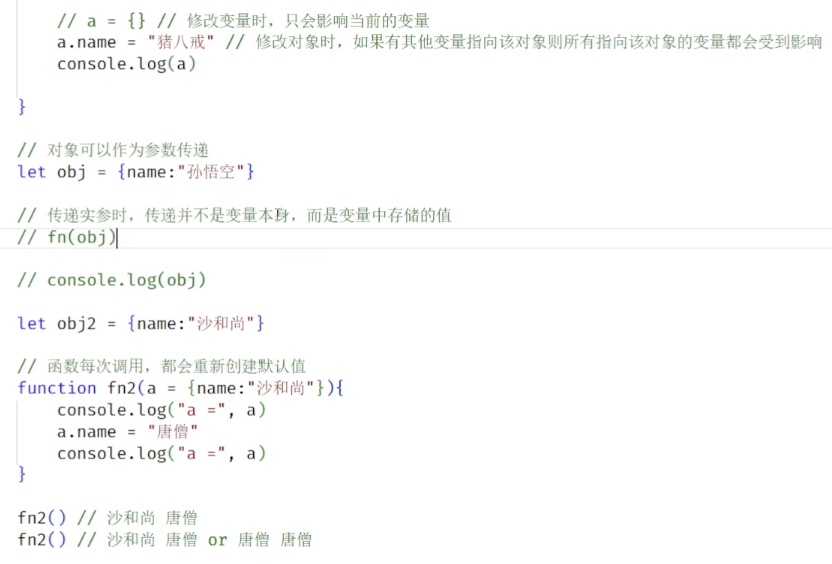
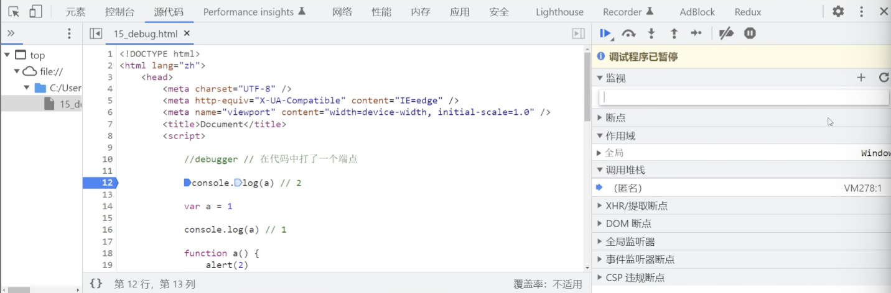

## 函数
### 函数(Function)介绍
1. 函数也是一个对象
（1）它具有其他对象所有的功能
（2）函数中可以存储代码，且可以在需要时调用这些代码
2. 语法
```html
<script>
    // 创建函数
    function fn(){
        console.log("hello")
    }
    // 调用函数
    fn()
</script>
```
3. 使用typeof，会返回function


### 函数的创建方式
1. 函数声明
```html
<script>
    function 函数名(){
        语句...
    }
</script>
```
2. 函数表达式
```html
<script>
    const 变量 = function(){
        语句...
    }
</script>
```
3. 箭头函数
```html
<script>
    const fn = () => {
        语句...
    }
</script>
```

### 参数
#### 形式参数
1. 定义函数时，可以在函数中指定数量不等的形式参数
2. 在函数中定义参数，就相当于在函数内部声明了对应的变量，但是没有赋值

#### 实际参数
1. 调用函数时，可以在函数的()传递数量不等的实参
2. 实参会赋值给对应的形参
（1）如果实参和形参数量相同，则对应赋值
（2）如果实参多于形参，则多于的实参不会使用
（3）如果实参少于形参，则多于的形参为undefined

#### 参数类型
1. JS不会检查参数的类型，可以传任何类型的参数
2. 可能结果会成NaN

#### 箭头函数的参数
1. 只有一个参数，可以省略()
2. 定义参数时，可以为参数指定默认值。函数每次调用，都会重新创建默认值
```html
<script>
    const fn = (a,b) => {}
    const fn2 = a => {}
    const fn3 = (a=10,b=20,c=30) => {}
</script>
```

#### 对象作为参数


#### 函数作为参数
1. 函数也是一个对象
```html
<script>
    function fn(a){
        console.log("a =",a)
    }
    function fn2(){
        console.log("我是fn2")
    }
    fn(fn2)

    fn(function(){
        console.log("我是匿名函数")
    })

    fn(()=>console.log("我是箭头函数"))
</script>
```

### 函数的返回值
1. 在函数中可以通过return关键字来指定函数的返回值
2. 返回值就是函数的执行结果，函数调用完毕返回值会作为结果返回
3. **任何值**都可以作为返回值使用（包括函数和对象之类）
4. 如果return后不跟任何值，或者不写return，则相当于返回undefined
5. return 一执行，函数立即结束
```html
return {name:"孙悟空"}
return ()=> alert(123)
```

#### 箭头函数的返回值
```html
<script>
    const sum =(a,b) => {
        return a+b
    }
    // 等价于
    const sum=(a,b) => a+b
    // 若把带括号的对象写到箭头后，则这个大括号会被识别成代码块！对象必须用()括起来
    const fn = () => ({name:"孙悟空"})
</script>
```

### 作用域
作用域指的是一个变量的可见区域
#### 全局作用域：
- 在网页运行时创建，在网页关闭时消耗
- 所有直接编写到script标签中的代码都位于全局作用域中
- 全局作用域中的变量是全局变量，可以在任意位置访问
```html
<script>
    let a = "变量a"
    function fn(){
        console.log(a)
    }
</script>
```
#### 局部作用域：
1）块作用域
- 代码块执行时创建，代码块执行完毕就销毁
- 在块作用域中声明的变量，只能在**块内部**访问，外部无法访问
2）函数作用域
- 在函数**调用** 时产生，调用结束后销毁
- 函数每次调用都会产生一个全新的函数作用域
- 只能在函数内部访问

#### 作用域链
1. 当使用一个变量，JS解释器会优先在**当前作用域**中寻找变量
（1）如果找到了则直接使用
（2）如果没找到，则去**上一层作用域**中寻找，找到了则使用
（3）如果没找到，则继续去上一层寻找
（4）如果一直到全局作用域都没有找到，则报错， xxx is not defined
```html
<script>
    let a = 10
    {
        let a = "第一代码块中的a"
        {
            let a = "第二代码块中的a" // 先找到的是这个
            console.log(a)
        }
    }
</script>
```

### 练习
1. 练习1
```html
<script>
    var a = 1
    function fn(){
        a = 2 // 这是全局变量
        console.log(a) // 2
    }
    fn()
    console.log(a) // 2, 打印的是全局的a，调用函数后a从1改成了2
</script>
```

2. 练习2
```html
<script>
    var a = 1
    function fn(){
        console.log(a) // undefined, 下面的a声明提升了还没赋值
         var a = 2  // 用var声明的局部变量，不会改函数外的a
        console.log(a) // 2
    }
    fn()
    console.log(a) // 1
</script>
```

3. 练习3
```html
<script>
    var a = 1
    // 定义形参（局部变量）就相当于在函数中声明了对应的变量，但是没有赋值
    function fn(a){
        console.log(a) // undefined
        a = 2  
        console.log(a) // 2
    }
    fn()
    console.log(a) // 1
</script>
```

4. 练习4
```html
<script>
    var a = 1
    function fn(a){
        console.log(a) // 10
        a = 2  
        console.log(a) // 2
    }
    // 调用函数时传入了参数10
    fn(10)
    console.log(a) // 1
</script>
```

5. 练习5
```html
<script>
    var a = 1
    function fn(a){
        console.log(a) // 1
        a = 2  
        console.log(a) // 2
    }
    fn(a) // 传的是a的值，是1
    console.log(a) // 1
</script>
```

6. 练习6
```html
<script>
    console.log(a) // f a(){alert(2)}, 函数会赋值，最后的函数产生影响（若有多个）
    var a = 1
    concole.log(a) // 1

    function a(){ // 早就被提升，已经提前执行，不会再执行了，不会产生影响
        alert(2)
    }

    console.log(a) // 1

    var a = 3

    console.log(a) // 3

    var a = function(){ // var只提升声明
        alert(4)
    }

    console.log(a) // f(){alert(4)}
    
    var a
    console.log(a) // f(){alert(4)}
</script>
```

### debug
1. 方法：
(1)在代码中打一个断点：debugger
(2)网页检查点源代码，在行数那里点一下


### 立即执行函数
#### 为什么
1. 在开发中应该尽量减少直接在全局作用域中编写代码（容易被别人改掉）
2. 所以代码要尽量写到局部作用域
（1）使用let声明，可以用{}来创建快作用域
（2）使用var声明变量，可以写到函数作用域，var没有块作用域。但是函数需要调用才会执行

#### 立即执行函数(IIFE)
希望可以创建一个**只执行一次的匿名函数**：只是为了创建函数作用域
```html
<script>
    // 加括号：就不是以function开头了，所以不会被提升
    (function(){
        let a = 10
        console.log(111)
    }()) ; // 若不加分号，下面再来一个IIFE的话，会报错（检测到两组括号，却没有分号隔开） 
    //里面加个括号表示调用

    (function(){
        let a = 20
        console.log(222)
    }())

</script>
``` 

### this
1. 函数在执行时，JS解析器每次都会传递进一个隐含的参数
2. 这个参数就是this
3. this会指向一个对象
（1）以函数形式调用时，this指向的是window
（2）以方法的形式调用时，this指向的是调用方法的**对象**

```html
<script>
    function fn(){
        console.log(this)
        console.log(this == window) // true
    }
    const obj = {name:"孙悟空"}
    obj.test = fn
    const obj2 = {name:"猪八戒", test:fn}
    obj.test() // {name:"孙悟空"}
    obj2.test() //{name:"猪八戒",test:fn}
</script>
```

#### 箭头函数的this
1. 箭头函数:
([参数])=>返回值
2. 例子:
- 无参箭头函数: ()=> 返回值
- 一个参数的: a=>返回值
- 多个参数的: (a，b)=>返回值
- 只有一个语句的函数: ()=>返回值
- 只返回一个对象的函数: ()=>({...})
- 有多行语句的函数: ()=>{
            ...
            return 返回值
        }
3. 箭头函数没有自己的this，它的this由外层作用域决定，和它的调用方式无关
4. 开发中经常用箭头函数，因为它的this不会乱变
```html
<script>
    function fn(){
        console.log("fn-->",this)
    }
    const fn2 = () => {
        console.log("fn2-->",this)
    }

    const obj = {
        name:"孙悟空",
        fn,  // 相当于fn:fn
        fn2  // 相当于fn2:fn2
    }

    obj.fn() // obj{...}
    obj.fn2() // window,外层作用域就是全局
</script>
```

### 严格模式

#### 模式
JS运行代码的模式有两种：
1. 正常模式：
默认情况下代码都运行在正常模式中
（1）语法检查并不严格
（2）原则是：能不报错的地方尽量不报错
（3）导致代码 的运行性能较差
```html
<script>
    a = 10 // 不加let或var，正常模式下可执行，但是不会在一开始就执行为变量准备内存
</script>
```
2. 严格模式：
语法检查更严格
（1）禁止一些语法
（2）更容易报错
（3）提升了性能
```html
<script>
    // 在代码开头,全局开
    "use strict"

    function fn(){
        "use strict" // 函数的严格模式，局部
    }
</script>
```

## 面向对象
### 面向对象编程(OOP) orient object program
1. 程序是干嘛的？
（1）程序就是对现实世界的抽象（照片是对人的抽象）
- 具体：全部信息
- 抽象：能够体现一些特征，部分信息
（2）一个事物抽象到程序中后就变成了对象
（3）在程序的世界中，一切皆对象
2. 对象
（1）一个事物通常由两部分组成：数据和功能
（2）一个对象由两部分组成：**属性（数据）和方法（功能）**
eg: 数据：姓名，年龄，身高，体重； 功能：睡，吃
```html
<script>
    const five = {
        //添加属性
        name:"王老五",
        age:48,
        height:180,
        weight:100,
         
        // 添加方法
        sleep(){
            console.log(this.name + "睡觉了")
        },
        eat(){
            console.log(this.name + "吃饭了")
            weight ++ // 功能最终也会体现为数据
        }
    }
</script>
```

3. 面向对象编程
（1）指的是，程序中的所有操作都是通过对象来完成
（2）做任何事情之前都需要先找到它的对象，然后通过对象来完成各种操作

### 类
1. 使用Object创建对象的问题：
（1）无法区分出不同类型的对象
（2）不方便批量创建对象
```html
<script>
    const five = {
        //添加属性
        name:"王老五",
        age:48,
        height:180,
        weight:100,
         
        // 添加方法
        sleep(){
            console.log(this.name + "睡觉了")
        },
        eat(){
            console.log(this.name + "吃饭了")
            weight ++ // 功能最终也会体现为数据
        }
    }

    const yellow = {
        name:"大黄",
        age:3
        sleep(){
            console.log(this.name + "睡觉了")
        },
        eat(){
            console.log(this.name + "吃饭了")
            weight ++ // 功能最终也会体现为数据
        }

    }
</script>
```

2. 在JS中可以通过类(class)来解决这个问题
（1）类是对象模板，可以将对象中的属性和方法直接定义在类中
（2）定义后，可以通过类来创建对象
（3）通过同一个类创建的对象，称为同类对象。
（4）可以通过instanceof来检查一个对象是否由某个类创建
3. 语法
```html
<script>
    class 类名 {} // 类名要使用大驼峰命名
    const 类名 = class {}
</script>
```
4. 通过类创建对象 : new 类()
```html
<script>
    // Person类专门用来创建人的对象
    class Person{

    }

    // Dog类专门用来创建狗的对象
    class Dog{

    }

    const p1 = new Person() // 调用构造函数创建对象
    const p2 = new Person()
    const d1 = new Dog()

    console.log(p1)
    console.log(p1 instanceof Person) // true
    console.log(d1 instanceof Person) // false

</script>
```

### 属性
1. 类的代码块，默认就是**严格模式**
2. 类的代码，是用来设置对象的**属性**，不是什么代码都能写
3. **实例属性**只能通过**实例(p1,p2)**来访问
4. **静态属性**只能通过**类**来访问
```html
<script>
    class Person{
        name = "孙悟空"// Person的实例属性name
        age = 18

        static test = "test静态属性" // 静态属性，访问需要Person.test

    }
    const p1 = new Person()
    console.log(p1)
</script>
```

### 方法
```html
<script>
    class Person{
        name = "孙悟空"
        sayHello = function(){
            // 添加方法的一种方式，不推荐使用
        }
        sayHello(){
            // 另一种方式
            console.log('大家好，我是',this.name)
            // 实例方法中this就是当前实例
        }

        static test(){
            console.log('我是静态方法',this)
            // 静态方法通过类来调用,this指的是当前类
        }
        
    }
    const p1 = new Person()
    p1.sayHello()
    Person.test()
</script>
```

### 构造函数
1. 当我们在类中直接指定实例属性的值时，意味着创建的所有对象的属性都是这个值
2. 在类中可以添加一个特殊的方法：constructer
(1)该方法叫做构造函数
(2)构造函数会在调用类创建对象时执行
(3)在构造函数中可以为实例属性进行赋值
(4)this表示的是当前创建的对象（实例）
```html
<script>
    class Person {
        name 
        age 
        gender

        sayHello(){
            console.log(this.name)
            }

        constructer(name,age,gender){
            this.name = name  // this.name是p1的name
            this.age = age
            this.gender = gender
        }
    }
    const p1 = new Person("孙悟空",18,"男")
</script>
```


