## Handbook 
对优秀 software tool 的描述：
1. 要对 wet lab 设计/执行有帮助
2. 对没有编程背景的人也可用
3. 文档和安装说明清楚
4. 最好有 API/架构图/执行脚本/性能说明
5. 实验验证会显著加分

围绕真实实验痛点做出可直接被别人接手的工具

## 分析
### Fudan 2023 RAP
不是单纯网页，而是设计工作流 + API + 实验验证的完整工具链

2025 Judge Handbook提到：
1. RAP 是一个帮助合成生物学设计与优化的软件套件，强调了三点：直观 web 界面、详细教程/文档、给高级用户的API；
2. 同时兼容 GenBank，并能与 SnapGene 这类工具衔接；
3. 软件输出的序列被 wet lab 实验验证过。

软件页面要讲**workflow**，而不是只讲 feature list。 judge 想看到的是：输入什么、内部怎么处理、输出什么、为什么可信、跟实验怎么连上。Fudan 2023 这点做得非常标准。

### Vilnius-Lithuania 2024

Vilnius-Lithuania 2024 的软件不是独立 app，而是围绕他们的 DIY bioreactor 做实时监控和控制。

官方 handbook 点名表扬了它的几个方面：
1. 软件来自真实实验需求；
2. 能实时读取temperature 等参数；
3. 通过文档化 API 和 Docker 部署支持扩展；
4. 并且给了安装说明、演示视频、API 说明，方便非程序员上手。它们的软件页也写了 docker compose up --build 的一键部署方式。

## 总结software主要思路
1. 实验设计工具
2. 实验执行/监控工具
3. 研究资源/数据库平台

## Fudan software
### 2022 Parthub
一个面向 iGEM Parts Registry 的增强型检索与关联分析工具
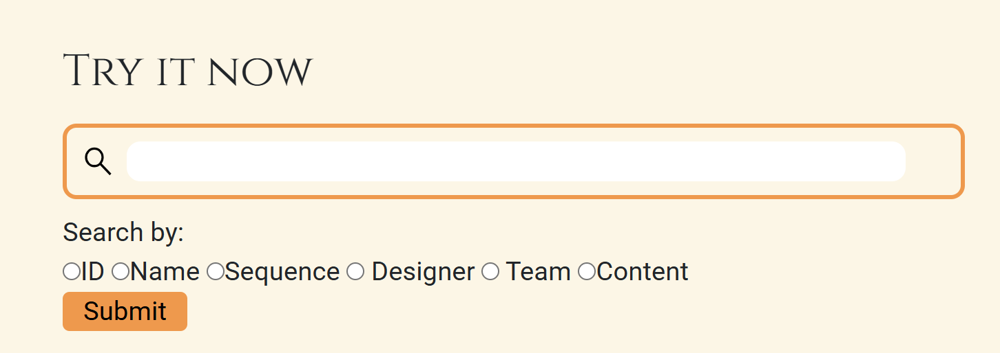
1. 把 2004 年以来几乎整个 Registry 的 part 信息抓取下来做成自己的数据库；
2. 提供比原 Registry 更丰富的检索方式；
3. 把 part 和 part 之间的关系可视化出来，帮助设计和复用。
4. 跨平台兼容

#### 主要内容
##### 目标
wiki的software页面写了：
1. 快速高效地辅助新 part 构建与设计
2. 提供多种搜索现有 parts 的方式
3. 可视化 parts 之间的关系

##### 具体功能
1. 支持按这些字段搜：
- ID
- Name
- Sequence
- Designer
- Team
- Content
2. 支持：
- 大小写不区分
- partial match，部分词匹配
- 布尔搜索：xxx AND xxx, xxx OR xxx
- 模糊搜索：fuzzy search(处理打字错误，拼写变体等)
- 多种排序方式：Most cited, best match, recommended
3. part关系网络图
点进某个 part 后，它不是只给你一个条目，而是会展示这个 part 的关系网络图：
- 节点代表 part
- 边代表 citation / cited 或 twin parts 关系
- 节点大小和颜色还能反映引用量和发布时间。

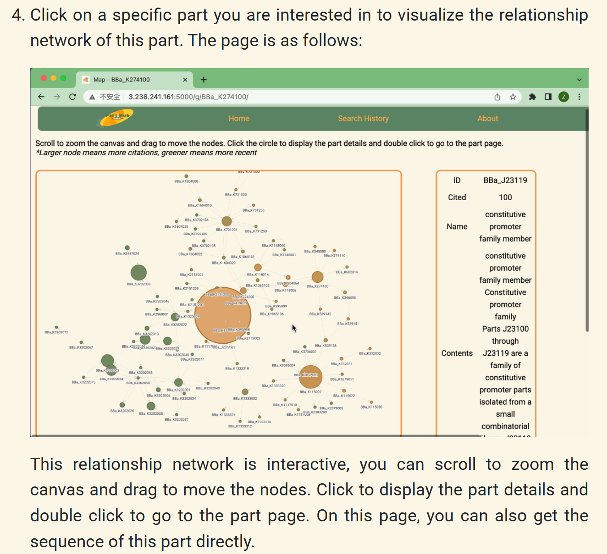

#### 核心亮点
1. 解决的是一个真实而普遍的痛点
（1）他们在wiki说，做这个软件的直接动机，是觉得 Registry 虽然有很多数据，但队伍很难快速找到和自己项目真正相关的 part。
（2）而且他们还把它嵌进了自己项目的 DBTL 流程里；在 parts 页写了他们在 DBTL pipeline 中用 PartHub 做 gene 和相似 sequence 的检索。
2. 不是只做 keyword search，而是做了关系梳理
（1）搜索parts这个需求，在Registry页面也有，但效果没那么好。
help页面说可以：
- 直接搜 part name 或文本
- 找用了这个 part 的 parts
- 找包含这段文字的 parts
- 查看 catalog、distribution 等浏览入口
- 对 composite part 做assembly help一类查询。

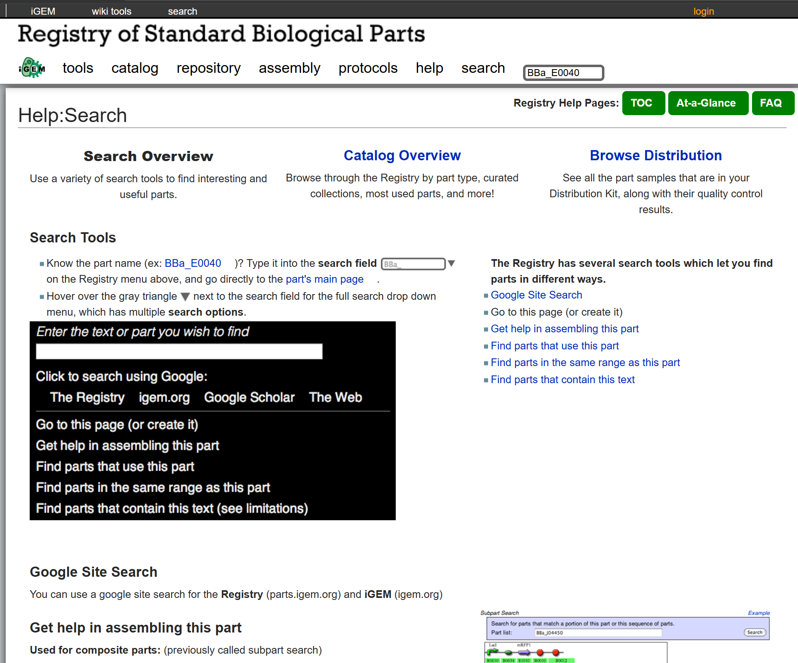

（2）官方搜索更像，想知道有没有这个 part。但设计的时候，更多想知道，别人怎么用过它、它和哪些 part 常一起出现、能不能借它改造

3. 覆盖范围大
（1）PartHub 页里说它包含了 2004 年以来几乎全部 Registry 信息
（2）而且官方 blog 在回顾 2022 software时，也把 Fudan 2022 概括为包含几乎全部 Registry parts 信息的软件工具。
（3）wiki页面说，对于这个网络爬虫，由于标准生物零件注册处页面数量庞大，建议使用高性能计算机或计算团队，尤其是高性能计算平台。笔记本电脑可能不适合这种高负载工作。数据量实在是大

#### 可能的局限
从wiki披露的实现看，这套系统比较依赖 crawler 抓取、预处理和自建数据库更新；这意味着维护成本不低，而且数据新鲜度和稳定性会受到 Registry 页面结构影响。

#### 以前有吗
在Fudan 2022之前，有
##### Registry 自己的search tools
这个在上面核心亮点第二点讲了
##### 2021 Leiden
1. 做过 DiKST（Distribution Kit Search Tool），目的就是帮助未来队伍更容易搜索 distribution kit 中的 biobricks；
2. 它同样是 Python 程序 + 网站界面，也是把 Registry 数据抓出来做数据库和检索。
3. wiki写：他们在春季规划实验时，频繁使用 Distribution Kit，发现官方关于 Distribution Kit 的页面里主要只显示 part ID，虽然也能查，但过程比较费时间，不方便快速判断 kit 里有没有自己需要的构件。于是他们就做了 DiKST。
4. 解决的问题：现在手里官方发来的这盒 DNA 样品里，到底有没有适合实验的元件，更方便的查询


### 2023 RAP
一个围绕 pRAP 设计的软件套件
#### 主要内容
一个从找 part，到算酶比例，再到生成构建序列，完整工作流工具链。由3部分组成：
1. KineticHub：搜索酶、反应动力学信息，并计算酶的最优浓度比例
2. RAP Builder：根据目标表达需求，设计 pRAP 系统中的调控元件，并组装序列
3. PartHub 2：搜索 iGEM Registry parts，并提供网络关系分析与推荐。

#### why
1. Fudan 2023 说，2022 年他们已经证明了 pRAP 系统有用：通过 ribozyme-assisted polycistronic co-expression，可以改善底盘代谢、优化多酶级联表达。
2. 但他们认为 2022 方案有两个局限：
（1）缺少**定量调控**：2022 主要是通过换不同强度的 RBS 来相对地调表达量，本质上偏定性；
（2）仅关注核酶切割和核糖体结合，忽视降解问题，因为降解对许多被切割的mRNA来说是个问题。
3. 把 pRAP 从经验式、定性式设计, 升级成定量式、全调控元件的设计工具。

#### 具体怎么做
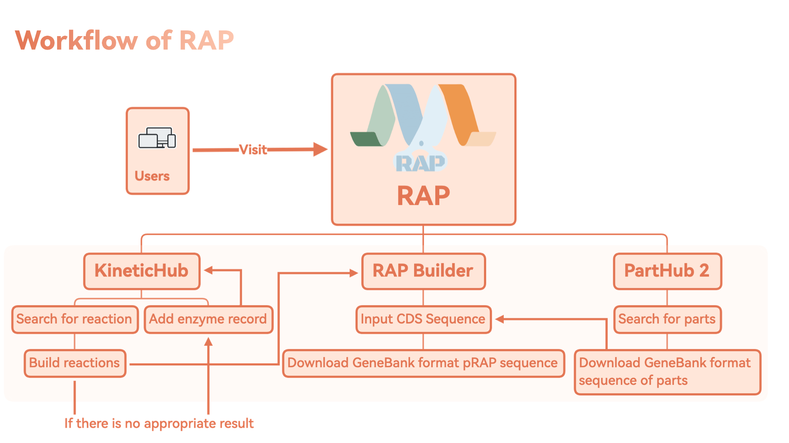
##### 总体流程
1. 先在 PartHub 2 找合适的 part / sequence
2. 再在 KineticHub 查目标反应、酶学参数、估计酶浓度比
3. 再用 RAP Builder 设计 RBS / stem-loop 等调控元件
4. 最后输出 GenBank 格式序列 和注释文件，可直接接到 SnapGene 等工具。

wiki中说他们把这个流程具体到了DBTL各阶段：
- Design 阶段用 PartHub 2 找 part 和序列，再用 KineticHub 算最优酶浓度；
- Build 阶段用 RAP Builder 设计 RBS / stem-loop 并构建 pRAP；
- Test 和 Learn 阶段再结合实验结果迭代。

##### KineticHub
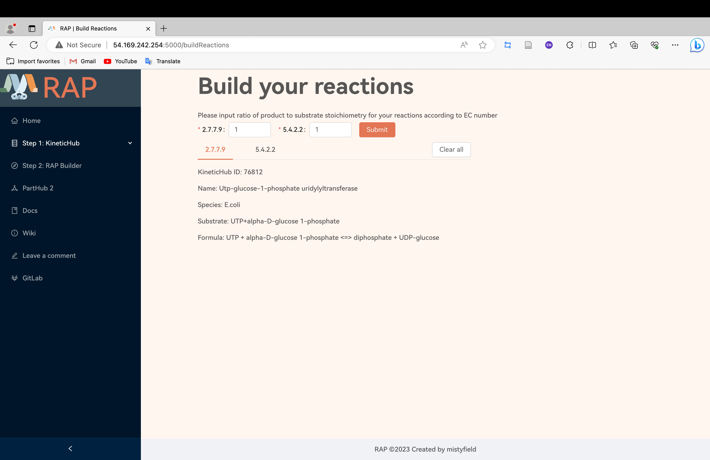
1. 根据级联反应和酶动力学参数，帮助用户估算最优酶浓度比。
2. 用户需要先搜索目标反应和对应酶记录，再构建 cascade reaction，系统会返回基于数据的最优酶比例。
3. 数据来源：BRENDA（公开可使用），但这个原始数据是文本文件，fudan做了转化

##### RAP Builder
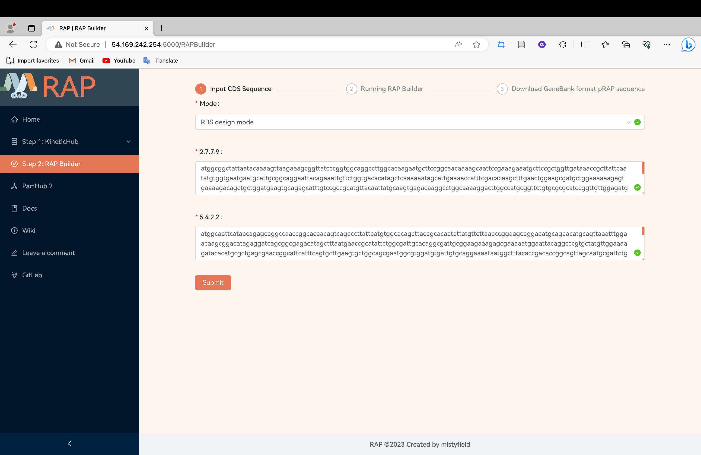
1. 整个软件的核心设计器，任务是：
- 根据目标酶表达需求
- 设计 pRAP 中对应的 RBS 和 stem-loop
- 自动生成构建序列
2. 模型上：
- 热力学模型
- Monte Carlo 算法
- 对转录/翻译的 cell-scale dynamic model
- 在 stem-loop 设计里还用了 scikit-learn 的 SVR
3. 实现：
- Python 3.10
- ViennaRNA package 2 做 RNA 二级结构与自由能计算
- 借鉴开源 RBS Calculator 的 Monte Carlo 思路生成 synthetic RBS
- scikit-learn 实现 stem-loop 相关回归
- Biopython 生成 GenBank 文件与 annotation 文件
- 输出结果可直接导入 SnapGene

##### PartHub 2
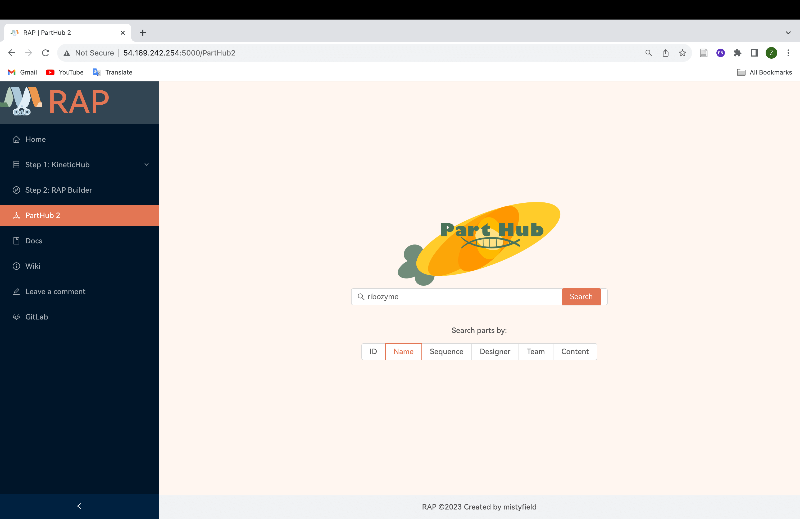
1. PartHub 2 是对 2022 PartHub 的升级版，几项升级：
- 更新到 2022 Registry 数据，包含 6 万多个 parts
- 根据用户反馈优化交互界面，删掉不必要选项
- 开始加入**推荐算法**
- 用户可以直接下载 GenBank 格式序列
2. 底层实现上，PartHub 2 延续了图数据库路线：
- 用 web crawler 抓取 2022 Registry parts
- 用 Neo4j 做图数据库
- 用 Flask 提供 RESTful APIs
- 用 Neo4j GDS 做 PageRank 和 Louvain community detection
- 推荐逻辑优先展示 PageRank 高、同时不属于同一 Louvain 社区的 parts
- 支持 Docker 安装
- 用 Biopython 导出 GenBank
- 用 Neovis.js 做网络可视化

#### 核心亮点
1. 完整工作流
（1）官方 handbook 对它的评价也是 “a software suite designed to streamline the design and optimization of synthetic biology constructs”。
（2）解决了：找 part，查反应/酶参数，算最优酶比例，设计表达调控元件，输出可用序列

2. 把wet lab问题接入software
直接面向 多酶级联代谢优化 这个问题

3. 与既有生物信息学工具兼容很好
采用 GenBank 格式，方便和 SnapGene 这类现有序列工具衔接

4. 有实验验证


#### 以前有没有类似的
1. PartHub 2 就是在 Fudan 2022的基础上改进的，对于搜索parts这一块，前面也提到registry官方也有search tools
2. KineticHub, 接入的就是BRENDA的酶学动力学数据库。
（1）USTC 2022 MEI：给定反应，预测可能的酶候选。把公开酶学数据按反应层—酶层—动力学层分开整理，做成了自己软件后台的三类数据库
3. RBS Builder: 
（1）2013 XMU 的 RBS-decoder，它就是专门做 RBS 强度评估与 SD 位点定位 的软件工具。
（2）Monte Carlo 设计思路参考了开源版 RBS Calculator


### 2024 PartHub 3
主页
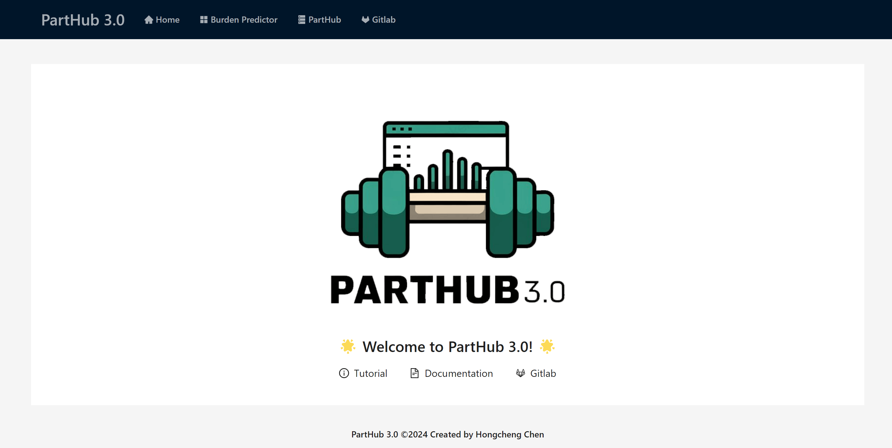
来自2024wiki的表格，对比了3个version
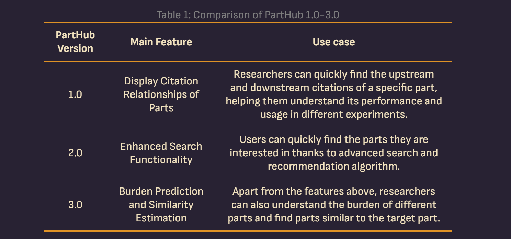
所以2024的software强调了这个PartHub的burden prediction和similarity estimation

#### 主要内容
1. Burden Predictor：预测一个 composite part 带来的 burden，既支持 monocistron，也支持基于 pRAP system 的 polycistron。
2. Similarity Estimator：在 PartHub 中搜索目标 part，并寻找与其相似的 parts。

#### why
1. 他们认为过去的 PartHub 更偏知识组织和关系发现，但对合成生物学来说，序列本身才是决定功能、兼容性和宿主表现的核心信息。citation 和 search 当然有用，但研究者真正想知道的往往还包括：
（1）这个 part 的序列会不会给宿主造成很大负担？
（2）我能不能快速找到和它序列相近、功能可能相近的其它 part？
2. part 最本质的信息其实是 sequence
3. overview 里说，过去两年的 PartHub 1.0 和 2.0 在 citation relation 和 search function 上都做得不错，但仍有一个关键缺口，对 sequence information 的重视不够

#### 具体功能
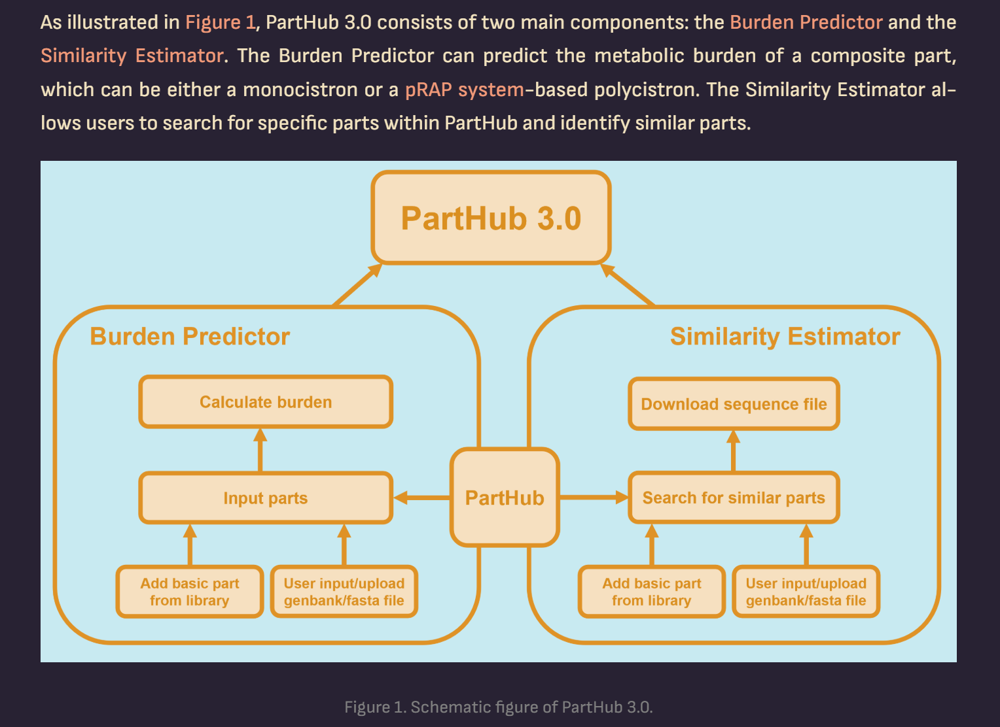
##### Burden Predictor
1. 想解决的问题：
（1）随着合成生物学构建越来越复杂，外源 part 会消耗宿主细胞的 ribosomes、tRNAs、ATP 等资源，从而增加 metabolic burden、降低生长速率，并加速“回变”或使低功能突变体在竞争中占优势
（2）此前没有方法能仅根据一个 genetic part 的 sequence 和 structure 来预测 burden。因此他们要做一个只基于 **part 输入信息**进行 **burden 预测**的工具
2. 如果用户选的 basic parts 不在他们自建的小型 validated library 里，系统支持三种方式导入：
手动输入 sequence、上传 GenBank/FASTA 文件、或者直接从 PartHub 搜索导入。
对于未知的 promoter 和 RBS，他们调用 Promoter Calculator 和 RBS Calculator 来从序列估计 promoter strength 与 RBS strength。

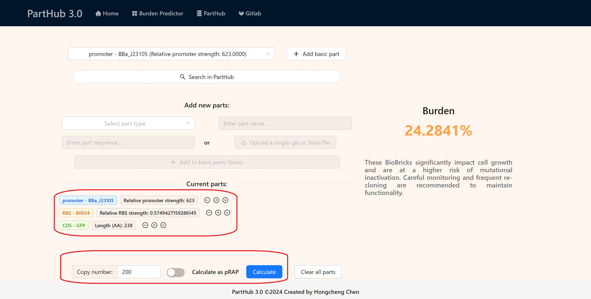

##### Similarity Estimator
1. 如果两个 parts 在 sequence 上更相似，它们更可能具有相似的 biological characteristics 和 functions。
2. 进一步提供了基于 sequence 的 similar parts discovery。它直接整合到 PartHub 2.0 的基础上，使用户能够同时看到 citation relationships 和 similarity relationships
3. 公开了DBTL迭代过程，第一轮采用的similarity计算方法，结果不如预期，于是改了。这个失败经历展示到wiki页面
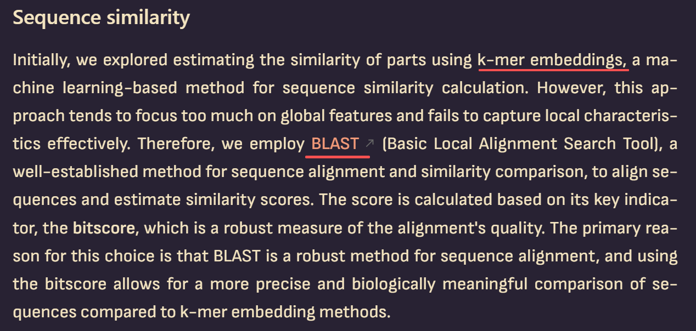
4. 用户可以直接在 PartHub 页面输入关键词、序列或上传文件；进入 part detail page 后，软件会自动开始寻找 similar parts。
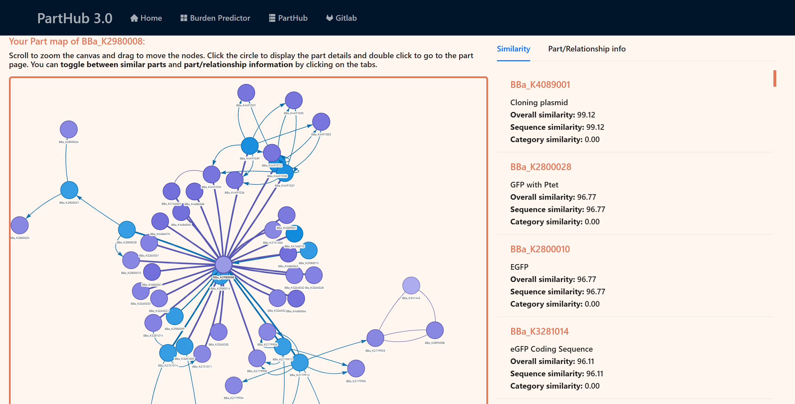

#### 前人做过
1. Burden prediction
模型核心来自 Weiße 与 Nikolados 等人的框架，host burden mechanistic modeling 以前就有
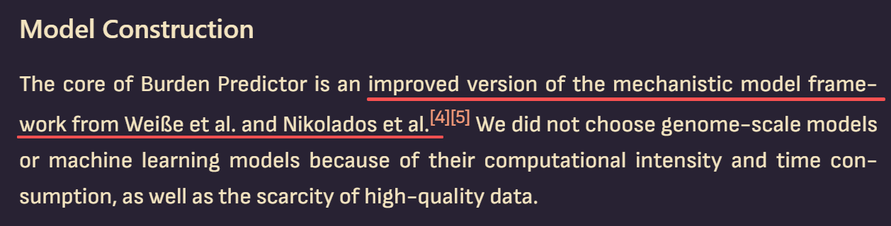

2. Similar part search
以前就有 BLAST 这类通用序列比对工具，Fudan 2024 最后也选择了 BLAST 路线


### 2021 Leiden
[2021 Leiden DIKST](https://2021.igem.org/Team%3ALeiden/Kit-Search)

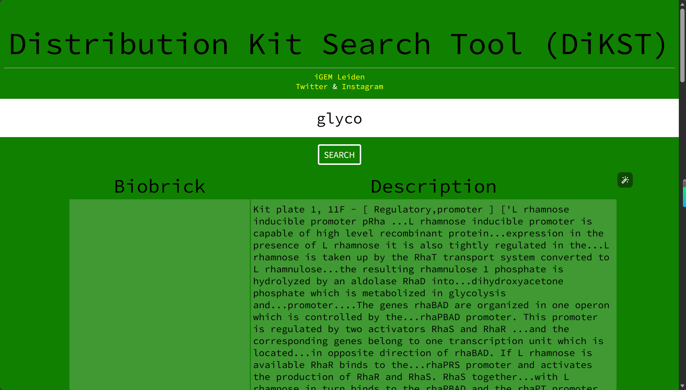

Distribution Kit Search Tool，简称 DiKST.

直接访问[DiKST](https://2021.igem.org/Team:Leiden/Distribution-kit-search?#)就可以使用了，就像上面那个绿色的页面

#### why
他们在规划实验时频繁使用 Distribution Kit，但发现 Registry 里 Distribution Kit 页面主要只显示 part ID，想靠功能或者描述找构件很麻烦，所以开发了 DiKST 来让后续 iGEM 队伍更容易浏览 kit、快速找到 parts。

#### 主要功能
1. 按关键词搜索 Distribution Kit 中的 BioBrick
2. 显示 part 在 Distribution Kit 中的位置
DiKST 会告诉这个 BioBrick 在 Distribution Kit 的哪一块板、哪一个孔。不用再回头翻官方表格找
3. 显示 part 的简要描述
4. 提供 Registry 原页面跳转
5. 可以为未来年份的 kit 重新生成数据库
提供了一个 Python 程序，理论上可以用新的 Distribution Kit plate 文件重新生成数据库。不过也有小局限：它基于 2021 年及以前年份的 Excel/CSV 结构，如果之后 Distribution Kit 的 CSV 格式变了，可能需要改代码。

#### 数据来源
| 数据来源                                  | 用途                            |
| ------------------------------------- | ----------------------------- |
| Distribution Kit plate CSV / Excel 文件 | 获取 BioBrick 编号和 plate/well 位置 |
| iGEM Registry API                     | 获取 BioBrick 的分类、标签等结构化信息      |
| 每个 BioBrick 的 Registry 页面             | 抓取描述性文本，用于关键词搜索               |

#### 技术结构分析

从软件架构看，DiKST 可以拆成三层：

1. 数据采集层

Python 脚本负责：
```text
读取 CSV；

建立 BioBrick 条目；

记录 plate/well 位置；

调用 Registry API；

抓取 Registry 页面；

提取描述性文本。
```


2. 数据库层

最终数据不是 SQL 数据库，而是一个静态 JSON 文件。

这很符合 iGEM wiki 的限制，因为很多时候不能在 iGEM 服务器上跑**后端程序**。Leiden 也说明，因为 iGEM 编程限制，他们不能做服务器端处理，所以选择了**客户端搜索**。(下面会讲到服务器的付费问题)


3. 前端检索层

前端是一个网页搜索框。用户输入关键词后，浏览器在本地 JSON 数据中检索。

wiki提到搜索在 client/browser side 进行，所以取决于电脑性能，可能会慢 1–2 秒。

它适合**小而静态**的数据库，但不适合特别大规模的知识库。

#### 不用持续付费？
有前端，但几乎没有在线后端。

1. 它不需要一个长期运行的服务器程序。它的后端工作主要是在部署前由 Python 脚本离线完成，生成一个 dataset.json 数据库文件。真正访问时，只是在浏览器里打开一个**静态网页**。

2. 运行时的结构：
```text
用户浏览器
  ↓ 访问网页
iGEM 静态服务器返回 HTML / JS / JSON
  ↓
浏览器里的 JS 搜索 dataset.json
```

3. 有一个**离线后端脚本**
这个`DiKST.py`脚本负责
```text
读取 Distribution Kit 的 plate CSV
↓
获取每个 BBa part 的 plate / well 位置
↓
调用 Registry API
↓
抓取 Registry 页面信息
↓
整理 part 描述
↓
生成 dataset.json
```
这个过程只在准备数据库时运行一次，不是用户每次搜索时都运行。

5. fudan 2024的software
是后端型，它的Docker Compose里有两个服务，一个 Flask 后端服务和一个 Neo4j 图数据库服务。

它的服务器要真正工作，不是单纯静态网页

## 尝试使用
### 2024 fudan software
参考https://2024.igem.wiki/fudan/software/#_1-installation

我以本电脑windows为例，尝试部署
#### docker方法
1. 首先确保电脑上安装了 Docker Desktop
2. 然后这个Docker Desktop，打开，左下角是在running的即可
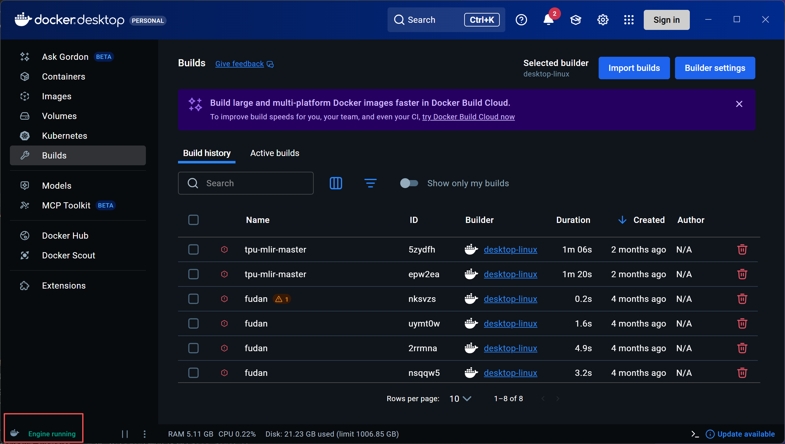

3. 在自己电脑上，自己喜欢的目录下，新建一个文件夹，比如我建在了`D:\igem\igem_software\fudan_2024_parthub_deploy`

4. 进入文件夹，新建文件`docker-compose.yml`，然后里面的内容填写：
```yml
services:
  flask:
    image: chc1234567890/fudanigem2024:1.0.0
    ports:
      - "5000:5000"
    restart: always
    depends_on:
      - parthub
    environment:
      - SERVER_URL=bolt://parthub:7687
      - SERVER_USER=neo4j
      - SERVER_PASSWORD=igem2024
  parthub:
    image: neo4j:5.11
    restart: always
    environment:
      - NEO4J_AUTH=neo4j/igem2024
      - NEO4J_PLUGINS=["graph-data-science"]
      - NEO4J_dbms_security_procedures_allowlist=gds.*
      - NEO4J_dbms_security_procedures_unrestricted=gds.*
    ports:
      - "7474:7474"
      - "7687:7687"
    deploy:
      resources:
        reservations:
          memory: 2G
```

5. 打开终端，进入工作目录`D:\igem\igem_software\fudan_2024_parthub_deploy`，执行
```powershell
docker compose up -d
```
这个拉取docker镜像的过程很慢

6. 等它结束了，就可以访问`http://localhost:5000/`
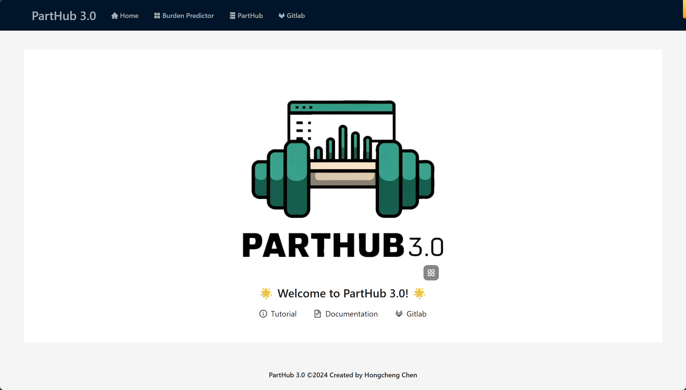


#### git clone源代码方法
1. clone到本地
先`cd`到目标目录，然后`git clone`，此处需要**稳定的代理**，不然会error
```powershell
cd "D:\igem\igem_software"
git clone https://gitlab.igem.org/2024/software-tools/fudan.git
```

2. 然后执行
```powershell
cd fudan/webUI
npm install
cd ..
pack.bat
```

3. 然后我记得`pack.bat`后会报错，提示缺失什么什么包，按照提示段去安装就行

4. 但最后因为数据集还需要自己去导入到`Neo4j`中，于是我又去官网下了`Neo4j Desktop`,并新建了一个instance

5. 但好像一直卡在了这里，不知为何，就没再研究了
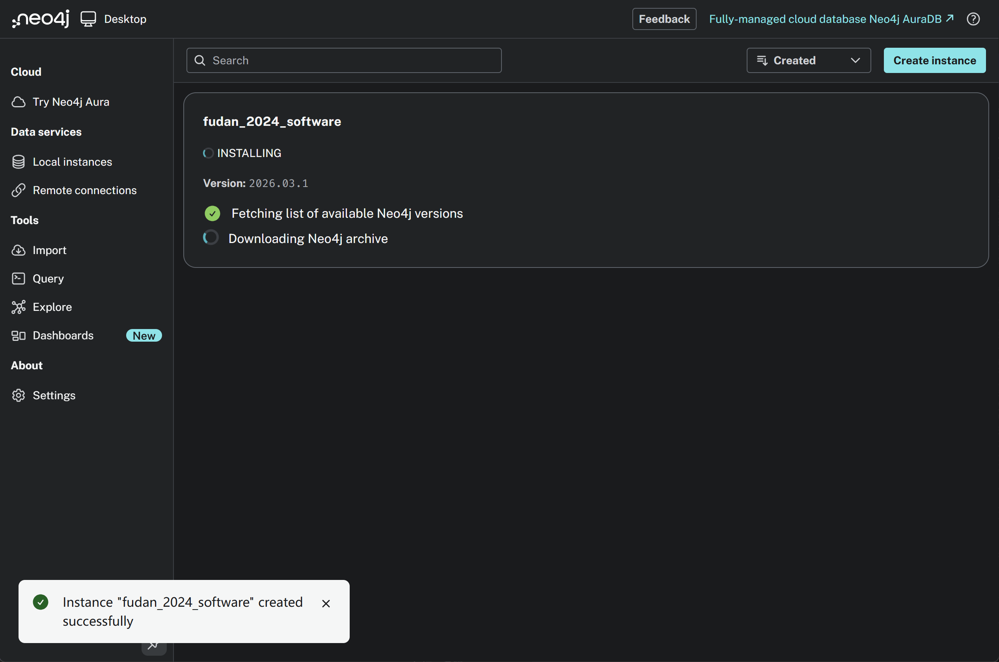

6. wiki提到“数据存储方面，我们使用 Neo4j 5.11，这是一个强大的图数据库，擅长管理复杂关系的大型数据集。”之后我再去研究一下


## 形态
### PyPI包
受 Munich 2025 contribution中，他们做的registry_api的启发，他们就是把工具链做成这个PyPI包，然后发不到了PyPI，PyPI本身是Python社区用于分发软件包的标准仓库


#### 好处
1. 方便，别人可以直接`pip install 包名`
2. **不用付钱**。把自己的工具上传到了一个公开的平台，大家可以pip install来用
3. 可以**长期留存**。之前问gong shitao学长，做好的软件，要想让大家都能访问，需要跑在一台公共服务器上，需要承担好多费用，所以比赛停了一般就关了，但这个PyPI包可以一直留存。
4. 其实是一个分发包文件，发给用户，自己安装运行。把软件部署到自己电脑上也能跑，但是无论是拉取docker还是clone源代码来部署，都不是那么的用户友好型。而直接在命令行`pip install`就真的很方便，
5. 很好的思路，我觉得我们也可以搞一个工具链，发布到PyPI


#### 怎么发布到PyPI
1. 把代码整理成符合 Python packaging 规范的项目。 [Python打包用户指南](https://packaging.python.org/en/latest/tutorials/packaging-projects/?utm_source=chatgpt.com)

（1）官方推荐的基础目录
现在让cc或者codex去vibe coding一个工程项目，也能很天然生成这样的目录结构和文件，不成问题。这也是很标准的工程框架
```text
your_project/
├── LICENSE
├── pyproject.toml
├── README.md
├── src/
│   └── your_package/
│       ├── __init__.py
│       └── ...
└── tests/
```
要注意的点：
- 代码建议放在 `src/` 下面。
- 包目录里最好有 `__init__.py`，这样它能作为常规 package 被 import。
- 项目根目录要有 `README.md`、`LICENSE`、`pyproject.toml`

（2）最核心的文件：`pyproject.toml`

它需要告诉打包工具：

1）用什么构建后端

常见后端有 Hatchling、Setuptools、Flit、PDM、uv-build。官方教程默认用 Hatchling，但这些只要支持 [project] 元数据表，思路都差不多。

例子：
```toml
[build-system]
requires = ["hatchling >= 1.26"]
build-backend = "hatchling.build"
```
- `requires`：构建这个包时需要先装什么
- `build-backend`：实际负责打包的是谁。

2）项目元数据是什么

 `[project]`是项目身份证。官方教程给的关键字段包括：
```text
name
version
authors
description
readme
requires-python
classifiers
license
license-files
project.urls
```
要明确告诉 PyPI：是谁、支持什么 Python 版本、许可证是什么、主页在哪。

2. 在 PyPI 上注册并上传这个项目。PyPI 帮项目托管名字、版本、分类等元数据，这些分类信息本身就是由项目维护者提供的。
3. 用合法的发布身份去维护它。PyPI 还要求维护项目的账号满足安全要求，比如维护者账户需要启用 2FA。

（3）一定要有 LICENSE

官方教程特别强调，每个上传到 PyPI 的分发包都应该包含 license，告诉用户在什么条款下可以使用。license-files 也可以帮助把 license 自动打进包里。

想让别的队伍或老师放心用，MIT / BSD / Apache-2.0 这种开源许可证最好早点定。

（4）准备`tests/`

一开始可以是空的，放那占位，但一定要有

2. 整理好了怎么发：

（1）变成可发布的包

1）安装构建工具：先升级`build`

2）在`pyproject.toml`所在目录运行：
```bash
python -m build
```
它会在 `dist/` 下面生成两类分发文件

（2）先发到 `TestPyPI` 做测试

它是专门给实验和试上传用的，不是正式仓库。需要：

- 注册 TestPyPI 账号
- 验证邮箱
- 创建 API token
- 装 `twine`
- 用 `twine upload --repository testpypi dist/*` 上传。

然后可以在虚拟环境里用 `pip --index-url https://test.pypi.org/simple/ ...` 试装，确认安装和 import 没问题。

（3）去正式的 `pypi.org` 发正式版

官方还提醒，TestPyPI 和正式 PyPI 是两个不同系统，账号不共用。

3. 安全承诺

[通过双因素认证保护 PyPI 账户](https://blog.pypi.org/posts/2023-05-25-securing-pypi-with-2fa/?utm_source=chatgpt.com)

### 软件
中规中矩的分为前端后端，部署到公共服务器上，网址大家都可以访问