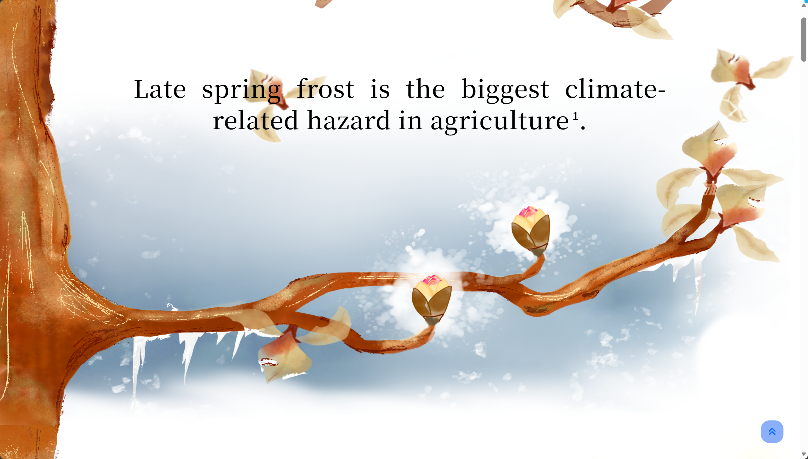
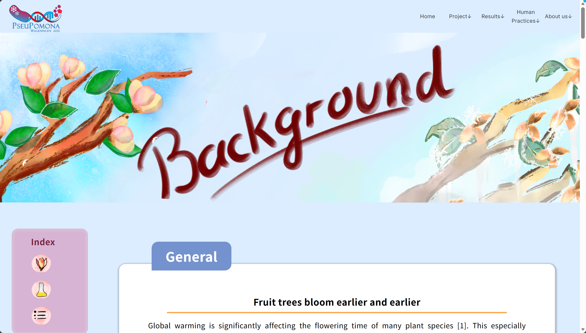

## 类似的花园相关的homepage
### 2024 iGEM - Marburg   
https://2024.igem.wiki/marburg/

#### 鼠标跟随的聚光灯效果


1. 结构
```text
底层：暗背景（雨林被砍）
中层：亮内容（蒲公英）
顶层：遮罩（黑色 + mask）
```

2. 关键点：
- 用一个圆形 mask跟随鼠标移动
- mask 内透出下面的花
- mask 外保持暗色

3. 实现：CSS mask + JS 鼠标跟踪
```CSS
CSS
.mask {
  mask-image: radial-gradient(circle at var(--x) var(--y), 
               transparent 0px, black 150px);
}
```

```JavaScript
JavaScript
document.addEventListener("mousemove", (e) => {
  document.documentElement.style.setProperty('--x', e.clientX + 'px');
  document.documentElement.style.setProperty('--y', e.clientY + 'px');
});
```

#### 图片对比滑块
- 一张 1993 年卫星图
- 一张 2022 年卫星图
- 中间一个圆形拖拽按钮
- 左右根据拖拽位置显示不同区域
- 角上再叠年份文字


1. 把两张图叠在一起，用中间的拖拽手柄控制上层图片的显示范围，从而做前后变化对比
2. 思路：两张图上下叠放。底层放after，上层放before，然后给上层图片外面套一个容器，这个容器的宽度跟着滑块位置变化。
```html
HTML
<div class="compare">
  
  <div class="overlay" id="overlay">
    
  </div>
  <div class="slider" id="slider"></div>
</div>
```
```CSS
CSS
.compare {
  position: relative;
  width: 800px;
  aspect-ratio: 16 / 9;
  overflow: hidden;
}

.img {
  position: absolute;
  inset: 0;
  width: 100%;
  height: 100%;
  object-fit: cover;
}

.overlay {
  position: absolute;
  inset: 0;
  width: 50%;
  overflow: hidden;
}

.slider {
  position: absolute;
  top: 0;
  left: 50%;
  transform: translateX(-50%);
  width: 4px;
  height: 100%;
  background: white;
  cursor: ew-resize;
}
```
```JavaScript
JavaScript
const container = document.querySelector('.compare');
const overlay = document.querySelector('.overlay');
const slider = document.querySelector('.slider');

let isDragging = false;

function update(position) {
  const rect = container.getBoundingClientRect();
  let x = position - rect.left;

  if (x < 0) x = 0;
  if (x > rect.width) x = rect.width;

  overlay.style.width = x + 'px';
  slider.style.left = x + 'px';
}

slider.addEventListener('mousedown', () => {
  isDragging = true;
});

window.addEventListener('mousemove', (e) => {
  if (!isDragging) return;
  update(e.clientX);
});

window.addEventListener('mouseup', () => {
  isDragging = false;
});
```
3. 可以直接用现成组件或库：
- React 里搜 react compare image
- 原生 JS 搜 before after slider js
- Vue 里搜 image comparison slider vue
先改`.vitepress/config.ts`：
```TypeScript
TypeScript
import { defineConfig } from 'vitepress'

export default defineConfig({
  head: [
    [
      'link',
      {
        rel: 'stylesheet',
        href: 'https://cdn.jsdelivr.net/npm/img-comparison-slider@8/dist/styles.css'
      }
    ],
    [
      'script',
      {
        defer: '',
        src: 'https://cdn.jsdelivr.net/npm/img-comparison-slider@8/dist/index.js'
      }
    ]
  ],

  vue: {
    template: {
      compilerOptions: {
        isCustomElement: (tag) => tag === 'img-comparison-slider'
      }
    }
  }
})
```
在`.md`文件里写：
```Markdown
Markdown
<ClientOnly>
  <div class="vp-compare-demo">
    
      
      

      <button
        slot="handle"
        class="vp-compare-handle"
        aria-label="拖动查看前后对比"
      >
        <span>↔</span>
      </button>
    </img-comparison-slider>

    <div class="vp-compare-label vp-compare-label-left">Before</div>
    <div class="vp-compare-label vp-compare-label-right">After</div>
  </div>
</ClientOnly>

<style>
.vp-compare-demo {
  position: relative;
  max-width: 960px;
  margin: 24px auto;
}

.vp-compare-slider {
  width: 100%;
  border-radius: 20px;
  overflow: hidden;

  --divider-width: 2px;
  --divider-color: rgba(255, 255, 255, 0.95);
  --divider-shadow: 0 0 12px rgba(0, 0, 0, 0.18);

  /* 隐藏默认手柄，改用自定义手柄 */
  --default-handle-width: 0px;
  --default-handle-opacity: 0;
}

.vp-compare-slider img {
  display: block;
  width: 100%;
  height: 560px;
  object-fit: cover;
}

.vp-compare-handle {
  width: 52px;
  height: 52px;
  border: none;
  border-radius: 999px;
  background: rgba(255, 255, 255, 0.92);
  color: #111827;
  font-size: 22px;
  font-weight: 700;
  cursor: ew-resize;
  display: flex;
  align-items: center;
  justify-content: center;
  box-shadow:
    0 10px 24px rgba(0, 0, 0, 0.20),
    0 2px 6px rgba(0, 0, 0, 0.12);
}

.vp-compare-handle span {
  transform: translateY(-1px);
  line-height: 1;
}

.vp-compare-label {
  position: absolute;
  top: 18px;
  z-index: 5;
  padding: 6px 12px;
  border-radius: 999px;
  background: rgba(17, 24, 39, 0.78);
  color: #fff;
  font-size: 13px;
  font-weight: 600;
  letter-spacing: 0.02em;
  pointer-events: none;
  backdrop-filter: blur(6px);
}

.vp-compare-label-left {
  left: 18px;
}

.vp-compare-label-right {
  right: 18px;
}

@media (max-width: 768px) {
  .vp-compare-slider img {
    height: 320px;
  }

  .vp-compare-handle {
    width: 44px;
    height: 44px;
    font-size: 18px;
  }

  .vp-compare-label {
    top: 12px;
    font-size: 12px;
    padding: 5px 10px;
  }

  .vp-compare-label-left {
    left: 12px;
  }

  .vp-compare-label-right {
    right: 12px;
  }
}
</style>
```
这里代码中替换图片路径和标签文字即可
```HTML
src="/images/before.jpg"
src="/images/after.jpg"
```
```HTML
Before
After
```

### 2023 WageningenUR
https://2023.igem.wiki/wageningenur/home?



#### 绘本式首屏 海报式构图

1. 特点
- 页面不像常规网页，更像一张插画海报
- 树枝从左下横向伸出，形成**视觉引导线**
- 文字和图片一起构图

2. 实现：插入图片 PNG+GIF图层叠加
- 静态底图：`.png`，手绘风格的场景图
- 动画层：`.gif`，雪花、火焰等动态效果
```HTML
HTML
<div class="HomeContainer">
               <!-- 静态底图 -->
      <!-- 动画层 -->
    <div class="home-text-container">...</div>                   <!-- 文字层 -->
</div>
```
```CSS
CSS
.HomeContainerImg {
    position: absolute;
    top: 0;
}
.HomeContainerGifOver {
    position: absolute;
    top: 0;
    left: 0;
}
```

#### 滑动感（树干）
##### position
我去研究了一下，滑动感大致分为三种情况的position
1. absolute：相对于**父容器**摆位置。父容器滚，它也跟着滚。
```CSS
CSS
.section {
  position: relative;
  height: 120vh;
}

.branch {
  position: absolute;
  left: 0;
  bottom: 10%;
}
```
这里 `.branch` 是绝对定位。
但如果 `.section` 随页面往上滚，枝条也会一起滚走。
2. fixed：相对于**浏览器视口**摆位置。页面滚，它不动。钉在屏幕上
```CSS
CSS
.branch {
  position: fixed;
  left: 0;
  bottom: 0;
}
```
3. sticky：平时像普通元素，滚到某个位置后会吸住。这种会造成一种很强的滚动叙事感，因为会感觉**某一层画面停住了，文字在继续滚**。
```CSS
.HomeContainerSticky {
  position: sticky;
  top: 0;
}
```
`top: 0` 的意思是：当这个元素滚到浏览器窗口顶部时，就粘在顶部。
```html
页面结构
<div class="HomeContainer" id="HomeContainer7-8-9">
  <div class="HomeContainerDistanceMeasureBig">
    <div id="HomeContainer7"></div>
    <div id="HomeContainer8"></div>
    <div id="HomeContainer9"></div>
  </div>

  <div id="HomeContainerSticky7-8-9" class="HomeContainerSticky">
    
    
    
  </div>
</div>
```
外层 `HomeContainer7-8-9 `很高,占了大概 3 屏的高度：
```CSS
#HomeContainer7-8-9 {
  height: calc(3 * var(--Home-Container-Height));
}
```
JS又在这个停住的过程中切换图片透明度：
```js
HomeContainerImg7.style.opacity = '1';
HomeContainerImg8.style.opacity = '0';
HomeContainerImg9.style.opacity = '0';
```
```js
HomeContainerImg7.style.opacity = '0';
HomeContainerImg8.style.opacity = '1';
HomeContainerImg9.style.opacity = '0';
```
```js
HomeContainerImg7.style.opacity = '0';
HomeContainerImg8.style.opacity = '0';
HomeContainerImg9.style.opacity = '1';
```
最终效果就是：往下滑，画面停在屏幕上，第一张图淡出，第二张图淡入...（通过透明度），直到这个大section滚完


##### 这个网页
1. 使用了`position:relative`的地方：用在**作为定位参照**或**轻微挪动但仍参与文档流**的元素上。
- 外层容器：它自己还是正常占据页面空间、跟着页面滚动，但里面的 `absolute` 图片可以以它为参照定位。
`home.css`:61
```CSS
.HomeContainer {
  position: relative;
}
```
- 一些装饰图会用 `relative` 来手动挪位置:图片本来还在文档流里（会跟着附近内容一起走），但被视觉上往上挪，并用负 margin 减少它占据的空间，看起来像背景装饰。
`description.html`:85
```html

```

2. `position:absolute`: 叠到某个 `section` 里面的图片、GIF、文字上。这些元素脱离普通文档流，叠在父容器指定位置。这里的**手绘场景 + 动画 + 文字**就是通过这种方式叠起来的。
- 首页主图：
`home.css`：16
```CSS
.HomeContainerImg {
  position: absolute;
  top: 0;
}
```
- 首页GIF覆盖层
`home.css`：120
```CSS
.HomeContainerGifOver {
  position: absolute;
  top: 0;
  left: 0;
}
```
- 首页文字层
`home.css`：166
```CSS
.home-text-container {
  z-index: 2;
  position: absolute;
}
```

3. `position:sticky`：用在首页滚动叙事里，让某个画面在滚动时钉住一段时间
`home.css`：130
```CSS
.HomeContainerSticky {
  position: sticky;
  top: 0;
}
```
平时像普通元素一样排队滚动；滚到某个位置后，暂时变成 fixed，粘在屏幕上；等它所在的父容器滚完了，再跟着离开。

4. `position: fixed`：用在始终固定在浏览器窗口上的东西。
- 开场遮罩：
`home.css`:8
```CSS
#HomeOverlayBox {
  position: fixed;
  top: 0;
  left: 0;
}
```
回到顶部按钮：
`home.css`:300
```CSS
#HomeBackToTop {
  position: fixed;
  bottom: 2vw;
  right: 2vw;
}
```
全站 preloader：
`style.css`:16
```CSS
.preloader {
  position: fixed;
  z-index: 100;
}
```
导航栏默认也是 fixed：
`menu.css`:10
```CSS
#ATfullBar {
  position: fixed;
  z-index: 1000;
}
```
但首页 JS 会把导航改成 absolute：
`home.js`:11
```CSS
ATfullBar.style.position = 'absolute';
```
fixed 是粘在浏览器窗口上，不随页面滚动；而首页把导航改成 absolute 后，它更像页面开头的一部分，会随页面内容滚走。

##### 背景花瓣飘落类似动画
###### 这个队伍的做法
1. 预先做好的 GIF 动画层，直接叠在静态手绘图上

```html


```
先插入静态页头图，然后再叠一个动画GIF。这个内容页里的 `headeranimation.gif` 在很多页面都重复使用，比如 `background.html`、`parts.html`、`wetlab.html`、`safety.html` 等

2. 叠上去，`style.css`:571：
```css
.overlayGifHeaders {
  position: absolute;
  top: 0;
  left: 0;
  z-index: 1;
  width: 100vw;
  height: 69.85vw;
  transition: opacity 0.7s ease;
}
```
这个 GIF 被绝对定位到页头左上角，宽高铺满页头，层级在静态图上方。浏览器正常播放 GIF，于是看起来像花瓣在背景上飘

######  GIF怎么做
重点：**GIF 里只放花瓣动画，背景保持透明；网页里把它盖在静态 header 上**
1. 先确定底图尺寸。最好按和静态页头图一样的比例做 GIF。比如静态 header 是 1920 x 1341，那 GIF 也做成 1920 x 1341，这样叠上去不会错位。
```css
width: 100vw;
height: 69.85vw;
```
2. 做一个透明画布
在 Photoshop、After Effects、Procreate、Krita、Figma 动画插件、Canva 等工具里，新建透明背景画布。

3. 只画会动的元素:
比如只放花瓣，不要再放树和背景。
花瓣可以在不同帧里位置不同：
```text
第 1 帧：花瓣在左上
第 2 帧：花瓣往右下移动一点
第 3 帧：再往右下移动一点
...
```
4. 导出为 GIF
导出时要保留透明背景。文件名类似`headeranimation.gif`

5. 网页里这样叠：
```html
html
<header style="position: relative;">
  
  
</header>
```
```css
css
.overlayGifHeaders {
  position: absolute;
  top: 0;
  left: 0;
  z-index: 1;
  width: 100vw;
  height: 69.85vw;
  pointer-events: none;
}
```

6. 如果用 Photoshop，流程大概是：
- 打开静态页头图作为参考。
- 新建透明图层，画几片花瓣。
- 打开时间轴 `Window > Timeline`。
- 做多帧动画，每一帧移动花瓣一点点。
- 隐藏静态页头参考图，只保留花瓣图层。
E- xport > Save for Web (Legacy)，格式选 GIF，透明勾上，循环选 Forever。
- 不过更现代的做法其实是导出透明 webm/apng，质量会比 GIF 好很多；但这个项目用的是 GIF，因为实现简单，直接 `` 就能播放。


