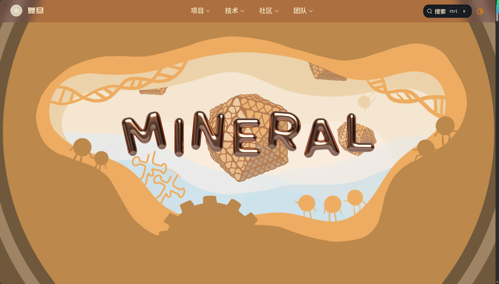
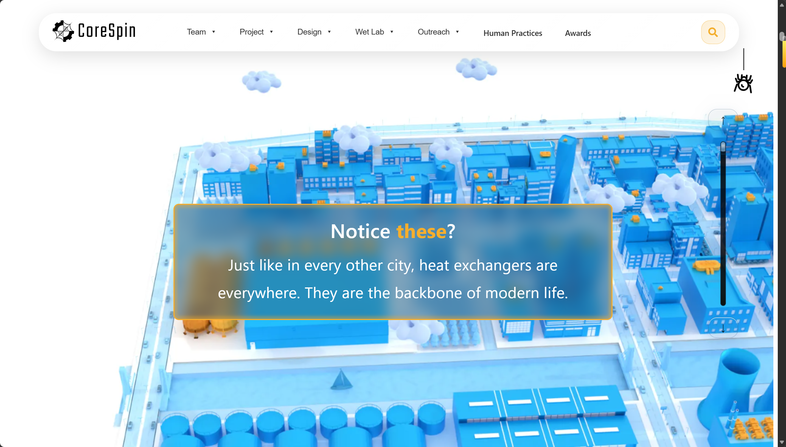

## 类似的花园相关的homepage
### 2024 iGEM - Marburg   
https://2024.igem.wiki/marburg/

#### 鼠标跟随的聚光灯效果


1. 结构
```text
底层：暗背景（雨林被砍）
中层：亮内容（蒲公英）
顶层：遮罩（黑色 + mask）
```

2. 关键点：
- 用一个圆形 mask跟随鼠标移动
- mask 内透出下面的花
- mask 外保持暗色

3. 实现：CSS mask + JS 鼠标跟踪
```CSS
CSS
.mask {
  mask-image: radial-gradient(circle at var(--x) var(--y), 
               transparent 0px, black 150px);
}
```

```JavaScript
JavaScript
document.addEventListener("mousemove", (e) => {
  document.documentElement.style.setProperty('--x', e.clientX + 'px');
  document.documentElement.style.setProperty('--y', e.clientY + 'px');
});
```

#### 图片对比滑块
- 一张 1993 年卫星图
- 一张 2022 年卫星图
- 中间一个圆形拖拽按钮
- 左右根据拖拽位置显示不同区域
- 角上再叠年份文字


1. 把两张图叠在一起，用中间的拖拽手柄控制上层图片的显示范围，从而做前后变化对比
2. 思路：两张图上下叠放。底层放after，上层放before，然后给上层图片外面套一个容器，这个容器的宽度跟着滑块位置变化。
```html
HTML
<div class="compare">
  
  <div class="overlay" id="overlay">
    
  </div>
  <div class="slider" id="slider"></div>
</div>
```
```CSS
CSS
.compare {
  position: relative;
  width: 800px;
  aspect-ratio: 16 / 9;
  overflow: hidden;
}

.img {
  position: absolute;
  inset: 0;
  width: 100%;
  height: 100%;
  object-fit: cover;
}

.overlay {
  position: absolute;
  inset: 0;
  width: 50%;
  overflow: hidden;
}

.slider {
  position: absolute;
  top: 0;
  left: 50%;
  transform: translateX(-50%);
  width: 4px;
  height: 100%;
  background: white;
  cursor: ew-resize;
}
```
```JavaScript
JavaScript
const container = document.querySelector('.compare');
const overlay = document.querySelector('.overlay');
const slider = document.querySelector('.slider');

let isDragging = false;

function update(position) {
  const rect = container.getBoundingClientRect();
  let x = position - rect.left;

  if (x < 0) x = 0;
  if (x > rect.width) x = rect.width;

  overlay.style.width = x + 'px';
  slider.style.left = x + 'px';
}

slider.addEventListener('mousedown', () => {
  isDragging = true;
});

window.addEventListener('mousemove', (e) => {
  if (!isDragging) return;
  update(e.clientX);
});

window.addEventListener('mouseup', () => {
  isDragging = false;
});
```
3. 可以直接用现成组件或库：
- React 里搜 react compare image
- 原生 JS 搜 before after slider js
- Vue 里搜 image comparison slider vue
先改`.vitepress/config.ts`：
```TypeScript
TypeScript
import { defineConfig } from 'vitepress'

export default defineConfig({
  head: [
    [
      'link',
      {
        rel: 'stylesheet',
        href: 'https://cdn.jsdelivr.net/npm/img-comparison-slider@8/dist/styles.css'
      }
    ],
    [
      'script',
      {
        defer: '',
        src: 'https://cdn.jsdelivr.net/npm/img-comparison-slider@8/dist/index.js'
      }
    ]
  ],

  vue: {
    template: {
      compilerOptions: {
        isCustomElement: (tag) => tag === 'img-comparison-slider'
      }
    }
  }
})
```
在`.md`文件里写：
```Markdown
Markdown
<ClientOnly>
  <div class="vp-compare-demo">
    
      
      

      <button
        slot="handle"
        class="vp-compare-handle"
        aria-label="拖动查看前后对比"
      >
        <span>↔</span>
      </button>
    </img-comparison-slider>

    <div class="vp-compare-label vp-compare-label-left">Before</div>
    <div class="vp-compare-label vp-compare-label-right">After</div>
  </div>
</ClientOnly>

<style>
.vp-compare-demo {
  position: relative;
  max-width: 960px;
  margin: 24px auto;
}

.vp-compare-slider {
  width: 100%;
  border-radius: 20px;
  overflow: hidden;

  --divider-width: 2px;
  --divider-color: rgba(255, 255, 255, 0.95);
  --divider-shadow: 0 0 12px rgba(0, 0, 0, 0.18);

  /* 隐藏默认手柄，改用自定义手柄 */
  --default-handle-width: 0px;
  --default-handle-opacity: 0;
}

.vp-compare-slider img {
  display: block;
  width: 100%;
  height: 560px;
  object-fit: cover;
}

.vp-compare-handle {
  width: 52px;
  height: 52px;
  border: none;
  border-radius: 999px;
  background: rgba(255, 255, 255, 0.92);
  color: #111827;
  font-size: 22px;
  font-weight: 700;
  cursor: ew-resize;
  display: flex;
  align-items: center;
  justify-content: center;
  box-shadow:
    0 10px 24px rgba(0, 0, 0, 0.20),
    0 2px 6px rgba(0, 0, 0, 0.12);
}

.vp-compare-handle span {
  transform: translateY(-1px);
  line-height: 1;
}

.vp-compare-label {
  position: absolute;
  top: 18px;
  z-index: 5;
  padding: 6px 12px;
  border-radius: 999px;
  background: rgba(17, 24, 39, 0.78);
  color: #fff;
  font-size: 13px;
  font-weight: 600;
  letter-spacing: 0.02em;
  pointer-events: none;
  backdrop-filter: blur(6px);
}

.vp-compare-label-left {
  left: 18px;
}

.vp-compare-label-right {
  right: 18px;
}

@media (max-width: 768px) {
  .vp-compare-slider img {
    height: 320px;
  }

  .vp-compare-handle {
    width: 44px;
    height: 44px;
    font-size: 18px;
  }

  .vp-compare-label {
    top: 12px;
    font-size: 12px;
    padding: 5px 10px;
  }

  .vp-compare-label-left {
    left: 12px;
  }

  .vp-compare-label-right {
    right: 12px;
  }
}
</style>
```
这里代码中替换图片路径和标签文字即可
```HTML
src="/images/before.jpg"
src="/images/after.jpg"
```
```HTML
Before
After
```

### 2023 WageningenUR
https://2023.igem.wiki/wageningenur/home?


#### 绘本式首屏 海报式构图

1. 特点
- 页面不像常规网页，更像一张插画海报
- 树枝从左下横向伸出，形成**视觉引导线**
- 文字和图片一起构图

2. 实现：插入图片 PNG+GIF图层叠加
- 静态底图：`.png`，手绘风格的场景图
- 动画层：`.gif`，雪花、火焰等动态效果
```HTML
HTML
<div class="HomeContainer">
               <!-- 静态底图 -->
      <!-- 动画层 -->
    <div class="home-text-container">...</div>                   <!-- 文字层 -->
</div>
```
```CSS
CSS
.HomeContainerImg {
    position: absolute;
    top: 0;
}
.HomeContainerGifOver {
    position: absolute;
    top: 0;
    left: 0;
}
```

#### 滑动感（树干）
##### position
我去研究了一下，滑动感大致分为三种情况的position
1. absolute：相对于**父容器**摆位置。父容器滚，它也跟着滚。
```CSS
CSS
.section {
  position: relative;
  height: 120vh;
}

.branch {
  position: absolute;
  left: 0;
  bottom: 10%;
}
```
这里 `.branch` 是绝对定位。
但如果 `.section` 随页面往上滚，枝条也会一起滚走。
2. fixed：相对于**浏览器视口**摆位置。页面滚，它不动。钉在屏幕上
```CSS
CSS
.branch {
  position: fixed;
  left: 0;
  bottom: 0;
}
```
3. sticky：平时像普通元素，滚到某个位置后会吸住。这种会造成一种很强的滚动叙事感，因为会感觉**某一层画面停住了，文字在继续滚**。
```CSS
.HomeContainerSticky {
  position: sticky;
  top: 0;
}
```
`top: 0` 的意思是：当这个元素滚到浏览器窗口顶部时，就粘在顶部。
```html
页面结构
<div class="HomeContainer" id="HomeContainer7-8-9">
  <div class="HomeContainerDistanceMeasureBig">
    <div id="HomeContainer7"></div>
    <div id="HomeContainer8"></div>
    <div id="HomeContainer9"></div>
  </div>

  <div id="HomeContainerSticky7-8-9" class="HomeContainerSticky">
    
    
    
  </div>
</div>
```
外层 `HomeContainer7-8-9 `很高,占了大概 3 屏的高度：
```CSS
#HomeContainer7-8-9 {
  height: calc(3 * var(--Home-Container-Height));
}
```
JS又在这个停住的过程中切换图片透明度：
```js
HomeContainerImg7.style.opacity = '1';
HomeContainerImg8.style.opacity = '0';
HomeContainerImg9.style.opacity = '0';
```
```js
HomeContainerImg7.style.opacity = '0';
HomeContainerImg8.style.opacity = '1';
HomeContainerImg9.style.opacity = '0';
```
```js
HomeContainerImg7.style.opacity = '0';
HomeContainerImg8.style.opacity = '0';
HomeContainerImg9.style.opacity = '1';
```
最终效果就是：往下滑，画面停在屏幕上，第一张图淡出，第二张图淡入...（通过透明度），直到这个大section滚完


##### 这个网页
1. 使用了`position:relative`的地方：用在**作为定位参照**或**轻微挪动但仍参与文档流**的元素上。
- 外层容器：它自己还是正常占据页面空间、跟着页面滚动，但里面的 `absolute` 图片可以以它为参照定位。
`home.css`:61
```CSS
.HomeContainer {
  position: relative;
}
```
- 一些装饰图会用 `relative` 来手动挪位置:图片本来还在文档流里（会跟着附近内容一起走），但被视觉上往上挪，并用负 margin 减少它占据的空间，看起来像背景装饰。
`description.html`:85
```html

```

2. `position:absolute`: 叠到某个 `section` 里面的图片、GIF、文字上。这些元素脱离普通文档流，叠在父容器指定位置。这里的**手绘场景 + 动画 + 文字**就是通过这种方式叠起来的。
- 首页主图：
`home.css`：16
```CSS
.HomeContainerImg {
  position: absolute;
  top: 0;
}
```
- 首页GIF覆盖层
`home.css`：120
```CSS
.HomeContainerGifOver {
  position: absolute;
  top: 0;
  left: 0;
}
```
- 首页文字层
`home.css`：166
```CSS
.home-text-container {
  z-index: 2;
  position: absolute;
}
```

3. `position:sticky`：用在首页滚动叙事里，让某个画面在滚动时钉住一段时间
`home.css`：130
```CSS
.HomeContainerSticky {
  position: sticky;
  top: 0;
}
```
平时像普通元素一样排队滚动；滚到某个位置后，暂时变成 fixed，粘在屏幕上；等它所在的父容器滚完了，再跟着离开。

4. `position: fixed`：用在始终固定在浏览器窗口上的东西。
- 开场遮罩：
`home.css`:8
```CSS
#HomeOverlayBox {
  position: fixed;
  top: 0;
  left: 0;
}
```
回到顶部按钮：
`home.css`:300
```CSS
#HomeBackToTop {
  position: fixed;
  bottom: 2vw;
  right: 2vw;
}
```
全站 preloader：
`style.css`:16
```CSS
.preloader {
  position: fixed;
  z-index: 100;
}
```
导航栏默认也是 fixed：
`menu.css`:10
```CSS
#ATfullBar {
  position: fixed;
  z-index: 1000;
}
```
但首页 JS 会把导航改成 absolute：
`home.js`:11
```CSS
ATfullBar.style.position = 'absolute';
```
fixed 是粘在浏览器窗口上，不随页面滚动；而首页把导航改成 absolute 后，它更像页面开头的一部分，会随页面内容滚走。

##### 背景花瓣飘落类似动画
###### 这个队伍的做法
1. 预先做好的 GIF 动画层，直接叠在静态手绘图上

```html


```
先插入静态页头图，然后再叠一个动画GIF。这个内容页里的 `headeranimation.gif` 在很多页面都重复使用，比如 `background.html`、`parts.html`、`wetlab.html`、`safety.html` 等

2. 叠上去，`style.css`:571：
```css
.overlayGifHeaders {
  position: absolute;
  top: 0;
  left: 0;
  z-index: 1;
  width: 100vw;
  height: 69.85vw;
  transition: opacity 0.7s ease;
}
```
这个 GIF 被绝对定位到页头左上角，宽高铺满页头，层级在静态图上方。浏览器正常播放 GIF，于是看起来像花瓣在背景上飘

######  GIF怎么做
重点：**GIF 里只放花瓣动画，背景保持透明；网页里把它盖在静态 header 上**
1. 先确定底图尺寸。最好按和静态页头图一样的比例做 GIF。比如静态 header 是 1920 x 1341，那 GIF 也做成 1920 x 1341，这样叠上去不会错位。
```css
width: 100vw;
height: 69.85vw;
```
2. 做一个透明画布
在 Photoshop、After Effects、Procreate、Krita、Figma 动画插件、Canva 等工具里，新建透明背景画布。

3. 只画会动的元素:
比如只放花瓣，不要再放树和背景。
花瓣可以在不同帧里位置不同：
```text
第 1 帧：花瓣在左上
第 2 帧：花瓣往右下移动一点
第 3 帧：再往右下移动一点
...
```
4. 导出为 GIF
导出时要保留透明背景。文件名类似`headeranimation.gif`

5. 网页里这样叠：
```html
html
<header style="position: relative;">
  
  
</header>
```
```css
css
.overlayGifHeaders {
  position: absolute;
  top: 0;
  left: 0;
  z-index: 1;
  width: 100vw;
  height: 69.85vw;
  pointer-events: none;
}
```

6. 如果用 Photoshop，流程大概是：
- 打开静态页头图作为参考。
- 新建透明图层，画几片花瓣。
- 打开时间轴 `Window > Timeline`。
- 做多帧动画，每一帧移动花瓣一点点。
- 隐藏静态页头参考图，只保留花瓣图层。
E- xport > Save for Web (Legacy)，格式选 GIF，透明勾上，循环选 Forever。
- 不过更现代的做法其实是导出透明 webm/apng，质量会比 GIF 好很多；但这个项目用的是 GIF，因为实现简单，直接 `` 就能播放。


## 有亮点的homepage
### 2024 fudan
#### 开窗效果
##### 效果整体描述

打开首页，首先是带有标题和多层窗框的画面。向下滚动鼠标，会发生两件事：

- 放大：多层窗框以不同速度快速放大，产生一种正在向窗户里面前进的感觉
- 开窗：随后遮蔽向上退去，原本被遮住的下方世界逐渐显现，像窗户被打开一样

代码在`src/.vuepress/components/HomePage.vue`

##### 页面结构
页面被分成了两层

1. 固定的动画层：`.animation-container`
```html
<div class="animation-container">
  <svg viewBox="0 0 1920 953" width="100%" height="100%">
    <!-- 所有 SVG 图片和遮罩都在这里 -->
  </svg>
</div>
```
```css
.animation-container {
  position: fixed;      /* 关键：固定在整个视口上，不随滚动条移动 */
  top: 0;
  left: 50%;
  width: 100%;
  height: 100%;
  z-index: 1;           /* 放在底层 */
  pointer-events: none; /* 不阻挡鼠标点击下层内容 */
}
```
这个固定层的容器是不动的，但是图案等会随着下滑进度条而变

2. 可滚动的内容层: `<main>`
```html
<main>
  <div class="scrollDist"></div>  <!-- 高度 300vh，专门用来记录进度条 -->
  <section class="page-1">...</section>
  <section class="page-2">...</section>
  <!-- ... 后续很多 section -->
</main>
```
```css
main {
  position: relative;
  z-index: 2;  /* 放在上层，覆盖在动画层之上 */
}
.scrollDist {
  height: 300vh;  /* 300% 的屏幕高度，提供很长的滚动距离 */
}
```
`main`才是真正的网页内容，`.scrollDist`是一个非常高的空白区域，是为了让浏览器出现一个很长的滚动条，方便控制开窗过程的动画

##### 核心技术
###### SVG Mask 遮幕
一种镂空工具，能选择性的遮住或显示下方的内容

1. 代码中的Mask定义
在 `HomePage.vue:11-15`
```html
<mask id="m">
  <g class="cloud1">
    <!-- 一个巨大的白色矩形 -->
    <rect fill="#fff" width="100%" height="1801" y="953" />
  </g>
</mask>
```

2. 被遮幕的内容（在Mask下方）
位置`HomePage.vue:89-98`
```html
<g mask="url(#m)">  <!-- 这一组元素要接受 id="m" 的遮罩控制 -->
  <rect fill="#CDE3EC" width="100%" height="100%" class="gan"/>
  <image class="mineral2" xlink:href="..." />
  <g id="scroll-arrow">
    <polygon class="down-arrow" points="960,910 940,880 980,880" fill="#000" />
  </g>
</g>
```

3. Mask的动态变化，GSAP驱动
GSAP是js的一个动画库，通常用于网页中的视觉效果动画

位置 `HomePage.vue:1366`
```javascript
.fromTo('.cloud1', { y: 100 }, { y: -950, duration: 5 }, 'afterScaling')
```

|状态	|`.cloud1` 的 y 值	|白色矩形的位置	|被遮罩内容（gan + mineral2 + 箭头）|
|---|---|---|---|
|初始|	953	|刚好盖住整个屏幕下方|	完全看不见（被白色矩形遮住）|
|滚动中	|100 → 0 → -950	|白色矩形逐渐向上移出屏幕|	随着矩形上移，逐渐显露出来|
|最终	|-950	|完全移出屏幕上方	|完全可见|

`.cloud1` 里有一块巨大的白色幕布。最开始这块幕布横在屏幕下方，把下方的世界盖住了。滚动时，GSAP 把这块幕布向上拉走，幕布下面的浅蓝色背景和矿物图案就一点一点露出来了，这就是开窗的视觉来源。

###### ScrollTrigger 滚动
1. GSAP:前端最强大的动画库之一，可以精确控制任何DOM元素或SVG元素的：
- 位置（`x,y`）
- 缩放（`scale`）
- 旋转（`rotation`）
- 透明度（`opacity`）
- 颜色（`fill`,`backgroundColor`）

2. ScrollTrigger
是GSAP的一个插件，能把**滚动条的进度**和**动画的进度**绑定在一起。

3. 关键的ScrollTrigger配置
位置：`HomePage.vue:1298-1313`
```javascript
const tl = gsap.timeline({
  scrollTrigger: {
    trigger: '.scrollDist',     // 监听哪个元素
    start: 'top top',           // 当 .scrollDist 的顶部碰到视口顶部时，动画开始
    end: 'bottom bottom',       // 当 .scrollDist 的底部碰到视口底部时，动画结束
    scrub: 1,                   // 动画进度紧跟滚动进度（1秒缓冲）
  },
});
```
- `.scrollDist`高300vh，有3个屏幕高度的滚动距离来播放这个开窗效果的动画
- 滚到0%，动画在0%，滚到50%，动画在50%

4. 动画时间线的两段式结构
```javascript
// 第一段：缩放（0 ~ afterScaling）
tl.fromTo(['.frame0'], { scale: 1 }, { scale: 18, duration: 4, ease: 'power2.inOut' }, 0);
tl.fromTo(['.frame1'], { scale: 1 }, { scale: 15, duration: 5, ease: 'power2.inOut' }, 0);
tl.fromTo(['.frame2'], { scale: 1 }, { scale: 11, duration: 6, ease: 'power2.inOut' }, 0);
// ... 更多元素的缩放

// 标记一个节点
.addLabel('afterScaling')

// 第二段：位移/开窗（afterScaling ~ afterframe）
.fromTo('.frame7', { y: 0 }, { y: -200, duration: 5 }, 'afterScaling')
.fromTo('.cloud1', { y: 100 }, { y: -950, duration: 5 }, 'afterScaling')
.fromTo('.mineral2', { y: 200 }, { y: -350, duration: 5 }, 'afterScaling')
// ...
.addLabel('afterframe');
```
时间线进度与滚动进度的对应关系

| 滚动进度  | 时间线阶段    | 用户看到的画面                                                      |
| --------- | ------------- | --------------------------------------------------------------------- |
| 0% ~ 60%  | 第一段        | 多层窗框和云层快速放大，产生"向深处飞去"的感觉                        |
| 60% ~ 90% | 第二段        | 放大完成后，遮罩云层向上退去，窗框和波浪向上飞出，下方新世界显露       |
| 90% ~ 100%| afterframe    | 矿物和箭头继续上移，引导用户进入下面的 page-1                        |

###### 多层视差
 缩放的元素分为几类，每一类的放大倍数不同，从而产生视差（近大远小）

1） 窗框类（放大最猛，营造穿透感）

| 元素    | 初始 scale | 最终 scale | 视觉效果                              |
| ------- | ---------- | ---------- | ------------------------------------- |
| .frame0 | 1          | 18         | 最前面的窗框，飞速变大，感觉向人扑来   |
| .frame1 | 1          | 15         | 第二层窗框，放大也很快                |
| .frame2 | 1          | 11         | 第三层窗框，放大较快                  |

2） 波浪和中景元素（中等放大）

| 元素       | 初始 scale | 最终 scale | 视觉效果                              |
| ---------- | ---------- | ---------- | ------------------------------------- |
| .wave1~4 + .frame4 | 1          | 1.6        | 远处的波浪和山，放大很慢，感觉在背景深处 |
| .carbo2~5  | 1          | 1.4        | 碳分子，中等速度                      |

3） 标题和特殊元素

| 元素    | 初始 scale | 最终 scale | 视觉效果                              |
| ------- | ---------- | ---------- | ------------------------------------- |
| .title  | 0.6        | 1          | 标题从较小状态慢慢放大到正常           |
| .carbo1 | 0.6        | 0.8        | 一个远处的碳分子，只稍微变大          |

1. GSAP fromTo 语法拆解

每一行都长这样：

```js
tl.fromTo(
  ['.frame0'],                           // 目标元素（选择器）
  { scale: 1, transformOrigin: 'center center' },  // 起始状态
  { scale: 18, duration: 4, ease: 'power2.inOut' }, // 结束状态
  0                                      // 在时间线上的开始位置（第0秒）
);
```
参数解释：
- `['.frame0']`：给谁做动画。这里是一个数组，里面放 CSS 选择器。
- `{ scale: 1, transformOrigin: 'center center' }`：动画开始时，这个元素的状态。
  - `scale: 1` = 原始大小
  - `transformOrigin: 'center center'` = 从元素中心点开始缩放
- `{ scale: 18, duration: 4, ease: 'power2.inOut' }`：动画结束时，这个元素的状态。
  - `scale: 18` = 变成原来的 18 倍大
  - `duration: 4` = 这个过程占用时间线 4 个单位（不是真实秒数，因为 ScrollTrigger 会把它映射到滚动距离上）
  - `ease: 'power2.inOut'` = 先慢后快再慢，很平滑
- `0`：这个动画从时间线的第 0 个单位开始。也就是说，所有缩放动画是同时开始的。

2. 视差来源： 
人眼的经验告诉我们：当走近一个隧道时，隧道口（近处）会**变化很大**，而隧道深处的东西**变化很小**。这里把 `.frame0` 放大 18 倍，模拟正在飞速穿过最前面的窗框；而远处的波浪只放大 1.6 倍，模拟它们很远。这种**速度差异**就是**纵深感**的来源。


#### SVG图片层叠
1. 元素顺序
在SVG中，后写的元素会覆盖先写的元素
```html
<image class="frame7" />   <!-- 最底层：远处的背景山 -->
<image class="carbo5" />
<image class="frame6" />
<image class="carbo4" />
<image class="wave4" />
<image class="carbo3" />
<image class="wave3" />
<image class="frame4" />
<image class="carbo2" />
<image class="wave2" />
<image class="carbo1" />
<image class="wave1" />
<image class="mineral" />
<image class="frame2" />   <!-- 中间层 -->
<image class="frame1" />
<image class="frame0" />   <!-- 最前面：离你最近的窗框 -->
<image class="title" />    <!-- 标题在最上方 -->

<!-- 遮罩层（盖住下面的 gan/mineral2/箭头） -->
<g mask="url(#m)">
  <rect class="gan" fill="#CDE3EC" />
  <image class="mineral2" />
  <g id="scroll-arrow">...</g>
</g>
```

`frame7` 是最先写的，所以在最底层；`title` 是后写的，所以在最上层。而遮罩组 `<g mask="url(#m)">` 是最后写的，但它罩着的内容被 `.cloud1` 遮住了，初始状态下看不见。

2.  元素的分类
可以把这些元素分成三类：

|类别	|元素|	动画行为|
|---|---|---|
|前景窗框	|`frame0`,` frame1`, `frame2`|	快速放大，然后向上飞出|
|中景装饰	|`wave1~4`, `carbo1~5`, `frame4~7`	|中等放大，然后向上飞出|
|背景/遮罩后内容|	`gan`, `mineral2`, `down-arrow`	|被 mask 遮住，mask 移开后显露并上移|


### 2025 msp-maastricht


#### 3D建模？
这个 wiki 首页的 3D 穿梭效果 并不是浏览器实时 3D 渲染，而是用 预渲染帧序列 + 滚动驱动（Scrollytelling） 实现的。

##### 预渲染帧序列动画
本质上是 999 张静态图片 按滚动位置快速切换

1. 数据与加载
在`src/pages/HomePage.tsx:22-26`：
```tsx
const FRAME_COUNT = 999;           // 总帧数
const BATCH_SIZE = 25;             // 分批预加载
const getFrameSrc = (index: number) =>
  getImageUrl(`/landingPage/newcity/${String(index).padStart(4, "0")}.webp`);
```
页面启动时会并发预加载这 999 张 webp 图片（每批 25 张），并显示一个加载进度条。

2. 滚动映射
在 `src/pages/HomePage.tsx:162-197`，代码把**滚动位置**映射为**当前帧索引**：
```tsx
function generateScrollToFrameMapping(frameCount, frameActions, scrollUnitsPerFrame = 2) {
  const mapping = [];
  for (let frame = 0; frame < frameCount; frame++) {
    const action = sortedActions.find(a => a.pauseAt === frame);
    if (action) {
      // 在关键帧处“暂停”，多重复几次该帧，制造出停留感
      for (let i = 0; i < action.duration; i++) mapping.push(frame);
    } else {
      // 普通帧：每帧对应 N 个滚动像素单位
      for (let i = 0; i < scrollUnitsPerFrame; i++) mapping.push(frame);
    }
  }
  return mapping;
}
```
页面有一个高度极大的容器（ANIMATION_HEIGHT_FACTOR * 140vh * 3），用户滚动时，根据滚动进度去 mapping 数组里查当前该显示第几帧。

3. Canvas 逐帧绘制
在 `src/pages/HomePage.tsx:452-504`：
```tsx
const renderFrame = useCallback((index: number) => {
  const ctx = canvasRef.current?.getContext("2d");
  const img = imagesRef.current[index];
  if (ctx && img?.complete) {
    // 保持图片比例，自动适配屏幕
    const imgAspect = img.naturalWidth / img.naturalHeight;
    const canvasAspect = canvasRef.current.width / canvasRef.current.height;
    // ...计算 drawWidth/drawHeight/offsetX/offsetY
    ctx.drawImage(img, offsetX, offsetY, drawWidth, drawHeight);
  }
}, [canvasSize]);
```
滚动事件触发时，通过 `requestAnimationFrame` 调用 `renderFrame`，在 `<canvas>` 上画出当前帧。

##### 交互覆盖层
首页在特定帧会弹出信息卡片、指示点、标题等。这些由 `InteractiveOverlay` 组件负责

1. 关键帧动作配置
在 `src/pages/HomePage.tsx:43-159`：
```tsx
const FRAME_ACTIONS = [
  { pauseAt: 25,  duration: 200, overlayId: "introOverlay" },
  { pauseAt: 40,  duration: 200, overlayId: "firstZoomInBox",  overlayConfigs: ["refrigerator"] },
  { pauseAt: 80,  duration: 200, overlayId: "secondZoomInBox", overlayConfigs: ["airConditioner"] },
  // ... 冰箱、空调、医疗设备、汽车散热器、数据中心、HVAC、热交换器、生物膜、解决方案、地球
];
```
当滚动进入这些帧范围时，页面会暂停（通过让 mapping 数组重复同一帧实现），并显示对应的 `overlayConfigs`。

2. 三种覆盖层模式
在 `src/components/InteractiveOverlay.tsx` 中，支持三种展示形式：

- Intro 模式：中央大卡片，用于开场引导。
- Advanced 模式：画面某个坐标处出现小黄点 + 连线 + 信息卡片（如冰箱、空调的数据弹窗）。坐标基于原始 1920×1080 设计稿按比例缩放。
- Section 模式：全屏大字标题 + 描述（如 HVAC Systems、Biofilm Formation 等大段文字说明）。
- Earth 模式：地球四周分布四个关键词（SUSTAINABILITY、CIRCULARITY 等）。
