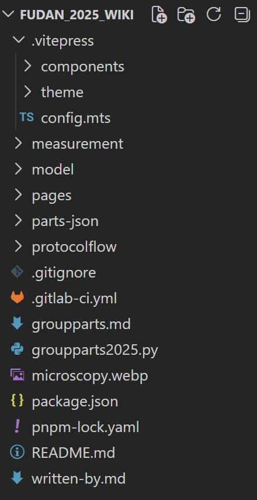
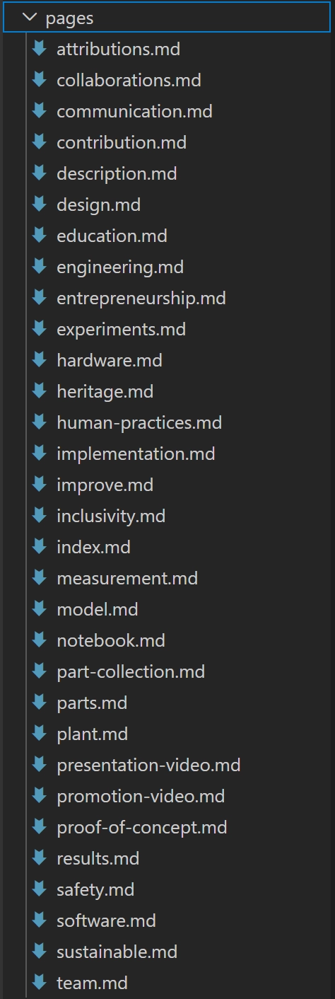
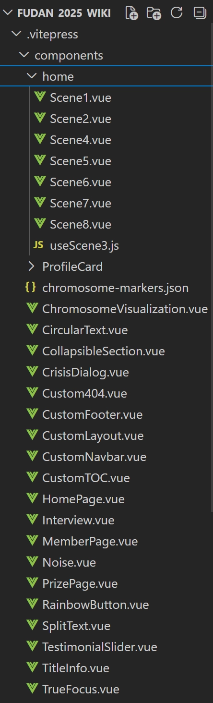

## 2025 Judge Handbook 
直接把好 wiki 的五个方面写出来了：
1. 项目与目标是否讲清
2. 结果是否有实验支撑
3. 设计是否帮助理解内容
4. 是否能成为后续团队的可靠记录
5. 引用是否规范。

它还特别强调：
(1)wiki 是 judge 在 jamboree 前最先看的东西，第一印象非常关键。
(2)核心不是做个漂亮网站，而是让judge低成本理解你们做了什么、为什么这么做、证据在哪里、以后别人能不能复现

### 2022 Patras-Medicine
**首页极强的信息压缩 + 侧边导航极强的 judge 友好性**
2025 Judge Handbook 把 Patras-Medicine 2022 当成 Best Wiki 正面范例来讲：
1. 首页一进入就给出动机、项目简介、疾病背景和 synthetic biology 方案；
2. 底部直接把读者导向 wet lab、product design、human practices、education、model 等关键模块；
3. 侧边菜单让 judge 可以快速对应打分项来找内容。

官方评价它“组织性强、流程清楚、配图帮助非专业读者理解”。

### 2022 Lambert_GA 
**叙事极清楚，结构极标准，方法-结果-证据闭环完整**
Handbook 对 Lambert_GA 2022 的评价也很典型
1. 首页用很短的文字和示意图就把产品 CADlock、疾病背景和总体方案讲清楚；
2. Description 页采用 abstract、problem、background、approach、references 这样的标准学术结构；
3. 整个 wiki 在 team / project / wetlab / drylab / human practices / judging 等层次上很整齐，还给出了充分的图、表、结果和参考资料。

### 2023/2024 Fudan 
**内容体量大，但仍靠工程化框架维持一致性**

Fudan 2023 和 2024 的 GitLab README 都明确写了：
wiki 是用 Vue.js + VuePress 搭的，并且以 GitLab Pages / PWA 方式发布，不走 Flask 这类传统后端站点路线。
2024 仓库还有 444 commits，说明其 wiki 不是临时拼出来的，而是持续工程化维护。

这类路线的优点是：内容驱动、多人协作、组件复用、后期统一改风格成本低。

## 2025 fudan 
### 文件位置总览



| 内容类型 | 位置 | 说明 |
| --- | --- | --- |
| **页面文字** | `pages/*.md` | 35个页面，直接改 `.md` 文件 |
| **Vue 组件** | `.vitepress/components/` | 首页、导航栏、页脚、可视化组件 |
| **站点配置** | `.vitepress/config.mts` | 网站标题、PWA配置、manifest |
| **图片** | 外部托管 `static.igem.wiki` | igem会有专门的图床，上传之后可以获得图片的URL |
| 首页 | 下面说，主要有两个部分，homepage和home | wiki首页那个很多动画弹来弹去的那个复杂页面 |

---

### 替换（内容页的小改，2026 改这里就行）

首页比较复杂，我还在研究

#### 1. 页面文字（pages）

(1)在pages/ 目录下  `.md`的是每个内容页的文本，对应parts, description, model等的页面



(2)每个 `.md` 文件顶部有 Frontmatter，改这里：

```yaml
 title: "新标题"
  author:
    - name: "新作者"
  heroImage: "https://static.igem.wiki/teams/【新团队号】/xxx.webp"
  
  
  eg 2025:
  
  title: Attributions
authors:
  - name: Duan Yuxin
    url: /fudan/team/#Yuxin
    avatar: https://static.igem.wiki/teams/5643/pageimage/team/dyx-a.webp
layout: igem
heroImage: https://static.igem.wiki/teams/5643/header/attribution.webp
description: On this page, we acknowledge all contributors to our project. THANK YOU!
```

(3)改正文内容：

- Frontmatter 下方的就是正文，用 Markdown 语法写
- 直接删掉 2025 的内容，写2026 的内容

#### 2. 图片替换
- 2025 的图片 URL：https://static.igem.wiki/teams/5643/...
- 2026 改成：[https://static.igem.wiki/teams/【新团队号】/](https://static.igem.wiki/teams/%E3%80%90%E4%BD%A0%E4%BB%AC%E7%9A%84%E6%96%B0%E5%9B%A2%E9%98%9F%E5%8F%B7%E3%80%91/)...
- 全局搜索替换 5643 → 新团队号
- 去 [tools.igem.org/uploads](http://tools.igem.org/uploads) 上传自己的图片
- 获得新的图片 URL，替换掉旧的图片 URL

#### 3. 作者信息

直接编辑 [written-by.md](http://written-by.md/) 表格，改成 2026 的队员

#### 4. 首页组件

文件位置：

（1）.vitepress/components/HomePage.vue

（2）.vitepress/components/home/，该目录下有8个scene的 .vue 组件



HomePage.vue定义了所有首页的图片URL、文字内容，还控制整个首页的流程，Scene1~8.vue调用定义好的数据，渲染自己这一场景的画面

简单修改：

- 首页的大标题、副标题
- 背景图片
- 按钮文字和链接

图片替换：在 HomePage.vue 里找 static.igem.wiki，替换成新图片URL。

| 改什么 | 在哪个文件改 | 在文件中的位置 |
| --- | --- | --- |
| 换图片/动画 | HomePage.vue | 第 89-110 行的 URL |
| 改页面文字 | HomePage.vue | 第 112-138 行的内容 |
| 改场景布局 | 对应的 SceneX.vue | template 和 style 部分 |
| 改动画效果 | HomePage.vue | setupScrollAnimation() 函数 |


#### 5. 站点配置（config.mts）

```jsx

title: "新队名",
description: "2026 wiki",
manifest: {
name: 'Team XXX 2026 Wiki',
}
```

#### 6. 改导航栏和页脚

导航栏：.vitepress/components/CustomNavbar.vue

- 改菜单项文字和链接
- 改 Logo 图片

页脚：.vitepress/components/CustomFooter.vue

- 改版权信息
- 改联系方式

#### 7. 图片补充

页头背景图： Frontmatter 里的 heroImage

页面内的图：pages里的.md里的``

交互组件：在需要的地方加`<script setup> `

#### 注意事项

- 图片不要放仓库：上传到 iGEM 的 [tools.igem.org/uploads](http://tools.igem.org/uploads%EF%BC%8C%E7%84%B6%E5%90%8E%E7%94%A8)，然后用 URL引用
- 组件名不改：保持 HomePage.vue、CustomNavbar.vue等文件名，只改内容
- Frontmatter 格式不要动：每个 .md 文件顶部的 --- 之间的格式固定