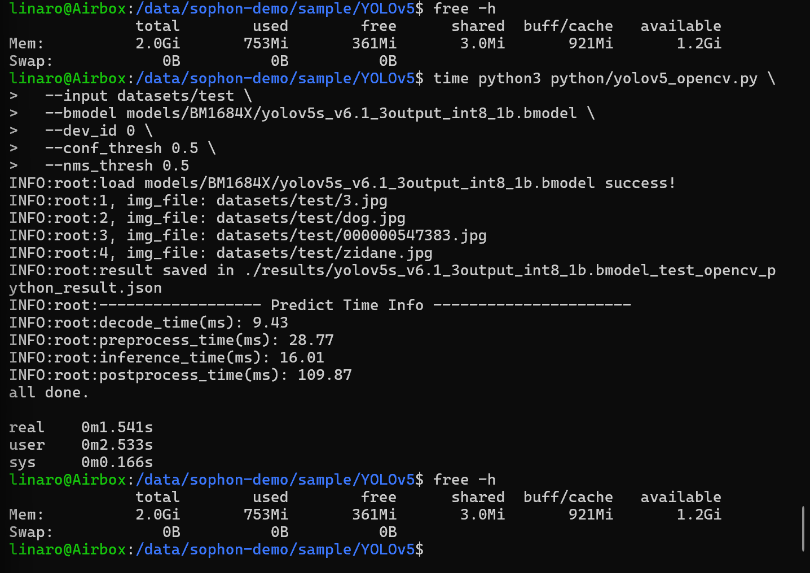
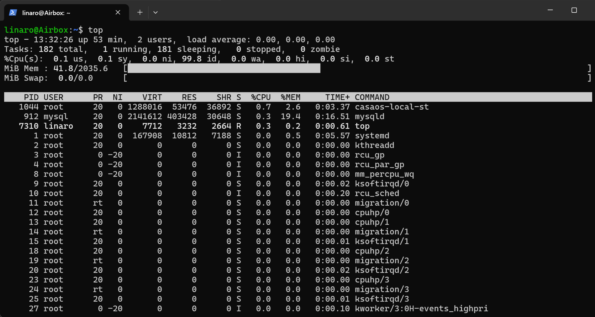
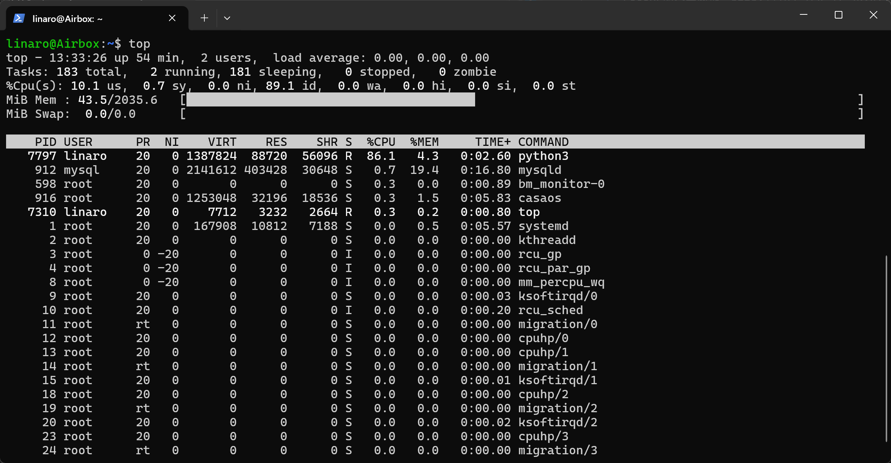

## 常用：
1. 硬件盒的说明文件：https://docs.radxa.com/fogwise/airbox
2. CasaOS的登录网址：http://192.168.31.70:81/
3. 登录SSH：
- 输入：ssh linaro@192.168.31.70
- 或者输入：ssh admin@192.168.31.70
4. 盒子关机：要在airbox里输入`sudo poweroff`，然后再拔掉盒子的电源
5. 处理器：BM1684X（算能面向深度学习领域推出的第四代张量处理器）

---
## 硬件连接准备工作
### 路由器
1. 一根电源线，插插座
2. 一根网线，接寝室的网
3. 一根网线，连airbox盒子的WAN口

### 硬件盒airbox
1. 一根网线，连路由器
2. 一根debug线，接电脑USB
3. 一根power线，插插座

### 网络
电脑网络连接路由器：airbox_lab

### ip
192.168.31.1   路由器/网关

192.168.31.11  电脑

192.168.31.70  AirBox

---

## 插入新的内存卡
### 插卡
1. 在airbox侧面一个TF卡槽，插进去
2. 登录进入airbox,输入`lsblk`，得到结果
```bash
linaro@Airbox:~$ lsblk
NAME         MAJ:MIN RM  SIZE RO TYPE MOUNTPOINT
mmcblk0      179:0    0 57.6G  0 disk
├─mmcblk0p1  179:1    0  128M  0 part /boot
├─mmcblk0p2  179:2    0    3G  0 part /recovery
├─mmcblk0p3  179:3    0   10M  0 part
├─mmcblk0p4  179:4    0    3G  0 part /media/root-ro
├─mmcblk0p5  179:5    0    6G  0 part /media/root-rw
├─mmcblk0p6  179:6    0    2G  0 part /opt
└─mmcblk0p7  179:7    0 43.5G  0 part /data
mmcblk0boot0 179:8    0    4M  1 disk
mmcblk0boot1 179:16   0    4M  1 disk
mmcblk1      179:24   0  233G  0 disk
└─mmcblk1p1  179:25   0  233G  0 part
```
说明
- 系统盘：mmcblk0
- 新插的 TF 卡：mmcblk1
- 卡分区：mmcblk1p1

### 挂载
在 Linux 里：设备 ≠ 文件系统路径，需要手动“把这个设备映射到某个目录”
#### 确认卡的格式
输入`lsblk -f`，得到
```bash
linaro@Airbox:~$ lsblk -f
NAME         FSTYPE LABEL UUID                                 FSAVAIL FSUSE% MOUNTPOINT
mmcblk0
├─mmcblk0p1  vfat         BF6A-61D9                              34.8M    73% /boot
├─mmcblk0p2  ext4         1ed9cf38-4010-4a53-a982-518a1a3a97ec    2.7G     2% /recovery
├─mmcblk0p3
├─mmcblk0p4  ext4         ddc16b78-6b01-45d0-a384-aadefac8e103  313.5M    84% /media/root-ro
├─mmcblk0p5  ext4         c83cdb58-0dc1-4590-9be4-7b3dd9386b61  791.6M    82% /media/root-rw
├─mmcblk0p6  ext4         145e1c67-1225-44dc-8b5d-086f74ddc7fc  421.7M    74% /opt
└─mmcblk0p7  ext4         7fffb335-a57b-46a0-8284-3d7dfef61009      1G    93% /data
mmcblk0boot0
mmcblk0boot1
mmcblk1
└─mmcblk1p1  vfat         3219-C816
```
看到`mmcblk1p1`是`vfat`

#### 创建挂载目录
输入
```bash
sudo mkdir -p /mnt/sdcard
```
意思是：在系统里新建一个目录,以后TF卡内容就从这个目录进去看

#### 先手动挂载一次
输入
```bash
sudo mount -t vfat /dev/mmcblk1p1 /mnt/sdcard
```

#### 验证挂载是否成功
输入`df -h`，结果
```bash
linaro@Airbox:~$ df -h
Filesystem      Size  Used Avail Use% Mounted on
overlay         5.9G  4.8G  792M  87% /
devtmpfs        951M     0  951M   0% /dev
tmpfs          1018M     0 1018M   0% /dev/shm
tmpfs           204M  3.6M  201M   2% /run
tmpfs           5.0M     0  5.0M   0% /run/lock
tmpfs          1018M     0 1018M   0% /sys/fs/cgroup
/dev/mmcblk0p7   43G   40G  1.1G  98% /data
/dev/mmcblk0p4  2.9G  2.5G  314M  89% /media/root-ro
/dev/mmcblk0p5  5.9G  4.8G  792M  87% /media/root-rw
/dev/mmcblk0p6  2.0G  1.5G  422M  78% /opt
/dev/mmcblk0p2  2.9G   51M  2.8G   2% /recovery
/dev/mmcblk0p1  128M   93M   35M  73% /boot
tmpfs           204M     0  204M   0% /run/user/1000
/dev/mmcblk1p1  233G  256K  233G   1% /mnt/sdcard
```
有`/mnt/sdcard`，说明挂载成功

#### 验证卡是否正常
尝试往卡里写入一个文件，但发现有权限问题
```bash
linaro@Airbox:~$ cd /mnt/sdcard
linaro@Airbox:/mnt/sdcard$ touch test.txt
touch: cannot touch 'test.txt': Permission denied
linaro@Airbox:/mnt/sdcard$ sudo touch test.txt
linaro@Airbox:/mnt/sdcard$ ls
'System Volume Information'   test.txt
```

#### 重新挂载（带权限参数）
1. 先卸载当前挂载
```bash
linaro@Airbox:/mnt/sdcard$ sudo umount /mnt/sdcard
umount: /mnt/sdcard: target is busy.
```
2. 提示忙碌，先退出来
```bash
linaro@Airbox:/mnt/sdcard$ cd ~
linaro@Airbox:~$ sudo umount /mnt/sdcard
```
3. 用带权限参数的方式重新挂载
```bash
sudo mount -t vfat /dev/mmcblk1p1 /mnt/sdcard -o uid=1000,gid=1000,umask=000
```
- uid=1000：把文件归给用户 linaro
- gid=1000：把组也设给 linaro
- umask=000：允许读写执行
4. 测试是否成功
```bash
linaro@Airbox:~$ cd /mnt/sdcard
linaro@Airbox:/mnt/sdcard$ touch test2.txt
linaro@Airbox:/mnt/sdcard$ ls
'System Volume Information'   test.txt   test2.txt
```

#### 设置开机自动挂载
1. 查UUID
```bash
linaro@Airbox:/mnt/sdcard$ sudo blkid /dev/mmcblk1p1
/dev/mmcblk1p1: UUID="3219-C816" TYPE="vfat"
```
UUID为`3219-C816`
2. 尝试使用`fstab`自动挂载，失败（改了`/etc/fstab`后重启没有生效），然后用`rc.local`开机脚本
3. 在`/etc/rc.local`里加入
```bash
mkdir -p /mnt/sdcard
mount -t vfat /dev/mmcblk1p1 /mnt/sdcard -o uid=1000,gid=1000,umask=000 || true
```
放在`exit 0`前面
4. 重启`sudo reboot`后重新登录，再执行`df -h`，成功看到`/dev/mmcblk1p1  233G  256K  233G   1% /mnt/sdcard`


## 用CasaOS跑模型
### 基本操作
1. 登录网址：http://192.168.31.70:81/
2. 用户名：xhlhz； 密码：xhlhz0301
3. 按照下面网址的说明进行app的安装，https://docs.radxa.com/fogwise/airbox/casaos/casaos_app_install#%E5%AE%89%E8%A3%85-radxa-llama3-chatbot-gpt-app，

### 安装 radxa Stable Diffusion 文/图生图 App
1. Error 1: 填的镜像名写错了，把版本号 tag 填重复了


2. Error2：CasaOS 已经开始去 Docker Hub 拉镜像了，但在访问 Docker Hub 的镜像仓库入口 registry-1.docker.io 这一步失败了


3. 按照ai的指示去找问题
(1)登录SSH
- 打开powershell
- 输入：ssh linaro@192.168.31.70
- 或者输入：ssh admin@192.168.31.70

(2)依次输入四条指令，观察结果


- ping -c 4 8.8.8.8 成功 → AirBox 能上外网
- ping -c 4 registry-1.docker.io 解析到了2a03:2880:...→ 域名解析也正常
- 但它解析出来的是一个 IPv6 地址
- curl 和 docker pull 都卡在这个 IPv6 地址的 443 端口超时 → AirBox 当前对 Docker Hub 的 IPv6 连不通

说明：AirBox 在访问 registry-1.docker.io 时优先走了 IPv6，但这条 IPv6 网络路径不通，于是 Docker 拉镜像失败。

4. 但是强行设IPv4也不行，又跟着ai测试，发现是无法访问国外服务，于是给当前shell配置代理
```powershell
linaro@Airbox:~$ export http_proxy=http://192.168.31.11:7897
linaro@Airbox:~$ export https_proxy=http://192.168.31.11:7897
linaro@Airbox:~$ export HTTP_PROXY=http://192.168.31.11:7897
linaro@Airbox:~$ export HTTPS_PROXY=http://192.168.31.11:7897
```

5. 但是docker daemon还没有走代理，`docker pull hello-world`还是会失败，所以给docker代理配置文件

(1)创建 Docker 代理配置目录
```powershell
sudo mkdir -p /etc/systemd/system/docker.service.d
```
(2)直接写入配置文件
```powershell
sudo tee /etc/systemd/system/docker.service.d/http-proxy.conf > /dev/null <<'EOF'
[Service]
Environment="HTTP_PROXY=http://192.168.31.11:7897"
Environment="HTTPS_PROXY=http://192.168.31.11:7897"
Environment="NO_PROXY=localhost,127.0.0.1,::1"
EOF
```
(3)重载并重启 Docker
```powershell
sudo systemctl daemon-reload
sudo systemctl restart docker
```
(4)检查 Docker 是否真的读到了代理
```powershell
systemctl show --property=Environment docker
```
能看到结果中包含类似
```powershell
HTTP_PROXY=http://192.168.31.11:7897
HTTPS_PROXY=http://192.168.31.11:7897
```
(5)再试拉镜像
```powershell
docker pull hello-world
```

6. Error3：no space left
输入命令查看当前空间

---

## AirBox 上 YOLOv5 现成 Demo 试跑总结

### 1. 任务目标
在**不修改旧卡原有内容**的前提下，利用盒子内已有的 `sophon-demo` 资源，尝试跑通一个现成模型，熟悉 AirBox 的部署与推理流程。

### 2. 环境与资源确认
本次使用的 Demo 路径为： `/data/sophon-demo/sample/YOLOv5`

检查确认：
- 盒子型号为 **BM1684X AirBox**
- `sophon.sail` 可正常导入
- 系统可识别到 **1 个 TPU**
- `bmrt_test`、`bm-smi` 工具存在
- YOLOv5 目录下已存在：
  - `models/`
  - `datasets/`
  - `python/`
  - `results/`

本地已存在可用模型和测试数据，无需额外下载。


### 3. 试跑过程

#### 3.1 初始尝试
最初误用了 `BM1688` 目录下的模型，出现：
- `tpu_kernel_launch failed`
- `invalid bmodel`

说明模型目标平台与当前盒子不匹配。

#### 3.2 切换到 BM1684X
切换到 `BM1684X` 模型后，部分 `fp32/fp16` 版本仍无法稳定运行。

进一步排查发现：
- `bm-smi` 中设备状态一度为 **Fault**

说明问题涉及 TPU 底层状态。

#### 3.3 故障恢复
对设备执行重启recovery后，再次查看：
- `bm-smi` 状态恢复为 **Active**

此后重新测试。


### 4. 最终成功路径

#### 4.1 底层 `bmrt_test` 成功
最终成功运行的模型为：

`models/BM1684X/yolov5s_v6.1_3output_int8_1b.bmodel`

使用命令：

```bash
bmrt_test --bmodel /data/sophon-demo/sample/YOLOv5/models/BM1684X/yolov5s_v6.1_3output_int8_1b.bmodel
```

成功完成：bmodel 加载，网络信息打印，输入输出张量检查，单次推理执行，输出结果打印，时间统计输出。

关键耗时为：
- calculate time(s): 0.003740
- 即纯底层推理约 3.74 ms

#### Python demo 成功
执行：
```bash
python3 python/yolov5_opencv.py --input datasets/test --bmodel models/BM1684X/yolov5s_v6.1_3output_int8_1b.bmodel --dev_id 0 --conf_thresh 0.5 --nms_thresh 0.5
```
结果：bmodel 加载成功，4 张测试图全部处理完成，生成结果 json，输出完整时间统计，最终打印 all done.。

### 5. 最终结果文件
成功运行后，结果保存在：
- `results/yolov5s_v6.1_3output_int8_1b.bmodel_test_opencv_python_result.json`
- `results/images/` 下的 4 张结果图。
实际检查到的输出文件包括： `000000547383.jpg`,`3.jpg`,`dog.jpg`,`zidane.jpg`

json文件中可以看到标准检测结果形式


## 简单测值
使用上面跑通的模型
`models/BM1684X/yolov5s_v6.1_3output_int8_1b.bmodel`
### 原则
1. 同一个模型，先跑 bmrt_test，再跑 Python demo。
2. 因为 bmrt_test 更适合给出 bmodel 本体是否可加载、纯模型运行时间；YOLOv5 sample 的 Python demo 则更适合给出 完整链路的 decode / preprocess / inference / postprocess。
3. 官方文档就是这么定位这两者的：bmrt_test 用于测试 bmodel 的正确性和实际运行性能；YOLOv5 sample README 则把 Python/C++ demo 作为完整程序测试，并单独列出了性能表。

### 模型本体运行时间(bmrt_test)
回答两个问题：
- 这个 bmodel 能不能被 TPU 正常加载和执行
- 纯模型的 `calculate time` 是多少
官方文档里说，`calculate time` 是模型纯推理时间，不包含加载输入和取输出
#### 第一步：测空闲内存
```powershell
linaro@Airbox:~$ date
Mon Apr  6 12:40:08 CST 2026
linaro@Airbox:~$ free -h
              total        used        free      shared  buff/cache   available
Mem:          2.0Gi       726Mi       507Mi       3.0Mi       801Mi       1.2Gi
Swap:            0B          0B          0B
linaro@Airbox:~$ cat /proc/meminfo | head
MemTotal:        2084452 kB
MemFree:          518528 kB
MemAvailable:    1242704 kB
Buffers:           31712 kB
Cached:           697440 kB
SwapCached:            0 kB
Active:           673832 kB
Inactive:         640512 kB
Active(anon):     589548 kB
Inactive(anon):     2160 kB
```
#### 第二步：跑bmrt_test
```powershell
cd /data/sophon-demo/sample/YOLOv5
pwd
ls models/BM1684X
bmrt_test --bmodel models/BM1684X/yolov5s_v6.1_3output_int8_1b.bmodel
```
结果为，省略了上面的识别shape等过程，只放了时间
```powershell
[BMRT][bmrt_test:1362] INFO:load input time(s): 0.008165
[BMRT][bmrt_test:1363] INFO:pre alloc  time(s): 0.000031
[BMRT][bmrt_test:1364] INFO:calculate  time(s): 0.003735
[BMRT][bmrt_test:1365] INFO:get output time(s): 0.006268
[BMRT][bmrt_test:1366] INFO:compare    time(s): 0.005704
```

#### 第三步：补充`real`
```bash
time bmrt_test --bmodel models/BM1684X/yolov5s_v6.1_3output_int8_1b.bmodel
```

结果为：
```powershell
[BMRT][bmrt_test:1362] INFO:load input time(s): 0.007782
[BMRT][bmrt_test:1363] INFO:pre alloc  time(s): 0.000031
[BMRT][bmrt_test:1364] INFO:calculate  time(s): 0.003629
[BMRT][bmrt_test:1365] INFO:get output time(s): 0.006269
[BMRT][bmrt_test:1366] INFO:compare    time(s): 0.006268

real    0m0.107s
user    0m0.033s
sys     0m0.041s
```
- `real`：模型加载 + 运行 + 程序整体结束 的总耗时
- `calculate time(s)`：模型纯推理时间

### 完整应用链路（Python demo）
回答：
- 这个简单功能是不是真的跑起来了
- 应用级总耗时主要花在哪
- 和 bmrt_test 的差距有多大

#### 测时间
```powershell
time python3 python/yolov5_opencv.py \
  --input datasets/test \
  --bmodel models/BM1684X/yolov5s_v6.1_3output_int8_1b.bmodel \
  --dev_id 0 \
  --conf_thresh 0.5 \
  --nms_thresh 0.5
```

结果
```powershell
INFO:root:load models/BM1684X/yolov5s_v6.1_3output_int8_1b.bmodel success!
INFO:root:1, img_file: datasets/test/3.jpg
INFO:root:2, img_file: datasets/test/dog.jpg
INFO:root:3, img_file: datasets/test/000000547383.jpg
INFO:root:4, img_file: datasets/test/zidane.jpg
INFO:root:result saved in ./results/yolov5s_v6.1_3output_int8_1b.bmodel_test_opencv_python_result.json
INFO:root:------------------ Predict Time Info ----------------------
INFO:root:decode_time(ms): 26.29
INFO:root:preprocess_time(ms): 35.30
INFO:root:inference_time(ms): 16.31
INFO:root:postprocess_time(ms): 112.28
all done.

real    0m3.515s
user    0m2.571s
sys     0m0.221s
```
#### 测系统内存前后变化


和bmrt_test一样，运行前后内存占用没有变化

#### 测运行时进程内存
1. 开另一个终端，登录进入airbox，输入`top`，再按一下`M`


2. 在原来的终端跑Python demo
```powershell
cd /data/sophon-demo/sample/YOLOv5

time python3 python/yolov5_opencv.py \
  --input datasets/test \
  --bmodel models/BM1684X/yolov5s_v6.1_3output_int8_1b.bmodel \
  --dev_id 0 \
  --conf_thresh 0.5 \
  --nms_thresh 0.5
  ```

3. 去另一个终端看


|项目|数值|
|---|---|
|Python 进程名|	python3|
|运行时驻留内存 RES	|88720 KiB ≈ 86.6 MiB|
|运行时内存占比 %MEM	|4.3%|
|运行时 CPU 占比 %CPU|	86.1%|


## 上一届盒子观察
### 看有哪些
1. sample
```powershell
linaro@Airbox:~$ ls /data/sophon-demo/sample
BERT       DeepSORT       Llama2           Qwen2_5-VL           StableDiffusionXL  YOLOv34               YOLOv9_det
BLIP       DeepSeek       Llama3_2_Vision  Real-ESRGAN          SuperGlue          YOLOv5                YOLOv9_seg
Baichuan2  DirectMHP      MP_SENet         Recogize-Anything    VITS_CHINESE       YOLOv5_fuse           ppYOLOv3
ByteTrack  FLUX.1         MiniCPM          ResNet               Vila               YOLOv5_opt            ppYoloe
C3D        FaceFormer     MiniCPM3         RetinaFace           WeNet              YOLOv7                segformer
CAM++      GroundingDINO  OpenPose         SAM                  Whisper            YOLOv8_obb            yolact
CLIP       HRNet_pose     P2PNet           SAM2                 YOLOX              YOLOv8_plus_cls
CenterNet  InternVL2      PP-OCR           SCRFD                YOLO_world         YOLOv8_plus_det
ChatGLM2   InternVL3      Phi4mm           SSD                  YOLOv10            YOLOv8_plus_obb
ChatGLM3   Janus          Qwen             Seamless             YOLOv11_det        YOLOv8_plus_seg
ChatGLM4   LPRNet         Qwen-VL-Chat     SlowFast             YOLOv11_obb        YOLOv8_plus_seg_fuse
ChatTTS    LightStereo    Qwen2-VL         StableDiffusionV1_5  YOLOv12_det        YOLOv8_pose
```
2. 有哪些模型目录
```powershell
linaro@Airbox:~$ find /data/sophon-demo/sample -maxdepth 2 -type d | grep -Ei "yolo|ocr|pose|track|sort|openpose|hrnet|face|slowfast|c3d"
/data/sophon-demo/sample/ppYoloe
/data/sophon-demo/sample/ppYoloe/cpp
/data/sophon-demo/sample/ppYoloe/scripts
/data/sophon-demo/sample/ppYoloe/pics
/data/sophon-demo/sample/ppYoloe/docs
/data/sophon-demo/sample/ppYoloe/python
/data/sophon-demo/sample/ppYoloe/tools
/data/sophon-demo/sample/YOLOv8_obb
/data/sophon-demo/sample/YOLOv5_fuse
/data/sophon-demo/sample/YOLOv5_fuse/cpp
/data/sophon-demo/sample/YOLOv5_fuse/scripts
/data/sophon-demo/sample/YOLOv5_fuse/pics
/data/sophon-demo/sample/YOLOv5_fuse/docs
/data/sophon-demo/sample/YOLOv5_fuse/python
/data/sophon-demo/sample/YOLOv5_fuse/tools
/data/sophon-demo/sample/OpenPose
/data/sophon-demo/sample/OpenPose/tpu_kernel_module
/data/sophon-demo/sample/OpenPose/cpp
/data/sophon-demo/sample/OpenPose/scripts
/data/sophon-demo/sample/OpenPose/pics
/data/sophon-demo/sample/OpenPose/python
/data/sophon-demo/sample/OpenPose/tools
/data/sophon-demo/sample/SlowFast
/data/sophon-demo/sample/SlowFast/cpp
/data/sophon-demo/sample/SlowFast/scripts
/data/sophon-demo/sample/SlowFast/python
/data/sophon-demo/sample/SlowFast/tools
/data/sophon-demo/sample/YOLOv8_plus_seg
/data/sophon-demo/sample/YOLOv8_plus_seg/cpp
/data/sophon-demo/sample/YOLOv8_plus_seg/scripts
/data/sophon-demo/sample/YOLOv8_plus_seg/pics
/data/sophon-demo/sample/YOLOv8_plus_seg/docs
/data/sophon-demo/sample/YOLOv8_plus_seg/python
/data/sophon-demo/sample/YOLOv8_plus_seg/tools
/data/sophon-demo/sample/PP-OCR
/data/sophon-demo/sample/PP-OCR/cpp
/data/sophon-demo/sample/PP-OCR/scripts
/data/sophon-demo/sample/PP-OCR/docs
/data/sophon-demo/sample/PP-OCR/datasets
/data/sophon-demo/sample/PP-OCR/models
/data/sophon-demo/sample/PP-OCR/python
/data/sophon-demo/sample/PP-OCR/tools
/data/sophon-demo/sample/RetinaFace
/data/sophon-demo/sample/RetinaFace/cpp
/data/sophon-demo/sample/RetinaFace/scripts
/data/sophon-demo/sample/RetinaFace/python
/data/sophon-demo/sample/RetinaFace/tools
/data/sophon-demo/sample/YOLO_world
/data/sophon-demo/sample/YOLO_world/scripts
/data/sophon-demo/sample/YOLO_world/pics
/data/sophon-demo/sample/YOLO_world/docs
/data/sophon-demo/sample/YOLO_world/python
/data/sophon-demo/sample/YOLO_world/tools
/data/sophon-demo/sample/ByteTrack
/data/sophon-demo/sample/ByteTrack/cpp
/data/sophon-demo/sample/ByteTrack/scripts
/data/sophon-demo/sample/ByteTrack/python
/data/sophon-demo/sample/ByteTrack/tools
/data/sophon-demo/sample/DeepSORT
/data/sophon-demo/sample/DeepSORT/cpp
/data/sophon-demo/sample/DeepSORT/scripts
/data/sophon-demo/sample/DeepSORT/python
/data/sophon-demo/sample/DeepSORT/tools
/data/sophon-demo/sample/YOLOv12_det
/data/sophon-demo/sample/HRNet_pose
/data/sophon-demo/sample/HRNet_pose/cpp
/data/sophon-demo/sample/HRNet_pose/scripts
/data/sophon-demo/sample/HRNet_pose/pics
/data/sophon-demo/sample/HRNet_pose/docs
/data/sophon-demo/sample/HRNet_pose/python
/data/sophon-demo/sample/HRNet_pose/tools
/data/sophon-demo/sample/YOLOv9_seg
/data/sophon-demo/sample/YOLOv8_plus_cls
/data/sophon-demo/sample/YOLOv8_plus_cls/cpp
/data/sophon-demo/sample/YOLOv8_plus_cls/scripts
/data/sophon-demo/sample/YOLOv8_plus_cls/docs
/data/sophon-demo/sample/YOLOv8_plus_cls/python
/data/sophon-demo/sample/YOLOv8_plus_cls/tools
/data/sophon-demo/sample/ppYOLOv3
/data/sophon-demo/sample/ppYOLOv3/cpp
/data/sophon-demo/sample/ppYOLOv3/scripts
/data/sophon-demo/sample/ppYOLOv3/python
/data/sophon-demo/sample/ppYOLOv3/tools
/data/sophon-demo/sample/YOLOv5
/data/sophon-demo/sample/YOLOv5/results
/data/sophon-demo/sample/YOLOv5/cpp
/data/sophon-demo/sample/YOLOv5/scripts
/data/sophon-demo/sample/YOLOv5/pics
/data/sophon-demo/sample/YOLOv5/docs
/data/sophon-demo/sample/YOLOv5/datasets
/data/sophon-demo/sample/YOLOv5/models
/data/sophon-demo/sample/YOLOv5/python
/data/sophon-demo/sample/YOLOv5/tools
/data/sophon-demo/sample/YOLOv8_plus_obb
/data/sophon-demo/sample/YOLOv8_plus_obb/results
/data/sophon-demo/sample/YOLOv8_plus_obb/cpp
/data/sophon-demo/sample/YOLOv8_plus_obb/scripts
/data/sophon-demo/sample/YOLOv8_plus_obb/pics
/data/sophon-demo/sample/YOLOv8_plus_obb/docs
/data/sophon-demo/sample/YOLOv8_plus_obb/datasets
/data/sophon-demo/sample/YOLOv8_plus_obb/models
/data/sophon-demo/sample/YOLOv8_plus_obb/python
/data/sophon-demo/sample/YOLOv8_plus_obb/tools
/data/sophon-demo/sample/YOLOv7
/data/sophon-demo/sample/YOLOv7/pic
/data/sophon-demo/sample/YOLOv7/cpp
/data/sophon-demo/sample/YOLOv7/scripts
/data/sophon-demo/sample/YOLOv7/docs
/data/sophon-demo/sample/YOLOv7/python
/data/sophon-demo/sample/YOLOv7/tools
/data/sophon-demo/sample/YOLOv11_det
/data/sophon-demo/sample/YOLOv11_obb
/data/sophon-demo/sample/YOLOv8_plus_det
/data/sophon-demo/sample/YOLOv8_plus_det/results
/data/sophon-demo/sample/YOLOv8_plus_det/cpp
/data/sophon-demo/sample/YOLOv8_plus_det/scripts
/data/sophon-demo/sample/YOLOv8_plus_det/pics
/data/sophon-demo/sample/YOLOv8_plus_det/docs
/data/sophon-demo/sample/YOLOv8_plus_det/datasets
/data/sophon-demo/sample/YOLOv8_plus_det/models
/data/sophon-demo/sample/YOLOv8_plus_det/python
/data/sophon-demo/sample/YOLOv8_plus_det/tools
/data/sophon-demo/sample/YOLOv34
/data/sophon-demo/sample/YOLOv34/cpp
/data/sophon-demo/sample/YOLOv34/scripts
/data/sophon-demo/sample/YOLOv34/docs
/data/sophon-demo/sample/YOLOv34/python
/data/sophon-demo/sample/YOLOv34/tools
/data/sophon-demo/sample/YOLOX
/data/sophon-demo/sample/YOLOX/cpp
/data/sophon-demo/sample/YOLOX/scripts
/data/sophon-demo/sample/YOLOX/pics
/data/sophon-demo/sample/YOLOX/python
/data/sophon-demo/sample/YOLOX/tools
/data/sophon-demo/sample/YOLOv8_plus_seg_fuse
/data/sophon-demo/sample/YOLOv8_plus_seg_fuse/cpp
/data/sophon-demo/sample/YOLOv8_plus_seg_fuse/scripts
/data/sophon-demo/sample/YOLOv8_plus_seg_fuse/pics
/data/sophon-demo/sample/YOLOv8_plus_seg_fuse/docs
/data/sophon-demo/sample/YOLOv8_plus_seg_fuse/python
/data/sophon-demo/sample/YOLOv8_plus_seg_fuse/tools
/data/sophon-demo/sample/YOLOv8_pose
/data/sophon-demo/sample/YOLOv8_pose/cpp
/data/sophon-demo/sample/YOLOv8_pose/scripts
/data/sophon-demo/sample/YOLOv8_pose/docs
/data/sophon-demo/sample/YOLOv8_pose/python
/data/sophon-demo/sample/YOLOv8_pose/tools
/data/sophon-demo/sample/C3D
/data/sophon-demo/sample/C3D/cpp
/data/sophon-demo/sample/C3D/scripts
/data/sophon-demo/sample/C3D/python
/data/sophon-demo/sample/C3D/tools
/data/sophon-demo/sample/YOLOv10
/data/sophon-demo/sample/YOLOv10/cpp
/data/sophon-demo/sample/YOLOv10/scripts
/data/sophon-demo/sample/YOLOv10/docs
/data/sophon-demo/sample/YOLOv10/python
/data/sophon-demo/sample/YOLOv10/tools
/data/sophon-demo/sample/YOLOv5_opt
/data/sophon-demo/sample/YOLOv5_opt/tpu_kernel_module
/data/sophon-demo/sample/YOLOv5_opt/cpp
/data/sophon-demo/sample/YOLOv5_opt/scripts
/data/sophon-demo/sample/YOLOv5_opt/docs
/data/sophon-demo/sample/YOLOv5_opt/python
/data/sophon-demo/sample/YOLOv5_opt/tools
/data/sophon-demo/sample/YOLOv9_det
/data/sophon-demo/sample/FaceFormer
/data/sophon-demo/sample/FaceFormer/scripts
/data/sophon-demo/sample/FaceFormer/docs
/data/sophon-demo/sample/FaceFormer/python
/data/sophon-demo/sample/FaceFormer/tools
```
3. 看有哪些`.bmodel`
```powershell
linaro@Airbox:~$ find /data/sophon-demo/sample -type f | grep -E "\.bmodel$"
/data/sophon-demo/sample/PP-OCR/models/CV186X/ch_PP-OCRv4_rec_fp16.bmodel
/data/sophon-demo/sample/PP-OCR/models/CV186X/ch_PP-OCRv4_det_fp16.bmodel
/data/sophon-demo/sample/PP-OCR/models/CV186X/ch_PP-OCRv4_det_fp32.bmodel
/data/sophon-demo/sample/PP-OCR/models/CV186X/ch_PP-OCRv4_rec_fp32.bmodel
/data/sophon-demo/sample/PP-OCR/models/BM1688/ch_PP-OCRv4_rec_fp16.bmodel
/data/sophon-demo/sample/PP-OCR/models/BM1688/ch_PP-OCRv4_rec_fp32_2core.bmodel
/data/sophon-demo/sample/PP-OCR/models/BM1688/ch_PP-OCRv4_det_fp16.bmodel
/data/sophon-demo/sample/PP-OCR/models/BM1688/ch_PP-OCRv4_det_fp32.bmodel
/data/sophon-demo/sample/PP-OCR/models/BM1688/ch_PP-OCRv4_det_fp16_2core.bmodel
/data/sophon-demo/sample/PP-OCR/models/BM1688/ch_PP-OCRv4_rec_fp32.bmodel
/data/sophon-demo/sample/PP-OCR/models/BM1688/ch_PP-OCRv4_rec_fp16_2core.bmodel
/data/sophon-demo/sample/PP-OCR/models/BM1688/ch_PP-OCRv4_det_fp32_2core.bmodel
/data/sophon-demo/sample/PP-OCR/models/BM1684X/ch_PP-OCRv4_rec_fp16.bmodel
/data/sophon-demo/sample/PP-OCR/models/BM1684X/ch_PP-OCRv4_det_fp16.bmodel
/data/sophon-demo/sample/PP-OCR/models/BM1684X/ch_PP-OCRv4_det_fp32.bmodel
/data/sophon-demo/sample/PP-OCR/models/BM1684X/ch_PP-OCRv4_rec_fp32.bmodel
/data/sophon-demo/sample/PP-OCR/models/BM1684/ch_PP-OCRv4_det_fp32.bmodel
/data/sophon-demo/sample/PP-OCR/models/BM1684/ch_PP-OCRv4_rec_fp32.bmodel
/data/sophon-demo/sample/Whisper/models/BM1684X/bmwhisper_base_1684x_f16.bmodel
/data/sophon-demo/sample/Qwen/models/BM1684X/deepseek-r1-distill-qwen2-1.5b/deepseek-r1-distill-qwen2-1.5b_w4bf16_seq8192.bmodel
/data/sophon-demo/sample/Qwen/models/BM1684X/deepseek-r1-distill-qwen2-7b/deepseek-r1-distill-qwen2-7b_w4bf16_seq2048.bmodel
/data/sophon-demo/sample/Qwen/models/BM1684X/deepseek-r1-distill-qwen2-14b/deepseek-r1-distill-qwen2-14b_w4bf16_seq512.bmodel
/data/sophon-demo/sample/Qwen/models/BM1684X/qwen3-0.6b_w4bf16_seq2048_bm1684x_1dev_20250808_192724.bmodel
/data/sophon-demo/sample/Qwen/models/BM1684X/qwen3-0.6b_w4bf16_seq8192_bm1684x_1dev_20250808_192615.bmodel
/data/sophon-demo/sample/Qwen/models/BM1684X/qwen3-0.6b_w4bf16_seq512_bm1684x_1dev_20250808_012523.bmodel
/data/sophon-demo/sample/Qwen/models/BM1684X/qwen3-4b_int4_seq512_1dev.bmodel
/data/sophon-demo/sample/Qwen/models/BM1684X/qwen3-0.6b_w4bf16_seq8192_bm1684x_1dev_20250808_012938.bmodel
/data/sophon-demo/sample/YOLOv5/models/BM1684X_ext/yolov5m_v6.1_1output_fp16_1b.bmodel
/data/sophon-demo/sample/YOLOv5/models/BM1684X_ext/yolov5s_v6.1_1output_fp16_1b.bmodel
/data/sophon-demo/sample/YOLOv5/models/BM1684X_ext/yolov5m_v6.1_1output_fp32_1b.bmodel
/data/sophon-demo/sample/YOLOv5/models/BM1684X_ext/yolov5m_v6.1_1output_int8_4b.bmodel
/data/sophon-demo/sample/YOLOv5/models/BM1684X_ext/yolov5s_v6.1_1output_fp32_1b.bmodel
/data/sophon-demo/sample/YOLOv5/models/BM1684X_ext/yolov5s_v6.1_1output_int8_4b.bmodel
/data/sophon-demo/sample/YOLOv5/models/CV186X/yolov5s_v6.1_3output_fp16_1b.bmodel
/data/sophon-demo/sample/YOLOv5/models/CV186X/yolov5s_v6.1_3output_int8_4b.bmodel
/data/sophon-demo/sample/YOLOv5/models/CV186X/yolov5s_v6.1_3output_int8_1b.bmodel
/data/sophon-demo/sample/YOLOv5/models/CV186X/yolov5s_v6.1_3output_fp32_1b.bmodel
/data/sophon-demo/sample/YOLOv5/models/BM1688/yolov5s_v6.1_3output_fp16_1b_2core.bmodel
/data/sophon-demo/sample/YOLOv5/models/BM1688/yolov5s_v6.1_3output_fp16_1b.bmodel
/data/sophon-demo/sample/YOLOv5/models/BM1688/yolov5s_v6.1_3output_int8_4b.bmodel
/data/sophon-demo/sample/YOLOv5/models/BM1688/yolov5s_v6.1_3output_int8_4b_2core.bmodel
/data/sophon-demo/sample/YOLOv5/models/BM1688/yolov5s_v6.1_3output_int8_1b.bmodel
/data/sophon-demo/sample/YOLOv5/models/BM1688/yolov5s_v6.1_3output_fp32_1b_2core.bmodel
/data/sophon-demo/sample/YOLOv5/models/BM1688/yolov5s_v6.1_3output_int8_1b_2core.bmodel
/data/sophon-demo/sample/YOLOv5/models/BM1688/yolov5s_v6.1_3output_fp32_1b.bmodel
/data/sophon-demo/sample/YOLOv5/models/BM1684X/yolov5s_v6.1_3output_fp16_1b.bmodel
/data/sophon-demo/sample/YOLOv5/models/BM1684X/yolov5s_v6.1_3output_int8_4b.bmodel
/data/sophon-demo/sample/YOLOv5/models/BM1684X/best.bmodel
/data/sophon-demo/sample/YOLOv5/models/BM1684X/yolov5s_v6.1_3output_int8_1b.bmodel
/data/sophon-demo/sample/YOLOv5/models/BM1684X/yolov5s_v6.1_3output_fp32_1b.bmodel
/data/sophon-demo/sample/YOLOv5/models/BM1684/yolov5s_v6.1_3output_int8_4b.bmodel
/data/sophon-demo/sample/YOLOv5/models/BM1684/yolov5s_v6.1_3output_int8_1b.bmodel
/data/sophon-demo/sample/YOLOv5/models/BM1684/yolov5s_v6.1_3output_fp32_1b.bmodel
/data/sophon-demo/sample/YOLOv5/models/BM1684_ext/yolov5m_v6.1_1output_fp32_1b.bmodel
/data/sophon-demo/sample/YOLOv5/models/BM1684_ext/yolov5m_v6.1_1output_int8_4b.bmodel
/data/sophon-demo/sample/YOLOv5/models/BM1684_ext/yolov5s_v6.1_1output_fp32_1b.bmodel
/data/sophon-demo/sample/YOLOv5/models/BM1684_ext/yolov5s_v6.1_1output_int8_4b.bmodel
/data/sophon-demo/sample/YOLOv8_plus_obb/models/CV186X/yolov11s-obb_fp32_1b.bmodel
/data/sophon-demo/sample/YOLOv8_plus_obb/models/CV186X/yolov8s-obb_fp32_1b.bmodel
/data/sophon-demo/sample/YOLOv8_plus_obb/models/CV186X/yolov11s-obb_fp16_1b.bmodel
/data/sophon-demo/sample/YOLOv8_plus_obb/models/CV186X/yolov8s-obb_fp16_1b.bmodel
/data/sophon-demo/sample/YOLOv8_plus_obb/models/BM1688/yolov11s-obb_fp32_1b.bmodel
/data/sophon-demo/sample/YOLOv8_plus_obb/models/BM1688/yolov8s-obb_fp32_1b_2core.bmodel
/data/sophon-demo/sample/YOLOv8_plus_obb/models/BM1688/yolov11s-obb_fp32_1b_2core.bmodel
/data/sophon-demo/sample/YOLOv8_plus_obb/models/BM1688/yolov8s-obb_fp32_1b.bmodel
/data/sophon-demo/sample/YOLOv8_plus_obb/models/BM1688/yolov8s-obb_fp16_1b_2core.bmodel
/data/sophon-demo/sample/YOLOv8_plus_obb/models/BM1688/yolov11s-obb_fp16_1b.bmodel
/data/sophon-demo/sample/YOLOv8_plus_obb/models/BM1688/yolov11s-obb_fp16_1b_2core.bmodel
/data/sophon-demo/sample/YOLOv8_plus_obb/models/BM1688/yolov8s-obb_fp16_1b.bmodel
/data/sophon-demo/sample/YOLOv8_plus_obb/models/BM1684X/yolov11s-obb_fp32_1b.bmodel
/data/sophon-demo/sample/YOLOv8_plus_obb/models/BM1684X/best.bmodel
/data/sophon-demo/sample/YOLOv8_plus_obb/models/BM1684X/yolov8s-obb_fp32_1b.bmodel
/data/sophon-demo/sample/YOLOv8_plus_obb/models/BM1684X/yolov11s-obb_fp16_1b.bmodel
/data/sophon-demo/sample/YOLOv8_plus_obb/models/BM1684X/yolov8s-obb_fp16_1b.bmodel
/data/sophon-demo/sample/StableDiffusionXL/models/BM1684X/vae_decoder_1684x_bf16.bmodel
/data/sophon-demo/sample/StableDiffusionXL/models/BM1684X/text_encoder_1_1684x_f32.bmodel
/data/sophon-demo/sample/StableDiffusionXL/models/BM1684X/unet_base_1684x_bf16.bmodel
/data/sophon-demo/sample/StableDiffusionXL/models/BM1684X/text_encoder_2_1684x_f16.bmodel
/data/sophon-demo/sample/StableDiffusionXL/models/BM1684X/vae_encoder_1684x_bf16.bmodel
/data/sophon-demo/sample/YOLOv8_plus_det/models/BM1684X/yolov11s_fp16_1b.bmodel
/data/sophon-demo/sample/YOLOv8_plus_det/models/BM1684X/sleep_best.bmodel
/data/sophon-demo/sample/YOLOv8_plus_det/models/BM1684X/best.bmodel
/data/sophon-demo/sample/YOLOv8_plus_det/models/BM1684X/yolov9s_fp16_1b.bmodel
/data/sophon-demo/sample/YOLOv8_plus_det/models/BM1684X/yolov9s_fp32_1b.bmodel
/data/sophon-demo/sample/YOLOv8_plus_det/models/BM1684X/yolov12s_fp16_1b.bmodel
/data/sophon-demo/sample/YOLOv8_plus_det/models/BM1684X/yolov8s_int8_4b.bmodel
/data/sophon-demo/sample/YOLOv8_plus_det/models/BM1684X/yolov9s_int8_4b.bmodel
/data/sophon-demo/sample/YOLOv8_plus_det/models/BM1684X/yolov11s_int8_1b.bmodel
/data/sophon-demo/sample/YOLOv8_plus_det/models/BM1684X/yolov12s_int8_1b.bmodel
/data/sophon-demo/sample/YOLOv8_plus_det/models/BM1684X/yolov9s_int8_1b.bmodel
/data/sophon-demo/sample/YOLOv8_plus_det/models/BM1684X/yolov11s_fp32_1b.bmodel
/data/sophon-demo/sample/YOLOv8_plus_det/models/BM1684X/yolov8s_fp32_1b.bmodel
/data/sophon-demo/sample/YOLOv8_plus_det/models/BM1684X/yolov8s_fp16_1b.bmodel
/data/sophon-demo/sample/YOLOv8_plus_det/models/BM1684X/yolov11s_int8_4b.bmodel
/data/sophon-demo/sample/YOLOv8_plus_det/models/BM1684X/yolov8s_int8_1b.bmodel
/data/sophon-demo/sample/YOLOv8_plus_det/models/BM1684X/yolov12s_fp32_1b.bmodel
/data/sophon-demo/sample/YOLOv8_plus_det/models/BM1684X/yolov12s_int8_4b.bmodel
/data/sophon-demo/sample/YOLOv8_plus_det/python/sleeping_detection/models/BM1684X/sleep_best.bmodel
/data/sophon-demo/sample/YOLOv8_plus_det/python/sleeping_detection/models/BM1684X/best.bmodel
/data/sophon-demo/sample/WeNet/models/CV186X/wenet_encoder_streaming_fp16.bmodel
/data/sophon-demo/sample/WeNet/models/CV186X/wenet_decoder_fp16.bmodel
/data/sophon-demo/sample/WeNet/models/CV186X/wenet_decoder_fp32.bmodel
/data/sophon-demo/sample/WeNet/models/CV186X/wenet_encoder_non_streaming_fp32.bmodel
/data/sophon-demo/sample/WeNet/models/CV186X/wenet_encoder_streaming_fp32.bmodel
/data/sophon-demo/sample/WeNet/models/CV186X/wenet_encoder_non_streaming_fp16.bmodel
/data/sophon-demo/sample/WeNet/models/BM1688/wenet_encoder_streaming_fp16.bmodel
/data/sophon-demo/sample/WeNet/models/BM1688/wenet_decoder_fp16.bmodel
/data/sophon-demo/sample/WeNet/models/BM1688/wenet_decoder_fp32.bmodel
/data/sophon-demo/sample/WeNet/models/BM1688/wenet_encoder_non_streaming_fp32.bmodel
/data/sophon-demo/sample/WeNet/models/BM1688/wenet_encoder_streaming_fp32.bmodel
/data/sophon-demo/sample/WeNet/models/BM1688/wenet_encoder_non_streaming_fp16.bmodel
/data/sophon-demo/sample/WeNet/models/BM1684X/wenet_encoder_streaming_fp16.bmodel
/data/sophon-demo/sample/WeNet/models/BM1684X/wenet_decoder_fp16.bmodel
/data/sophon-demo/sample/WeNet/models/BM1684X/wenet_decoder_fp32.bmodel
/data/sophon-demo/sample/WeNet/models/BM1684X/wenet_encoder_non_streaming_fp32.bmodel
/data/sophon-demo/sample/WeNet/models/BM1684X/wenet_encoder_streaming_fp32.bmodel
/data/sophon-demo/sample/WeNet/models/BM1684X/wenet_encoder_non_streaming_fp16.bmodel
/data/sophon-demo/sample/WeNet/models/BM1684/wenet_decoder_fp32.bmodel
/data/sophon-demo/sample/WeNet/models/BM1684/wenet_encoder_non_streaming_fp32.bmodel
/data/sophon-demo/sample/WeNet/models/BM1684/wenet_encoder_streaming_fp32.bmodel
linaro@Airbox:~$
```