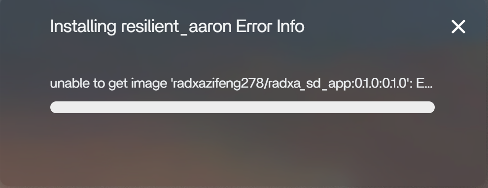
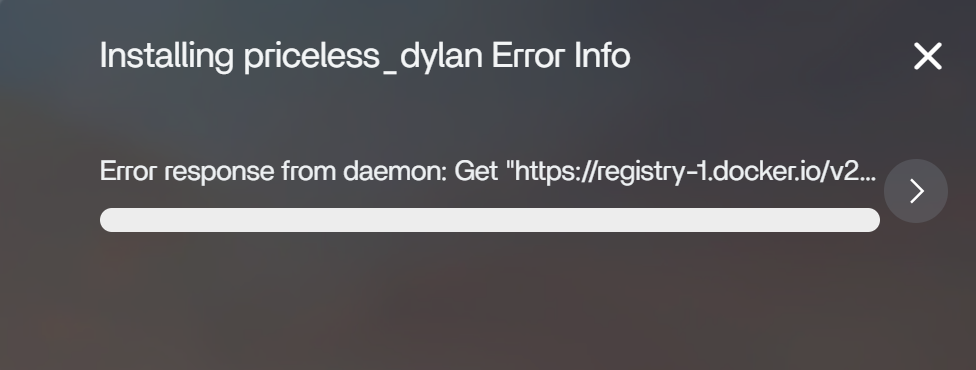
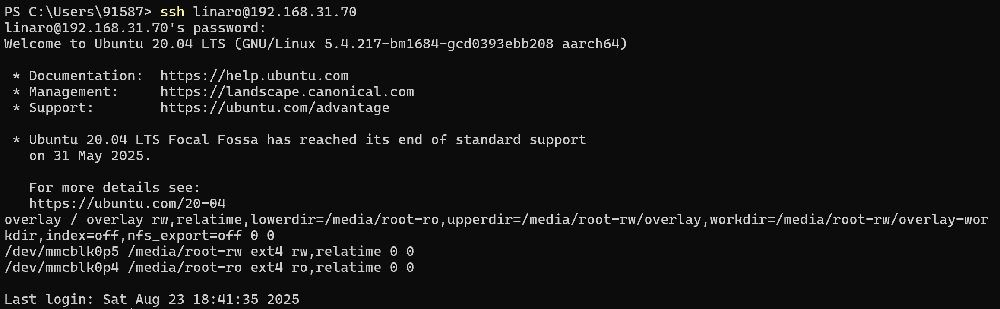
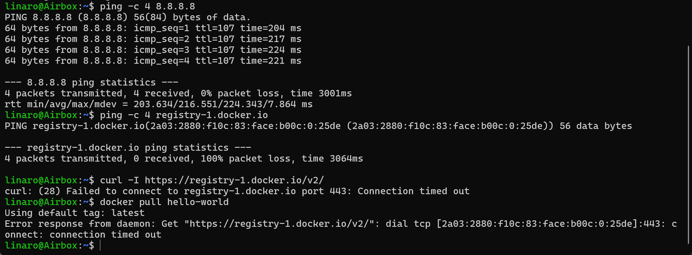
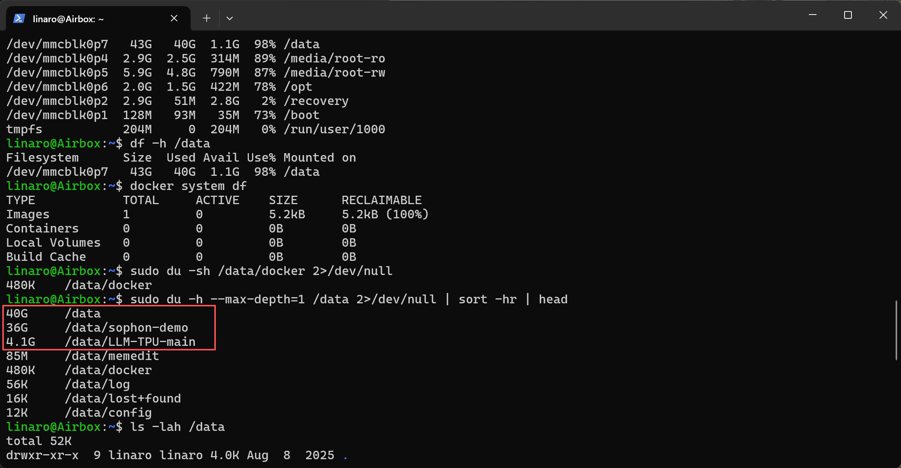
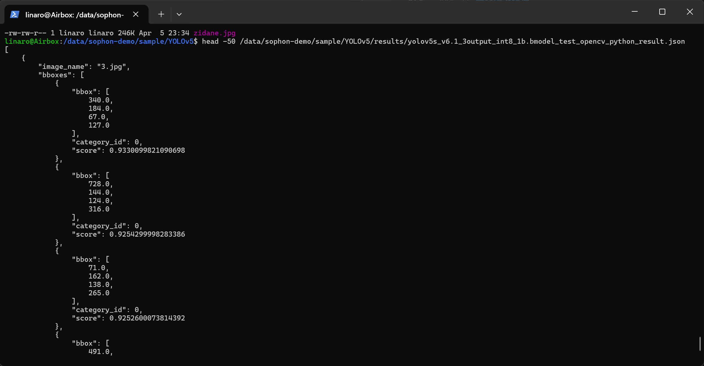

## 网址：
1. 硬件盒的说明文件：https://docs.radxa.com/fogwise/airbox
2. CasaOS的登录网址：http://192.168.31.70:81/
---
## 硬件连接准备工作
### 路由器
1. 一根电源线，插插座
2. 一根网线，接寝室的网
3. 一根网线，连airbox盒子

### 硬件盒airbox
1. 一根网线，连路由器
2. 一根debug线，接电脑USB
3. 一根power线，插插座

### 网络
电脑网络连接路由器：airbox_lab

### ip
192.168.31.1   路由器/网关

192.168.31.11  电脑

192.168.31.70  AirBox

---

## 用CasaOS跑通模型
### 基本操作
1. 登录网址：http://192.168.31.70:81/
2. 用户名：xhlhz； 密码：xhlhz0301
3. 按照下面网址的说明进行app的安装，https://docs.radxa.com/fogwise/airbox/casaos/casaos_app_install#%E5%AE%89%E8%A3%85-radxa-llama3-chatbot-gpt-app，

### 安装 radxa Stable Diffusion 文/图生图 App
1. Error 1: 填的镜像名写错了，把版本号 tag 填重复了


2. Error2：CasaOS 已经开始去 Docker Hub 拉镜像了，但在访问 Docker Hub 的镜像仓库入口 registry-1.docker.io 这一步失败了


3. 按照ai的指示去找问题
(1)登录SSH
- 打开powershell
- 输入：ssh linaro@192.168.31.70
- 或者输入：ssh admin@192.168.31.70

(2)依次输入四条指令，观察结果


- ping -c 4 8.8.8.8 成功 → AirBox 能上外网
- ping -c 4 registry-1.docker.io 解析到了2a03:2880:...→ 域名解析也正常
- 但它解析出来的是一个 IPv6 地址
- curl 和 docker pull 都卡在这个 IPv6 地址的 443 端口超时 → AirBox 当前对 Docker Hub 的 IPv6 连不通

说明：AirBox 在访问 registry-1.docker.io 时优先走了 IPv6，但这条 IPv6 网络路径不通，于是 Docker 拉镜像失败。

4. 但是强行设IPv4也不行，又跟着ai测试，发现是无法访问国外服务，于是给当前shell配置代理
```powershell
linaro@Airbox:~$ export http_proxy=http://192.168.31.11:7897
linaro@Airbox:~$ export https_proxy=http://192.168.31.11:7897
linaro@Airbox:~$ export HTTP_PROXY=http://192.168.31.11:7897
linaro@Airbox:~$ export HTTPS_PROXY=http://192.168.31.11:7897
```

5. 但是docker daemon还没有走代理，`docker pull hello-world`还是会失败，所以给docker代理配置文件

(1)创建 Docker 代理配置目录
```powershell
sudo mkdir -p /etc/systemd/system/docker.service.d
```
(2)直接写入配置文件
```powershell
sudo tee /etc/systemd/system/docker.service.d/http-proxy.conf > /dev/null <<'EOF'
[Service]
Environment="HTTP_PROXY=http://192.168.31.11:7897"
Environment="HTTPS_PROXY=http://192.168.31.11:7897"
Environment="NO_PROXY=localhost,127.0.0.1,::1"
EOF
```
(3)重载并重启 Docker
```powershell
sudo systemctl daemon-reload
sudo systemctl restart docker
```
(4)检查 Docker 是否真的读到了代理
```powershell
systemctl show --property=Environment docker
```
能看到结果中包含类似
```powershell
HTTP_PROXY=http://192.168.31.11:7897
HTTPS_PROXY=http://192.168.31.11:7897
```
(5)再试拉镜像
```powershell
docker pull hello-world
```

6. Error3：no space left
输入命令查看当前空间

---

## AirBox 上 YOLOv5 现成 Demo 试跑总结

### 1. 任务目标
在**不修改旧卡原有内容**的前提下，利用盒子内已有的 `sophon-demo` 资源，尝试跑通一个现成模型，熟悉 AirBox 的部署与推理流程。

### 2. 环境与资源确认
本次使用的 Demo 路径为： `/data/sophon-demo/sample/YOLOv5`

检查确认：
- 盒子型号为 **BM1684X AirBox**
- `sophon.sail` 可正常导入
- 系统可识别到 **1 个 TPU**
- `bmrt_test`、`bm-smi` 工具存在
- YOLOv5 目录下已存在：
  - `models/`
  - `datasets/`
  - `python/`
  - `results/`

本地已存在可用模型和测试数据，无需额外下载。


### 3. 试跑过程

#### 3.1 初始尝试
最初误用了 `BM1688` 目录下的模型，出现：
- `tpu_kernel_launch failed`
- `invalid bmodel`

说明模型目标平台与当前盒子不匹配。

#### 3.2 切换到 BM1684X
切换到 `BM1684X` 模型后，部分 `fp32/fp16` 版本仍无法稳定运行。

进一步排查发现：
- `bm-smi` 中设备状态一度为 **Fault**

说明问题涉及 TPU 底层状态。

#### 3.3 故障恢复
对设备执行重启recovery后，再次查看：
- `bm-smi` 状态恢复为 **Active**

此后重新测试。


### 4. 最终成功路径

#### 4.1 底层 `bmrt_test` 成功
最终成功运行的模型为：

`models/BM1684X/yolov5s_v6.1_3output_int8_1b.bmodel`

使用命令：

```bash
bmrt_test --bmodel /data/sophon-demo/sample/YOLOv5/models/BM1684X/yolov5s_v6.1_3output_int8_1b.bmodel
```

成功完成：bmodel 加载，网络信息打印，输入输出张量检查，单次推理执行，输出结果打印，时间统计输出。

关键耗时为：
- calculate time(s): 0.003740
- 即纯底层推理约 3.74 ms

#### Python demo 成功
执行：
```bash
python3 python/yolov5_opencv.py --input datasets/test --bmodel models/BM1684X/yolov5s_v6.1_3output_int8_1b.bmodel --dev_id 0 --conf_thresh 0.5 --nms_thresh 0.5
```
结果：bmodel 加载成功，4 张测试图全部处理完成，生成结果 json，输出完整时间统计，最终打印 all done.。

### 5. 最终结果文件
成功运行后，结果保存在：
- `results/yolov5s_v6.1_3output_int8_1b.bmodel_test_opencv_python_result.json`
- `results/images/` 下的 4 张结果图。
实际检查到的输出文件包括：
- `000000547383.jpg`
- `3.jpg`
- `dog.jpg`
- `zidane.jpg`

json文件中可以看到标准检测结果形式
