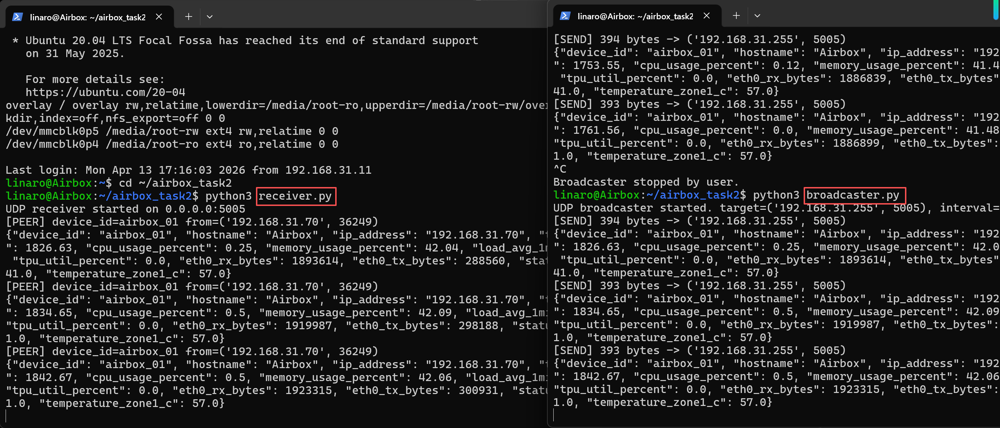

## 任务描述
实现单个Airbox的底层数据调取，包括，同时实现此Airbox的向外数据广播和接受外界数据功能，一位老师负责
预期ddl：4/22

## 模块一：状态采集
### 模块描述
1. 采用 Linux 内核提供的 procfs 与 sysfs 接口进行状态采集。其中：
- `/proc` 用于获取系统运行状态（CPU、内存等）
- `/sys` 用于获取硬件设备状态（温度、TPU 利用率等）
- 算能设备airbox通过驱动将加速器状态映射到这些接口中

2. `bm-smi`是算能的官方封装工具，可以读取`/proc`和`/sys`，有图形化界面，适合于给人看
- 辅以算能官方工具 `bm-smi` 进行状态校验与展示

3. 分层：
- 采集层：负责从 /proc、/sys 读原始数据
- 封装层：负责把原始数据变成有意义的字段
- 表示层：负责整合成统一 JSON
- 通信层：后面再负责广播和接收

#### 确认原始数据
1. 数据源确认，哪些能用
```bash
cat /etc/hostname
hostname -I
date +%s
cat /proc/uptime
cat /proc/stat
cat /proc/meminfo
cat /proc/loadavg
df -h /mnt/sdcard

# TPU利用率
bm-smi
find /sys -name "*tpu*" 2>/dev/null
find /sys -name "*util*" 2>/dev/null

# 网络流量
cat /proc/net/dev

# 温度
cat /sys/class/thermal/thermal_zone0/temp 
cat /sys/class/thermal/thermal_zone1/temp 
```

2. 根据输出结果，已确认可用

|节点状态|命令|
|---|---|
|CPU 使用率|`/proc/stat`|
|内存使用率|`/proc/meminfo`|
|系统负载|`/proc/loadavg`|
|运行时间|`/proc/uptime`|
|TF 卡使用率|`df -h /mnt/sdcard`|
|IP 地址|`ip addr / hostname -I`|
|网络流量|`/proc/net/dev`|
|TPU 利用率|`bm-smi`|
|温度|`/sys/class/thermal/thermal_zone*/temp`|

#### 代码实现
1. 从系统里读取原始状态
2. 把原始数据转成有意义的指标，比如：有些原始字段很多，对它进行计算
3. 把这些指标整合成统一字典
4. 再转成JSON输出
```python
#!/usr/bin/env python3
# -*- coding: utf-8 -*-

"""
Airbox Task2 - Node Status Collector (Phase 1)

功能：
1. 采集本机基础状态：
   - hostname
   - ip_address
   - timestamp
   - uptime
   - cpu_usage
   - memory_usage
   - load_avg
   - sdcard_usage
   - temperatures
   - tpu_util
   - eth0 rx/tx

2. 输出统一 JSON
3. 支持单次采集 / 循环采集

适用环境：
- Airbox / Linux
- Python 3.8+
"""

import json
import re
import shutil
import socket
import subprocess
import time
from typing import Dict, Optional, Tuple, List

# 全局常量
DEVICE_ID = "airbox_01"       
SDCARD_MOUNT = "/mnt/sdcard"
NET_IFACE = "eth0"
BM_SMI_CMD = ["bm-smi"]

# 读取文本文件，失败时返回 None
def read_text_file(path: str) -> Optional[str]:
    try:
        with open(path, "r", encoding="utf-8") as f:
            return f.read().strip()
    except Exception:
        return None


# 执行系统命令，失败时返回 None
def run_command(cmd: List[str], timeout: int = 3) -> Optional[str]:
    try:
        result = subprocess.run(
            cmd,
            stdout=subprocess.PIPE,
            stderr=subprocess.PIPE,
            text=True,
            timeout=timeout,
            check=False,
        )
        if result.returncode == 0:
            return result.stdout
        return None
    except Exception:
        return None

# 获取主机名
def get_hostname() -> str:
    try:
        return socket.gethostname()
    except Exception:
        return "unknown"

# 获取指定网卡的 IPv4 地址
def get_ip_address(interface: str = NET_IFACE) -> str:  
    # 优先从 `ip addr show <iface>` 解析
    output = run_command(["ip", "addr", "show", interface])
    if output:
        match = re.search(r"inet\s+(\d+\.\d+\.\d+\.\d+)/", output)
        if match:
            return match.group(1)
    # 失败时回退到 hostname -I
    fallback = run_command(["hostname", "-I"])
    if fallback:
        for token in fallback.split():
            if re.fullmatch(r"\d+\.\d+\.\d+\.\d+", token):
                if not token.startswith("127."):
                    return token

    return "0.0.0.0"

# 返回当前 Unix 时间戳
def get_timestamp() -> int:
    return int(time.time())

# 读取系统已运行秒数
def get_uptime_seconds() -> float:
    text = read_text_file("/proc/uptime")
    if not text:
        return 0.0

    try:
        return float(text.split()[0]) # 只取第一项（第二项为CPU空闲时间总和）
    except Exception:
        return 0.0

"""
读取 /proc/stat 第一行，返回：
- total_time
- idle_time
"""
def parse_proc_stat_cpu() -> Optional[Tuple[int, int]]:
    text = read_text_file("/proc/stat") # 读取CPU统计信息
    if not text:
        return None

    first_line = text.splitlines()[0] # 只取第一行
    parts = first_line.split() # 按空格拆开，拆成列表，eg:["cpu", "2226", "0", "1638", "450646", ...]

    # 基本合法性检查
    if len(parts) < 8 or parts[0] != "cpu":
        return None

    try:
        values = list(map(int, parts[1:]))
        user, nice, system, idle, iowait, irq, softirq = values[:7]
        steal = values[7] if len(values) > 7 else 0  # 有些系统会有 steal 字段，有些没有，所以做兼容

        idle_all = idle + iowait  # 空闲类事件
        total = user + nice + system + idle + iowait + irq + softirq + steal  # 总时间
        return total, idle_all  # 后面 CPU 利用率函数会拿这两个值做差分计算
    except Exception:
        return None


# 通过两次采样 /proc/stat 计算 CPU 利用率
def get_cpu_usage_percent(interval: float = 0.2) -> float:
    stat1 = parse_proc_stat_cpu()
    if stat1 is None:
        return 0.0

    time.sleep(interval)

    stat2 = parse_proc_stat_cpu()
    if stat2 is None:
        return 0.0

    total1, idle1 = stat1
    total2, idle2 = stat2

    total_delta = total2 - total1
    idle_delta = idle2 - idle1

    if total_delta <= 0:
        return 0.0

    # 总时间里，减去空闲增长的部分，剩下的就是“忙”的部分
    usage = (total_delta - idle_delta) / total_delta * 100.0
    return round(max(0.0, usage), 2) 

# 从 /proc/meminfo 计算内存使用率
def get_memory_usage_percent() -> float:
    text = read_text_file("/proc/meminfo")
    if not text:
        return 0.0

    mem_total = None
    mem_available = None

    for line in text.splitlines():  # 逐行找关键字段
        if line.startswith("MemTotal:"):
            mem_total = int(line.split()[1])
        elif line.startswith("MemAvailable:"):
            mem_available = int(line.split()[1])

    if not mem_total or mem_available is None:
        return 0.0

    used = mem_total - mem_available
    usage = used / mem_total * 100.0
    return round(max(0.0, usage), 2)


# 获取1分钟平均负载(最近1分钟内，系统排队等待CPU的平均任务量)
def get_load_avg_1min() -> float:
    text = read_text_file("/proc/loadavg")
    if not text:
        return 0.0

    try:
        return float(text.split()[0])
    except Exception:
        return 0.0

# 获取TF卡挂载路径使用率
def get_sdcard_usage_percent(path: str = SDCARD_MOUNT) -> float:
    try:
        usage = shutil.disk_usage(path)
        if usage.total <= 0:
            return 0.0
        percent = usage.used / usage.total * 100.0
        return round(percent, 2)
    except Exception:
        return 0.0


# 读取温度，单位转换
def get_temperatures() -> Dict[str, float]:
    temps: Dict[str, float] = {}

    for zone in [0, 1]:
        path = f"/sys/class/thermal/thermal_zone{zone}/temp"
        text = read_text_file(path)
        key = f"temperature_zone{zone}_c"

        if text is None:
            temps[key] = 0.0
            continue

        try:
            temps[key] = round(int(text) / 1000.0, 2)
        except Exception:
            temps[key] = 0.0

    return temps

# 从 bm-smi 输出中解析 Tpu-Util
def get_tpu_util_percent() -> float:
    output = run_command(BM_SMI_CMD, timeout=2)
    if not output:
        return 0.0

    match = re.search(r"\b(\d+)%\s*\|", output)
    if match:
        try:
            return float(match.group(1))
        except Exception:
            return 0.0

    # 更稳一点，再尝试直接找 Tpu-Util 所在行
    for line in output.splitlines():
        if "1684X-SOC" in line or "Tpu-Util" in line:
            util_match = re.search(r"(\d+)%", line)
            if util_match:
                try:
                    return float(util_match.group(1))
                except Exception:
                    return 0.0

    return 0.0

# 从 /proc/net/dev 获取指定网卡收发字节数
def get_net_dev_stats(interface: str = NET_IFACE) -> Dict[str, int]:
    text = read_text_file("/proc/net/dev")
    stats = {
        "rx_bytes": 0,
        "tx_bytes": 0,
    }

    if not text:
        return stats

    for line in text.splitlines():
        if ":" not in line:   # 真正的网卡数据行才有冒号
            continue

        iface_name, data = line.split(":", 1)
        iface_name = iface_name.strip()

        if iface_name != interface:
            continue

        parts = data.split()
        if len(parts) < 16:
            return stats

        try:
            stats["rx_bytes"] = int(parts[0]) # 第1个数是接收字节数
            stats["tx_bytes"] = int(parts[8]) # 第9个数是发送字节数
            return stats
        except Exception:
            return stats

    return stats

# 节点在线状态。第一版直接固定 online
def get_status() -> str:
    return "online"

# 核心函数：调用所有函数，统一成一个字典
def collect_status(device_id: str = DEVICE_ID) -> Dict[str, object]:
    # 这两项本身返回字典，所以先单独拿出来
    net_stats = get_net_dev_stats(NET_IFACE)
    temperatures = get_temperatures()

    status = {
        "device_id": device_id,
        "hostname": get_hostname(),
        "ip_address": get_ip_address(NET_IFACE),
        "timestamp": get_timestamp(),
        "uptime_seconds": get_uptime_seconds(),
        "cpu_usage_percent": get_cpu_usage_percent(interval=1.0),
        "memory_usage_percent": get_memory_usage_percent(),
        "load_avg_1min": get_load_avg_1min(),
        "sdcard_usage_percent": get_sdcard_usage_percent(SDCARD_MOUNT),
        "tpu_util_percent": get_tpu_util_percent(),
        "eth0_rx_bytes": net_stats["rx_bytes"],
        "eth0_tx_bytes": net_stats["tx_bytes"],
        "status": get_status(),
    }

    status.update(temperatures)
    return status

# 将状态字典转成 JSON 字符串
def status_to_json(status: Dict[str, object]) -> str:
    return json.dumps(status, ensure_ascii=False)


"""
默认每 2 秒采集一次并打印 JSON。
按 Ctrl+C 退出。
"""
def main() -> None:
    print("Airbox collector started. Press Ctrl+C to stop.")
    try:
        while True:
            status = collect_status()
            print(status_to_json(status))
            time.sleep(2)
    except KeyboardInterrupt:
        print("\nCollector stopped.")


# 如果这个文件是被直接运行的，就执行 main()
if __name__ == "__main__":
    main()
```

## 模块二：广播
### 通过UDP广播
#### 代码实现：broadcaster.py
```python
#!/usr/bin/env python3
# -*- coding: utf-8 -*-

"""
Airbox Task2 - UDP Broadcaster

功能：
1. 调用 collector.collect_status() 获取本机状态
2. 将状态字典编码为 JSON
3. 通过 UDP 广播发送到局域网
4. 本地打印发送日志，便于调试

运行方式：
    python3 broadcaster.py
"""

import json
import socket
import time
from typing import Tuple

from collector import collect_status


# ===== 可修改配置 =====
BROADCAST_IP = "192.168.31.255"   # 通用广播地址为255.255.255.255，后续可改成当前网段的广播地址：192.168.31.255
BROADCAST_PORT = 5005              # 广播端口（发送端和接收端一致）
SEND_INTERVAL = 2.0                # 每隔多少秒广播一次
SOCKET_TIMEOUT = 2.0               # socket 超时时间
# =====================


# 创建一个支持广播的 UDP socket
def create_udp_broadcast_socket() -> socket.socket:
    sock = socket.socket(socket.AF_INET, socket.SOCK_DGRAM)
    sock.setsockopt(socket.SOL_SOCKET, socket.SO_BROADCAST, 1)
    sock.settimeout(SOCKET_TIMEOUT)
    return sock

# 将状态字典编码为 UTF-8 JSON 字节串（UDP 真正发出去的是字节流）
def encode_status_to_bytes(status: dict) -> bytes:
    json_str = json.dumps(status, ensure_ascii=False)
    return json_str.encode("utf-8")

# 发送一帧 UDP 广播数据,返回发送的字节数
def send_broadcast(sock: socket.socket, data: bytes, addr: Tuple[str, int]) -> int:
    return sock.sendto(data, addr)

# 主循环：周期性采集状态并广播
def main() -> None:
    target = (BROADCAST_IP, BROADCAST_PORT)
    sock = create_udp_broadcast_socket()

    print(f"UDP broadcaster started. target={target}, interval={SEND_INTERVAL}s")

    try:
        while True:
            # 1. 采集当前状态
            status = collect_status()

            # 2. 编码为 JSON 字节串
            payload = encode_status_to_bytes(status)

            # 3. 发送广播
            sent_bytes = send_broadcast(sock, payload, target)

            # 4. 本地打印日志
            print(f"[SEND] {sent_bytes} bytes -> {target}")
            print(payload.decode("utf-8"))

            # 5. 等待下一次发送
            time.sleep(SEND_INTERVAL)

    except KeyboardInterrupt:
        print("\nBroadcaster stopped by user.")
    finally:
        sock.close()


if __name__ == "__main__":
    main()
```

#### 测试
1. 先在 Airbox 上跑发送端
```bash
python3 broadcaster.py
```
2. 然后在同一局域网另一台 Linux 设备上，用这个命令监听：
```bash
nc -ul 5005
```


## 模块三：接收
### 思路
`receiver.py`支持两类输入：
1. 收到别的 Airbox 广播来的状态包
- 自动解析
- 自动存进本地 peer_table
- 方便后面做组网节点列表
2. 收到外部设备发来的命令包
- 支持这几个命令：ping，get_status，get_peers
### 代码
```python
#!/usr/bin/env python3
# -*- coding: utf-8 -*-

"""
Airbox Task2 - UDP Receiver

功能：
1. 接收局域网内其他节点广播过来的状态 JSON
2. 维护一个本地 peer_table（记录最近收到的节点状态）
3. 接收外部控制命令，并返回响应
   支持命令：
   - ping
   - get_status
   - get_peers

运行方式：
    python3 receiver.py
"""

import json
import socket
import time
from typing import Any, Dict, Optional, Tuple

from collector import collect_status


# ===== 可修改配置 =====
LISTEN_IP = "0.0.0.0"     # 监听所有网卡，写成某个具体IP就只监听那个地址
LISTEN_PORT = 5005        # 与 broadcaster.py 保持一致，便于接收广播
BUFFER_SIZE = 4096        # 一次最多接收4096字节
SOCKET_TIMEOUT = 1.0
PEER_EXPIRE_SECONDS = 10  # 超过这个时间没更新，就认为该节点暂时失活
# =====================


#  创建 UDP 接收 socket
def create_udp_receiver_socket() -> socket.socket:
    sock = socket.socket(socket.AF_INET, socket.SOCK_DGRAM)
    sock.setsockopt(socket.SOL_SOCKET, socket.SO_REUSEADDR, 1)
    sock.bind((LISTEN_IP, LISTEN_PORT))
    sock.settimeout(SOCKET_TIMEOUT)
    return sock


# 将收到的字节串解码成 JSON 对象
def decode_json_bytes(data: bytes) -> Optional[Dict[str, Any]]:   
    try:
        text = data.decode("utf-8")
        obj = json.loads(text)     
        if isinstance(obj, dict):   # 协议设计里默认收到的包应该是一个 JSON 对象，也就是字典
            return obj
        return None
    except Exception:    # 解码失败或者JSON格式错了
        return None


# 发送 JSON 响应
def send_json(sock: socket.socket, payload: Dict[str, Any], addr: Tuple[str, int]) -> None:
    try:
        data = json.dumps(payload, ensure_ascii=False).encode("utf-8")
        sock.sendto(data, addr)
    except Exception:
        pass


    """
    判断是否是状态包（来自 broadcaster / 其他节点）
    只要有 device_id 和 timestamp，就先视为状态包
    """
def is_status_packet(obj: Dict[str, Any]) -> bool:
    return ("device_id" in obj) and ("timestamp" in obj)


# 判断是否是命令包
def is_command_packet(obj: Dict[str, Any]) -> bool:
    return "command" in obj


# 删除超时未更新的节点
def prune_expired_peers(peer_table: Dict[str, Dict[str, Any]]) -> None:
    now = time.time()
    expired = []

    for device_id, info in peer_table.items():
        last_seen = info.get("_last_seen_local", 0)
        if now - last_seen > PEER_EXPIRE_SECONDS:
            expired.append(device_id)

    for device_id in expired:
        del peer_table[device_id]


# 处理来自其他节点的状态广播
def handle_status_packet(
    obj: Dict[str, Any],
    addr: Tuple[str, int],
    peer_table: Dict[str, Dict[str, Any]],
) -> None:

    device_id = str(obj.get("device_id", "unknown"))

    # 给本地维护用的信息
    peer_info = dict(obj)
    peer_info["_sender_ip"] = addr[0]
    peer_info["_sender_port"] = addr[1]
    peer_info["_last_seen_local"] = time.time()

    peer_table[device_id] = peer_info

    print(f"[PEER] device_id={device_id} from={addr}")
    print(json.dumps(obj, ensure_ascii=False))


# 处理外部命令
def handle_command_packet(
    obj: Dict[str, Any],
    addr: Tuple[str, int],
    sock: socket.socket,
    peer_table: Dict[str, Dict[str, Any]],
) -> None:

    command = str(obj.get("command", "")).strip()

    if command == "ping":
        reply = {
            "msg_type": "pong",
            "timestamp": int(time.time()),
            "status": "online",
        }
        send_json(sock, reply, addr)
        print(f"[CMD] ping from {addr} -> pong")

    elif command == "get_status":
        reply = {
            "msg_type": "status_reply",
            "timestamp": int(time.time()),
            "status": collect_status(),
        }
        send_json(sock, reply, addr)
        print(f"[CMD] get_status from {addr} -> status_reply")

    elif command == "get_peers":
        # 返回对外可见的 peer_table，去掉内部字段
        peers_out = {}
        for device_id, info in peer_table.items():
            clean_info = dict(info)
            clean_info.pop("_last_seen_local", None)  # 去掉内部维护字段
            peers_out[device_id] = clean_info

        reply = {
            "msg_type": "peer_table_reply",
            "timestamp": int(time.time()),
            "peer_count": len(peers_out),
            "peers": peers_out,
        }
        send_json(sock, reply, addr)
        print(f"[CMD] get_peers from {addr} -> peer_table_reply")

# 不支持的命令
    else:
        reply = {
            "msg_type": "error",
            "timestamp": int(time.time()),
            "error": f"unsupported command: {command}",
            "supported_commands": ["ping", "get_status", "get_peers"],
        }
        send_json(sock, reply, addr)
        print(f"[CMD] unsupported command from {addr}: {command}")


def main() -> None:
    sock = create_udp_receiver_socket()
    peer_table: Dict[str, Dict[str, Any]] = {}

    print(f"UDP receiver started on {LISTEN_IP}:{LISTEN_PORT}")

# 开始异常保护，后面支持 Ctrl+C 退出
    try:
        while True:
            prune_expired_peers(peer_table)  # 每轮循环先清理一下超时节点

            try:
                data, addr = sock.recvfrom(BUFFER_SIZE)
            except socket.timeout:
                continue
            except Exception as e:
                print(f"[ERROR] recvfrom failed: {e}")
                continue

            # 解码数据
            obj = decode_json_bytes(data)
            if obj is None:
                print(f"[WARN] invalid JSON from {addr}")
                continue

            # 判断数据类型并分流
            if is_command_packet(obj):
                handle_command_packet(obj, addr, sock, peer_table)
            elif is_status_packet(obj):
                handle_status_packet(obj, addr, peer_table)
            else:
                print(f"[WARN] unknown packet type from {addr}")
                print(json.dumps(obj, ensure_ascii=False))

    # 按 Ctrl + C，程序会抛出 KeyboardInterrupt
    except KeyboardInterrupt:
        print("\nReceiver stopped by user.")
    finally:
        sock.close()


if __name__ == "__main__":
    main()
```

## 重构方案：拆成多级函数文件
原来的 `collector.py`、`broadcaster.py`、`receiver.py` 都是“入口 + 业务逻辑 + 工具函数”混在一个文件里。后续如果继续加指标、加命令、加协议字段，单个文件会越来越长，所以可以保留三个入口文件，但把真正的功能拆进 `airbox_task2` 包里。

我已经按这个结构整理了一份示例代码，放在本仓库：

```text
算能/airbox_task2_refactor/
├── collector.py                 # 采集入口，只调用 collector.service.main()
├── broadcaster.py               # 广播入口，只调用 broadcast.service.main()
├── receiver.py                  # 接收入口，只调用 receiver.service.main()
└── airbox_task2/
    ├── config.py                # 全局配置：设备 ID、端口、网卡、广播地址
    ├── utils/
    │   ├── files.py             # 读取 /proc、/sys 文本文件
    │   ├── commands.py          # 执行 bm-smi、ip addr 等系统命令
    │   └── json_codec.py        # JSON 编码 / 解码
    ├── collector/
    │   ├── identity.py          # hostname、IP 地址
    │   ├── system.py            # CPU、内存、负载、运行时间、在线状态
    │   ├── hardware.py          # TF 卡、温度、TPU 利用率
    │   ├── network.py           # eth0 收发字节数
    │   └── service.py           # collect_status() 总装函数
    ├── broadcast/
    │   ├── socket_utils.py      # UDP 广播 socket、sendto
    │   └── service.py           # 周期采集并广播
    └── receiver/
        ├── socket_utils.py      # UDP 接收 socket、JSON 回复
        ├── protocol.py          # 判断状态包 / 命令包
        ├── peers.py             # peer_table 更新、过期清理、对外输出
        ├── commands.py          # ping / get_status / get_peers
        └── service.py           # 接收主循环
```

这样拆分后，每一层职责更清楚：

|层级|文件|职责|
|---|---|---|
|入口层|`collector.py`、`broadcaster.py`、`receiver.py`|只负责启动程序，方便保持原来的运行命令不变|
|配置层|`airbox_task2/config.py`|集中修改设备 ID、端口、网卡、广播地址|
|工具层|`airbox_task2/utils/*`|文件读取、命令执行、JSON 编解码|
|采集层|`airbox_task2/collector/*`|按数据来源拆分：系统、硬件、网络、身份信息|
|广播层|`airbox_task2/broadcast/*`|创建广播 socket，周期发送状态包|
|接收层|`airbox_task2/receiver/*`|协议判断、节点表维护、命令处理、接收循环|

### 在 Airbox 上写入文件
如果采用重构版本，目录创建方式改为：

```bash
mkdir -p ~/airbox_task2/airbox_task2/utils
mkdir -p ~/airbox_task2/airbox_task2/collector
mkdir -p ~/airbox_task2/airbox_task2/broadcast
mkdir -p ~/airbox_task2/airbox_task2/receiver
cd ~/airbox_task2
```

然后把 `算能/airbox_task2_refactor/` 里面的文件复制到 Airbox 的 `~/airbox_task2/` 下。

### 语法检查
重构后需要检查整个包：

```bash
cd ~/airbox_task2
python3 -m py_compile \
  collector.py broadcaster.py receiver.py \
  airbox_task2/config.py \
  airbox_task2/utils/*.py \
  airbox_task2/collector/*.py \
  airbox_task2/broadcast/*.py \
  airbox_task2/receiver/*.py
```

### 运行方式
入口命令保持不变：

```bash
python3 collector.py
python3 broadcaster.py
python3 receiver.py
```

### 后续扩展方式
如果后面要增加新的采集指标，优先放到对应的小文件里：

- 新增系统指标：放到 `airbox_task2/collector/system.py`
- 新增硬件指标：放到 `airbox_task2/collector/hardware.py`
- 新增网络指标：放到 `airbox_task2/collector/network.py`
- 新增接收命令：在 `airbox_task2/receiver/commands.py` 里加一个 `build_xxx_reply()`，再在 `handle_command_packet()` 里加分支
- 新增包类型：在 `airbox_task2/receiver/protocol.py` 里加判断函数，再在 `receiver/service.py` 的 `handle_packet()` 里分流


## 盒子测试
### 写入代码
1. 安装nano编辑器
```bash
sudo apt update
sudo apt install -y nano
```
装完后检查
```bash
nano --version
```

2. 创建目录
```bash
mkdir -p ~/airbox_task2
cd ~/airbox_task2
```

3. 创建函数文件
```bash
nano collector.py
```
保存退出
- ctrl + o
- 回车 enter
- ctrl + x

4. 同理创建
```bash
nano broadcaster.py
```
```bash
nano receiver.py
```

5. 做语法检查
```bash
python3 -m py_compile collector.py broadcaster.py receiver.py
```
没有输出，说明没问题

### 第一次测试
#### 采集模块
1. 用一段一次性脚本跑
```bash
python3 - <<'PY'
from collector import *

print("hostname =", get_hostname())
print("ip_address =", get_ip_address())
print("timestamp =", get_timestamp())
print("uptime_seconds =", get_uptime_seconds())
print("cpu_usage_percent =", get_cpu_usage_percent())
print("memory_usage_percent =", get_memory_usage_percent())
print("load_avg_1min =", get_load_avg_1min())
print("sdcard_usage_percent =", get_sdcard_usage_percent())
print("temperatures =", get_temperatures())
print("tpu_util_percent =", get_tpu_util_percent())
print("net_dev_stats =", get_net_dev_stats())
print("collect_status =", collect_status())
PY
```
结果为
```bash
hostname = Airbox
ip_address = 192.168.31.70
timestamp = 1776176175
uptime_seconds = 1327.45
cpu_usage_percent = 0.62
memory_usage_percent = 41.46
load_avg_1min = 0.12
sdcard_usage_percent = 0.0
temperatures = {'temperature_zone0_c': 41.0, 'temperature_zone1_c': 56.0}
tpu_util_percent = 0.0
net_dev_stats = {'rx_bytes': 1881177, 'tx_bytes': 266572}
collect_status = {'device_id': 'airbox_01', 'hostname': 'Airbox', 'ip_address': '192.168.31.70', 'timestamp': 1776176181, 'uptime_seconds': 1333.47, 'cpu_usage_percent': 0.12, 'memory_usage_percent': 41.46, 'load_avg_1min': 0.11, 'sdcard_usage_percent': 0.0, 'tpu_util_percent': 0.0, 'eth0_rx_bytes': 1881177, 'eth0_tx_bytes': 266726, 'status': 'online', 'temperature_zone0_c': 41.0, 'temperature_zone1_c': 56.0}
```

#### 广播模块
1. 运行
```bash
cd ~/airbox_task2
python3 broadcaster.py
```
2. 得到：
```bash
linaro@Airbox:~/airbox_task2$ python3 broadcaster.py
UDP broadcaster started. target=('192.168.31.255', 5005), interval=2.0s
[SEND] 394 bytes -> ('192.168.31.255', 5005)
{"device_id": "airbox_01", "hostname": "Airbox", "ip_address": "192.168.31.70", "timestamp": 1776176593, "uptime_seconds": 1745.53, "cpu_usage_percent": 0.12, "memory_usage_percent": 41.47, "load_avg_1min": 0.0, "sdcard_usage_percent": 0.0, "tpu_util_percent": 0.0, "eth0_rx_bytes": 1886577, "eth0_tx_bytes": 277105, "status": "online", "temperature_zone0_c": 41.0, "temperature_zone1_c": 57.0}
[SEND] 394 bytes -> ('192.168.31.255', 5005)
{"device_id": "airbox_01", "hostname": "Airbox", "ip_address": "192.168.31.70", "timestamp": 1776176601, "uptime_seconds": 1753.55, "cpu_usage_percent": 0.12, "memory_usage_percent": 41.47, "load_avg_1min": 0.0, "sdcard_usage_percent": 0.0, "tpu_util_percent": 0.0, "eth0_rx_bytes": 1886839, "eth0_tx_bytes": 278331, "status": "online", "temperature_zone0_c": 41.0, "temperature_zone1_c": 57.0}
[SEND] 393 bytes -> ('192.168.31.255', 5005)
{"device_id": "airbox_01", "hostname": "Airbox", "ip_address": "192.168.31.70", "timestamp": 1776176609, "uptime_seconds": 1761.56, "cpu_usage_percent": 0.0, "memory_usage_percent": 41.48, "load_avg_1min": 0.0, "sdcard_usage_percent": 0.0, "tpu_util_percent": 0.0, "eth0_rx_bytes": 1886899, "eth0_tx_bytes": 279297, "status": "online", "temperature_zone0_c": 41.0, "temperature_zone1_c": 57.0}
^C
Broadcaster stopped by user.
```
可见有持续在发送，`ctrl+c`可退出

#### 接收模块
1. 在原终端运行广播端`python3 broadcaster.py`
2. 新开一个终端，登录进入airbox，运行接收端
```bash
cd ~/airbox_task2
python3 receiver.py
```
3. 结果


#### 测试节点表的查询
1. 打开第三个终端，登录进入airbox
2. 发送一个`get_peers`命令：
```bash
cd ~/airbox_task2
python3 - <<'PY'
import json, socket

sock = socket.socket(socket.AF_INET, socket.SOCK_DGRAM)
sock.settimeout(3)

sock.sendto(json.dumps({"command": "get_peers"}).encode("utf-8"), ("127.0.0.1", 5005))
data, addr = sock.recvfrom(4096)

print("from:", addr)
print(data.decode("utf-8"))
PY
```
3. 结果为：
```bash
from: ('127.0.0.1', 5005)
{"msg_type": "peer_table_reply", "timestamp": 1776177600, "peer_count": 1, "peers": {"airbox_01": {"device_id": "airbox_01", "hostname": "Airbox", "ip_address": "192.168.31.70", "timestamp": 1776177588, "uptime_seconds": 2740.92, "cpu_usage_percent": 0.25, "memory_usage_percent": 42.67, "load_avg_1min": 0.0, "sdcard_usage_percent": 0.0, "tpu_util_percent": 0.0, "eth0_rx_bytes": 2712093, "eth0_tx_bytes": 384163, "status": "online", "temperature_zone0_c": 41.0, "temperature_zone1_c": 57.0, "_sender_ip": "192.168.31.70", "_sender_port": 42033}}}
```

#### 测试命令接收
1. 在第三个终端进入airbox
2. 执行：
```bash
cd ~/airbox_task2
python3 - <<'PY'
import json, socket

sock = socket.socket(socket.AF_INET, socket.SOCK_DGRAM)
sock.settimeout(3)

sock.sendto(json.dumps({"command": "ping"}).encode("utf-8"), ("127.0.0.1", 5005))
data, addr = sock.recvfrom(4096)

print("from:", addr)
print(data.decode("utf-8"))
PY
```
3. 返回：
```bash
from: ('127.0.0.1', 5005)
{"msg_type": "pong", "timestamp": 1776177957, "status": "online"}
```

#### 测试状态接收
1. 在第三个终端进入airbox后输入
```bash
cd ~/airbox_task2
python3 - <<'PY'
import json, socket

sock = socket.socket(socket.AF_INET, socket.SOCK_DGRAM)
sock.settimeout(5)

sock.sendto(json.dumps({"command": "get_status"}).encode("utf-8"), ("127.0.0.1", 5005))
data, addr = sock.recvfrom(4096)

print("from:", addr)
print(data.decode("utf-8"))
PY
```
2. 结果，超时，失败
```bash
Traceback (most recent call last):
  File "<stdin>", line 7, in <module>
socket.timeout: timed out
```

3. 在测试脚本中，去掉超时时间设定，先测耗时，执行
```bash
cd ~/airbox_task2
python3 - <<'PY'
import time
from collector import collect_status

t0 = time.time()
status = collect_status()
t1 = time.time()

print("elapsed =", round(t1 - t0, 3), "seconds")
PY
```
输出
```bash
elapsed = 6.012 seconds
```
确实是超过设定的5秒了

4. 将超时设定为10秒，重新跑
```bash
python3 - <<'PY'
import json, socket

sock = socket.socket(socket.AF_INET, socket.SOCK_DGRAM)
sock.settimeout(10)

sock.sendto(json.dumps({"command": "get_status"}).encode("utf-8"), ("127.0.0.1", 5005))
data, addr = sock.recvfrom(4096)

print("from:", addr)
print(data.decode("utf-8"))
PY
```

5. 成功了
```bash
from: ('127.0.0.1', 5005)
{"msg_type": "status_reply", "timestamp": 1776178630, "status": {"device_id": "airbox_01", "hostname": "Airbox", "ip_address": "192.168.31.70", "timestamp": 1776178630, "uptime_seconds": 3783.04, "cpu_usage_percent": 0.5, "memory_usage_percent": 42.99, "load_avg_1min": 0.14, "sdcard_usage_percent": 0.0, "tpu_util_percent": 0.0, "eth0_rx_bytes": 2792572, "eth0_tx_bytes": 651410, "status": "online", "temperature_zone0_c": 42.0, "temperature_zone1_c": 58.0}}
```

6. 把`collector.py`中cpu采集时间和tpu采集时间缩短后，
```bash
hostname = Airbox
ip_address = 192.168.31.70
timestamp = 1776179235
uptime_seconds = 86.53
cpu_usage_percent = 2.5
memory_usage_percent = 40.55
load_avg_1min = 0.8
sdcard_usage_percent = 0.0
temperatures = {'temperature_zone0_c': 31.0, 'temperature_zone1_c': 41.0}
tpu_util_percent = 0.0
net_dev_stats = {'rx_bytes': 33786, 'tx_bytes': 32954}
collect_status = {'device_id': 'airbox_01', 'hostname': 'Airbox', 'ip_address': '192.168.31.70', 'timestamp': 1776179238, 'uptime_seconds': 88.76, 'cpu_usage_percent': 0.25, 'memory_usage_percent': 40.59, 'load_avg_1min': 0.8, 'sdcard_usage_percent': 0.0, 'tpu_util_percent': 0.0, 'eth0_rx_bytes': 33786, 'eth0_tx_bytes': 33100, 'status': 'online', 'temperature_zone0_c': 31.0, 'temperature_zone1_c': 41.0}
```

### 第二次测试
经过下面“衔接任务分配”的代码修改后，新增了测试参数和task_request，再对盒子进行测试
#### 测试 TPU 内存解析函数
测试能否把脚本里的sample解析正确
```bash
cd ~/airbox_task2
python3 - <<'PY'
from airbox_task2.collector.hardware import parse_tpu_memory_usage_percent

samples = [
    "Memory-Usage 0MB/13311MB",
    "Memory-Usage 2048MB/13311MB",
    "bad output",
]

for s in samples:
    print(s, "=>", parse_tpu_memory_usage_percent(s))
PY
```
得到，符合期望。-1表示没有解析到`Memory-Usage`
```bash
Memory-Usage 0MB/13311MB => 0.0
Memory-Usage 2048MB/13311MB => 15.39
bad output => -1.0
```

#### 测试采集函数 collect_status()
运行
```bash
cd ~/airbox_task2
python3 - <<'PY'
import json
from airbox_task2.collector.service import collect_status

status = collect_status()
print(json.dumps(status, ensure_ascii=False, indent=2))
PY
```
输出，关键字段都在
```bash
{
  "device_id": "airbox_01",
  "hostname": "Airbox",
  "ip_address": "192.168.31.70",
  "timestamp": 1776250857,
  "uptime_seconds": 1760.67,
  "cpu_usage_percent": 0.12,
  "memory_usage_percent": 41.36,
  "load_avg_1min": 0.03,
  "sdcard_usage_percent": 0.0,
  "tpu_util_percent": 0.0,
  "mem_util_percent": 41.36,
  "fps_input": 0.0,
  "queue_length": 0,
  "available_capacity": 0.876,
  "capabilities": [
    "cv"
  ],
  "eth0_rx_bytes": 1612691,
  "eth0_tx_bytes": 240450,
  "status": "online",
  "temperature_zone0_c": 42.0,
  "temperature_zone1_c": 58.0,
  "health_state": "AVAILABLE"
}
```

#### 测试 collector.py
看输出的JSON是否正常。运行
```bash
python3 collector.py
```
持续输出，
```bash
Airbox collector started. Press Ctrl+C to stop.
{"device_id": "airbox_01", "hostname": "Airbox", "ip_address": "192.168.31.70", "timestamp": 1776251147, "uptime_seconds": 2050.27, "cpu_usage_percent": 0.0, "memory_usage_percent": 41.35, "load_avg_1min": 0.0, "sdcard_usage_percent": 0.0, "tpu_util_percent": 0.0, "mem_util_percent": 41.35, "fps_input": 0.0, "queue_length": 0, "available_capacity": 0.876, "capabilities": ["cv"], "eth0_rx_bytes": 1651057, "eth0_tx_bytes": 257961, "status": "online", "temperature_zone0_c": 42.0, "temperature_zone1_c": 58.0, "health_state": "AVAILABLE"}
```
可见输出JSON中已包含新加入的字段
```text
mem_util_percent
fps_input
queue_length
health_state
available_capacity
capabilities
```

#### 测试 receiver.py 启动
在第一个终端，运行
```bash
cd ~/airbox_task2
python3 receiver.py
```
输出
```bash
UDP receiver started on 0.0.0.0:5005
```
留着不关，为了后续测试

#### 测试 get_status 命令
新开第二个终端，运行
```bash
cd ~/airbox_task2
python3 - <<'PY'
import json
import socket

sock = socket.socket(socket.AF_INET, socket.SOCK_DGRAM)
sock.settimeout(15)

sock.sendto(json.dumps({"command": "get_status"}).encode("utf-8"), ("127.0.0.1", 5005))
data, addr = sock.recvfrom(8192)

reply = json.loads(data.decode("utf-8"))

print("from:", addr)
print(json.dumps(reply, ensure_ascii=False, indent=2))

status = reply.get("status", {})
print("\n关键新增字段：")
for key in [
    "mem_util_percent",
    "fps_input",
    "queue_length",
    "health_state",
    "available_capacity",
    "capabilities",
]:
    print(key, "=", status.get(key))
PY
```
得到
```bash
from: ('127.0.0.1', 5005)
{
  "msg_type": "status_reply",
  "timestamp": 1776251323,
  "status": {
    "device_id": "airbox_01",
    "hostname": "Airbox",
    "ip_address": "192.168.31.70",
    "timestamp": 1776251327,
    "uptime_seconds": 2230.69,
    "cpu_usage_percent": 0.0,
    "memory_usage_percent": 41.93,
    "load_avg_1min": 0.0,
    "sdcard_usage_percent": 0.0,
    "tpu_util_percent": 0.0,
    "mem_util_percent": 41.93,
    "fps_input": 0.0,
    "queue_length": 0,
    "available_capacity": 0.874,
    "capabilities": [
      "cv"
    ],
    "eth0_rx_bytes": 1662468,
    "eth0_tx_bytes": 277386,
    "status": "online",
    "temperature_zone0_c": 42.0,
    "temperature_zone1_c": 58.0,
    "health_state": "AVAILABLE"
  }
}

关键新增字段：
mem_util_percent = 41.93
fps_input = 0.0
queue_length = 0
health_state = AVAILABLE
available_capacity = 0.874
capabilities = ['cv']
```
成功get新增关键字的status

#### 测试 broadcaster.py 广播
在第二个终端
```bash
python3 broadcaster.py
```
结果不列出来了，在broadcaster端广播的JSON中含有新增的关键字段，在receiver端接收的JSON里面也有，测试成功。

#### 测试 get_peers
先确保
```text
receiver.py 正在运行
broadcaster.py 已经至少发送过一次
如果超过 PEER_EXPIRE_SECONDS = 10 秒没有收到广播，peer 会被清掉。所以测试 get_peers 前最好刚刚运行过 broadcaster.py
```
在broadcaster端的终端运行
```bash
cd ~/airbox_task2
python3 - <<'PY'
import json
import socket

sock = socket.socket(socket.AF_INET, socket.SOCK_DGRAM)
sock.settimeout(10)

sock.sendto(json.dumps({"command": "get_peers"}).encode("utf-8"), ("127.0.0.1", 5005))
data, addr = sock.recvfrom(8192)

reply = json.loads(data.decode("utf-8"))

print("from:", addr)
print(json.dumps(reply, ensure_ascii=False, indent=2))

print("\n节点数量:", reply.get("peer_count"))
peers = reply.get("peers", {})

for device_id, info in peers.items():
    print("\n设备:", device_id)
    for key in [
        "mem_util_percent",
        "fps_input",
        "queue_length",
        "health_state",
        "available_capacity",
        "capabilities",
    ]:
        print(key, "=", info.get(key))
PY
```

得到
```bash
from: ('127.0.0.1', 5005)
{
  "msg_type": "peer_table_reply",
  "timestamp": 1776251631,
  "peer_count": 1,
  "peers": {
    "airbox_01": {
      "device_id": "airbox_01",
      "hostname": "Airbox",
      "ip_address": "192.168.31.70",
      "timestamp": 1776251623,
      "uptime_seconds": 2526.31,
      "cpu_usage_percent": 0.5,
      "memory_usage_percent": 42.81,
      "load_avg_1min": 0.01,
      "sdcard_usage_percent": 0.0,
      "tpu_util_percent": 0.0,
      "mem_util_percent": 42.81,
      "fps_input": 0.0,
      "queue_length": 0,
      "available_capacity": 0.872,
      "capabilities": [
        "cv"
      ],
      "eth0_rx_bytes": 2444244,
      "eth0_tx_bytes": 364797,
      "status": "online",
      "temperature_zone0_c": 42.0,
      "temperature_zone1_c": 58.0,
      "health_state": "AVAILABLE",
      "_sender_ip": "192.168.31.70",
      "_sender_port": 55251
    }
  }
}

节点数量: 1

设备: airbox_01
mem_util_percent = 42.81
fps_input = 0.0
queue_length = 0
health_state = AVAILABLE
available_capacity = 0.872
capabilities = ['cv']
```
同时在receiver端有
```bash
[CMD] get_peers from ('127.0.0.1', 51549) -> peer_table_reply
```

#### 测试 task_request / bid_response 协议
确保 receiver 正在运行，然后第二个终端执行：
```bash
cd ~/airbox_task2
python3 - <<'PY'
import json
import socket

sock = socket.socket(socket.AF_INET, socket.SOCK_DGRAM)
sock.settimeout(15)

payload = {
    "msg_type": "task_request",
    "task_id": "task_001",
    "task_type": "cv",
    "priority": 5,
    "deadline_ms": 300
}

sock.sendto(json.dumps(payload).encode("utf-8"), ("127.0.0.1", 5005))
data, addr = sock.recvfrom(8192)

reply = json.loads(data.decode("utf-8"))

print("from:", addr)
print(json.dumps(reply, ensure_ascii=False, indent=2))
PY
```
返回
```bash
from: ('127.0.0.1', 5005)
{
  "msg_type": "bid_response",
  "timestamp": 1776251958,
  "device_id": "airbox_01",
  "task_id": "task_001",
  "task_type": "cv",
  "priority": 5,
  "deadline_ms": 300,
  "estimated_latency_ms": 127,
  "score": 0.873,
  "can_handle": true,
  "health_state": "AVAILABLE",
  "available_capacity": 0.873
}
```
在receiver端有
```bash
[TASK] task_request from ('127.0.0.1', 57742) -> bid_response
```

#### 测试不支持的 task_type
将`task_type`改为`llm`
```bash
cd ~/airbox_task2
python3 - <<'PY'
import json
import socket

sock = socket.socket(socket.AF_INET, socket.SOCK_DGRAM)
sock.settimeout(15)

payload = {
    "msg_type": "task_request",
    "task_id": "task_002",
    "task_type": "llm",
    "priority": 5,
    "deadline_ms": 300
}

sock.sendto(json.dumps(payload).encode("utf-8"), ("127.0.0.1", 5005))
data, addr = sock.recvfrom(8192)

reply = json.loads(data.decode("utf-8"))

print("from:", addr)
print(json.dumps(reply, ensure_ascii=False, indent=2))
PY
```
返回的关键部分
```bash
"task_type": "llm",
"score": 0.0,
"can_handle": false,
```

#### 测试不支持的command
运行
```bash
cd ~/airbox_task2
python3 - <<'PY'
import json
import socket

sock = socket.socket(socket.AF_INET, socket.SOCK_DGRAM)
sock.settimeout(5)

sock.sendto(json.dumps({"command": "hello"}).encode("utf-8"), ("127.0.0.1", 5005))
data, addr = sock.recvfrom(4096)

print("from:", addr)
print(data.decode("utf-8"))
PY
```
返回
```bash
from: ('127.0.0.1', 5005)
{"msg_type": "error", "timestamp": 1776252351, "error": "unsupported command: hello", "supported_commands": ["ping", "get_status", "get_peers"]}
```
receiver端也有输出
```bash
[CMD] unsupported command from ('127.0.0.1', 59762): hello
```

#### 测试非法 JSON
运行
```bash
cd ~/airbox_task2
python3 - <<'PY'
import socket

sock = socket.socket(socket.AF_INET, socket.SOCK_DGRAM)
sock.sendto(b"not json data", ("127.0.0.1", 5005))
print("sent invalid json")
PY
```
在receiver端显示
```bash
[WARN] invalid JSON from ('127.0.0.1', 34959)
```

## 优化
### 代码结构
1. 原来只有三个冗长的函数，结构不清晰
2. 我让Codex重新整理一遍代码结构，于是
```text
~/airbox_task2/
├── collector.py
├── broadcaster.py
├── receiver.py
└── airbox_task2/
    ├── __init__.py
    ├── config.py
    ├── utils/
    │   ├── __init__.py
    │   ├── files.py
    │   ├── commands.py
    │   └── json_codec.py
    ├── collector/
    │   ├── __init__.py
    │   ├── identity.py
    │   ├── system.py
    │   ├── hardware.py
    │   ├── network.py
    │   └── service.py
    ├── broadcast/
    │   ├── __init__.py
    │   ├── socket_utils.py
    │   └── service.py
    └── receiver/
        ├── __init__.py
        ├── socket_utils.py
        ├── protocol.py
        ├── peers.py
        ├── commands.py
        └── service.py
```

#### 传给airbox
用`scp`把整个代码文件夹传到airbox
1. 进入电脑上的项目目录：
在电脑的powershell里执行：
```powershell
cd "D:\igem\网站搭建\docs-demo\算能"
```
确认`dir`下有`airbox_task2`文件夹

2. 新建目录，传到airbox
```powershell
scp -r ".\airbox_task2" "linaro@192.168.31.70:~/airbox_task2_new"
```
解释，这里：
```text
scp        远程复制命令
-r         递归复制整个文件夹
.\airbox_task2    你电脑上的代码文件夹
linaro@192.168.31.70    Airbox 用户名和 IP
~/airbox_task2_new      传到 Airbox 后的目录名
```
3. 登录airbox检查文件
进入airbox后执行`ls~`，能看到`airbox_task2_new`，再检查里面的结构
```bash
cd ~/airbox_task2_new
find . -maxdepth 3 -type f | sort
```
能看到
```bash
./__pycache__/broadcaster.cpython-313.pyc
./__pycache__/collector.cpython-313.pyc
./__pycache__/collector.cpython-313.pyc.2521483976400
./__pycache__/receiver.cpython-313.pyc
./airbox_task2/__init__.py
./airbox_task2/__pycache__/__init__.cpython-313.pyc
./airbox_task2/__pycache__/config.cpython-313.pyc
./airbox_task2/broadcast/__init__.py
./airbox_task2/broadcast/service.py
./airbox_task2/broadcast/socket_utils.py
./airbox_task2/collector/__init__.py
./airbox_task2/collector/hardware.py
./airbox_task2/collector/identity.py
./airbox_task2/collector/network.py
./airbox_task2/collector/service.py
./airbox_task2/collector/system.py
./airbox_task2/config.py
./airbox_task2/receiver/__init__.py
./airbox_task2/receiver/commands.py
./airbox_task2/receiver/peers.py
./airbox_task2/receiver/protocol.py
./airbox_task2/receiver/service.py
./airbox_task2/receiver/socket_utils.py
./airbox_task2/utils/__init__.py
./airbox_task2/utils/commands.py
./airbox_task2/utils/files.py
./airbox_task2/utils/json_codec.py
./broadcaster.py
./collector.py
./receiver.py
```
4. 替换旧目录
先备份旧的（其实也可以删了）
```bash
mv ~/airbox_task2 ~/airbox_task2_backup
```
然后把新目录改名
```bash
mv ~/airbox_task2_new ~/airbox_task2
```

### 衔接任务分配
#### 新增参数
| 新增测量参数 | 所属类别 | 含义 | 当前获取方式 | 是否真实测量 | 后续改进方向 |
|---|---|---|---|---|---|
| `mem_util_percent` | 加速器状态参数 | TPU / 加速器侧内存占用率 | 从 `bm-smi` 的 `Memory-Usage` 字段解析，例如 `0MB/13311MB`，计算 `used / total * 100` | 是，基于 `bm-smi` 真实输出 | 如果后续 `bm-smi` 输出格式变化，需要调整解析函数 |
| `fps_input` | 任务输入参数 | 当前节点输入任务速率 / 输入帧率 | 当前从配置常量 `DEFAULT_FPS_INPUT` 读取，默认 `0.0` | 否，占位字段 | 后续接入摄像头、视频流或任务输入管线后，在程序中实时统计 FPS |
| `queue_length` | 任务负载参数 | 当前待处理任务数 / 任务队列长度 | 当前从配置常量 `DEFAULT_QUEUE_LENGTH` 读取，默认 `0` | 否，占位字段 | 后续接入真实任务队列后，用 `queue.qsize()` 或实际队列长度替换 |
| `health_state` | 节点健康状态参数 | 节点当前是否适合继续接任务 | 根据温度、CPU 利用率、TPU 利用率、加速器内存占用率、队列长度综合判断 | 是，基于已有测量值计算 | 后续可根据实测情况调整阈值和状态分类 |
| `available_capacity` | 节点剩余能力参数 | 当前节点剩余接活能力，范围 `0~1` | 根据 `tpu_util_percent`、`mem_util_percent`、`queue_length` 启发式估算 | 否，计算估算值 | 后续可替换为正式任务分配评分公式 |
| `capabilities` | 节点能力参数 | 当前节点支持的任务类型列表，例如 `["cv"]` | 从配置常量 `CAPABILITIES` 读取 | 否，配置字段 | 后续可根据已部署模型、SDK 能力或服务注册信息自动生成 |


#### 代码修改
| 所属模块 | 新增内容 | 字段 / 函数 | 当前实现方式 | 作用 | 说明 |
|---|---|---|---|---|---|
| `collector` | 新增加速器内存占用率字段 | `mem_util_percent` | 从 `bm-smi` 的 `Memory-Usage` 解析，例如 `0MB/13311MB` | 表示 TPU / 加速器侧内存占用率 | 与 `memory_usage_percent` 不同，后者是 Linux 系统内存 |
| `collector` | 新增 TPU 内存解析函数 | `parse_tpu_memory_usage_percent(output)` | 用正则解析 `usedMB/totalMB`，计算 `used / total * 100` | 把 `bm-smi` 的内存使用量转成百分比 | 例如 `2048MB/13311MB` 会得到约 `15.39` |
| `collector` | 新增 TPU 内存获取函数 | `get_mem_util_percent()` | 调用 `bm-smi`，解析 `Memory-Usage` | 给状态包提供 `mem_util_percent` | 如果解析失败，建议返回 `0.0`，不要用系统内存冒充 TPU 内存 |
| `collector` | 新增输入帧率字段 | `fps_input` | 当前从配置常量读取，默认 `0.0` | 表示当前节点输入任务速率 / 输入帧率 | 当前是占位字段，后续应由摄像头或视频输入管线实时统计 |
| `collector` | 新增输入帧率函数 | `get_fps_input()` | 返回 `DEFAULT_FPS_INPUT` | 给状态包提供 `fps_input` | 后续可替换为最近一段时间内的真实 FPS |
| `collector` | 新增任务队列长度字段 | `queue_length` | 当前从配置常量读取，默认 `0` | 表示当前待处理任务数 | 当前是占位字段，后续应接入真实任务队列 |
| `collector` | 新增队列长度函数 | `get_queue_length()` | 返回 `DEFAULT_QUEUE_LENGTH` | 给状态包提供 `queue_length` | 后续可替换为 `task_queue.qsize()` 或实际队列长度 |
| `collector` | 新增节点健康状态字段 | `health_state` | 根据温度、CPU、TPU、内存、队列长度判断 | 表示节点是否适合继续接任务 | 支持 `AVAILABLE`、`BUSY`、`OVERHEAT`、`DEGRADED` |
| `collector` | 新增健康状态判断函数 | `get_health_state(metrics)` | 使用阈值规则判断 | 将多个底层指标转成更高层的节点状态 | `status="online"` 继续表示在线，`health_state` 表示可用程度 |
| `collector` | 新增剩余接活能力字段 | `available_capacity` | 根据 TPU 利用率、加速器内存利用率、队列长度估算 | 表示当前节点剩余处理能力，范围 `0~1` | 当前是启发式估算值，后续可按正式公式调整 |
| `collector` | 新增剩余能力估算函数 | `estimate_available_capacity(...)` | `0.5*tpu_free + 0.3*mem_free + 0.2*queue_free` | 快速给任务分配提供决策依据 | 不是硬件真实值，是根据状态字段算出的评分 |
| `collector` | 新增能力列表字段 | `capabilities` | 从配置常量 `CAPABILITIES` 读取，默认 `["cv"]` | 表示该节点支持哪些任务类型 | 后续任务分配可根据 `task_type` 和 `capabilities` 匹配节点 |
| `collector` | 新增能力读取函数 | `get_capabilities()` | 返回配置里的能力列表 | 给状态包提供 `capabilities` | 当前不自动探测，手动配置 |
| `config` | 新增能力配置 | `CAPABILITIES` | 默认 `["cv"]` | 配置节点支持的任务能力 | 例如可改成 `["cv", "llm"]` |
| `config` | 新增占位负载配置 | `DEFAULT_FPS_INPUT`、`DEFAULT_QUEUE_LENGTH` | 默认 `0.0` 和 `0` | 在没有真实输入管线/任务队列时保持字段存在 | 后续接入真实业务逻辑后可替换 |
| `config` | 新增健康判断阈值 | `CPU_BUSY_THRESHOLD`、`TPU_BUSY_THRESHOLD`、`MEM_BUSY_THRESHOLD`、`OVERHEAT_TEMP_C`、`DEGRADED_TEMP_C`、`BUSY_QUEUE_LENGTH` | 固定阈值 | 用于判断 `health_state` 和估算容量 | 后续可根据 Airbox 实测情况调参 |
| `receiver` | 新增任务请求包识别 | `is_task_request_packet(obj)` | 判断 `msg_type == "task_request"` | 让接收端能区分任务请求包 | 不影响原来的 `ping`、`get_status`、`get_peers` |
| `receiver` | 新增任务请求构造函数 | `build_task_request(...)` | 构造包含任务信息的 JSON 字典 | 预留后续任务招标协议格式 | 包含 `task_id`、`task_type`、`priority`、`deadline_ms` |
| `receiver` | 新增竞标回复构造函数 | `build_bid_response(task_request, status)` | 根据本机状态生成竞标回复 | 预留后续任务分配中的节点竞标机制 | 包含 `estimated_latency_ms`、`score`、`can_handle` 等 |
| `receiver` | 新增任务请求处理函数 | `handle_task_request_packet(...)` | 收到任务请求后采集本机状态并返回竞标回复 | 让 Airbox 初步具备“接收任务招标并回复”的能力 | 当前只回复评分，不真正执行任务 |
| `receiver` | 新增竞标相关字段 | `estimated_latency_ms` | 当前用 `(1 - available_capacity) * 1000` 估算 | 表示预计处理延迟 | 目前是占位公式，后续应替换为真实模型耗时估算 |
| `receiver` | 新增竞标相关字段 | `score` | 当前如果能力匹配，则等于 `available_capacity`，否则为 `0` | 表示该节点对任务的竞标分数 | 目前是简单评分公式，后续可加入 deadline、历史成功率等因素 |
| `receiver` | 新增竞标相关字段 | `can_handle` | 判断 `task_type in capabilities` | 表示该节点是否支持该任务类型 | 用于避免把任务分给不支持的节点 |
| `receiver` | 接收主循环新增分支 | `elif is_task_request_packet(obj)` | 分流到 `handle_task_request_packet()` | 支持任务请求协议 | 原有状态包和命令包逻辑保持不变 |
| `broadcaster` | 广播状态包自动新增字段 | 无需单独新增函数 | 因为广播端调用 `collect_status()` | 广播包自动包含新增状态字段 | `broadcaster.py` 入口文件本身无需改 |
| `receiver` | `get_status` 自动返回新增字段 | 无需单独新增字段处理 | 因为 `get_status` 调用 `collect_status()` | 查询本机状态时能看到新增字段 | 原有命令协议保持兼容 |
| `receiver` | `get_peers` 自动返回新增字段 | 无需单独新增字段处理 | 因为状态包原样存入 `peer_table` | 查询节点表时能看到其他节点的新字段 | 原有 peer_table 存储逻辑保持兼容 |


