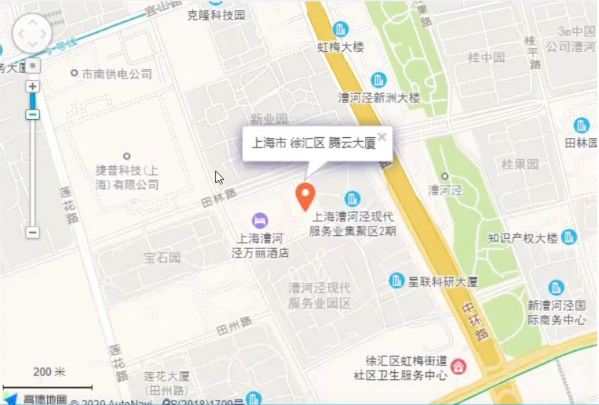

## 综合案例1-招聘
#### 代码：
```html
<!DOCTYPE html>
<html lang="en">
<head>
    <meta charset="UTF-8">
    <meta name="viewport" content="width=device-width, initial-scale=1.0">
    <title>综合案例1-招聘案例</title>
</head>
<body>
    <h1>腾讯科技高级web前端开发岗位</h1>
    <hr>
    <h2>职位描述</h2>
    负责重点项目的前端技术方案和架构的研发和维护工作;
    <h2>岗位要求</h2>
    <p>5年以上前端开发经验，<strong>精通html5/css3/javascript</strong>等web开发技术;</p>
    <p>熟悉bootstrap，vue，angularjs，reactjs等框架，熟练掌握一种以上;</p>
    <p>代码风格严谨，能高保真还原设计稿，能兼容各种浏览器;</p>
    <p>对web前端的性能优化以及web常见漏洞有一定的理解和相关实践;</p>
    <p>具备良好的分析解决问题能力，能独立承担任务，有开发进度把控能力;</p>
    <p>责任心强，思路路清晰，抗压能力好，具备良好的对外沟通和团队协作能力。</p>
    <h2>工作地址</h2>
    上海市-徐汇区-腾云大厦
    <br>
    
</body>
</html>
```

#### 渲染结果：


## 综合案例2-学生信息表
### 代码
```html
<!DOCTYPE html>
<html lang="en">
<head>
    <meta charset="UTF-8">
    <meta name="viewport" content="width=device-width, initial-scale=1.0">
    <title>综合案例2-学生信息表</title>
</head>
<body>
    <table border="1" width="500" height="300">
        <caption><h3>优秀学生信息表格</h3></caption>
        <tr>
            <th>年级</th>
            <th>姓名</th>
            <th>学号</th>
            <th>班级</th>
        </tr>
        <tr>
            <td rowspan="2">高三</td>
            <td>张三</td>
            <td>110</td>
            <td>三年二班</td>
        </tr>
        <tr>
            <!-- <td>高二</td> -->
            <td>李四</td>
            <td>120</td>
            <td>三年二班</td>
        </tr>
        <tr>
            <td>评语</td>
            <td colspan="3">你们很优秀</td>
        </tr>
    </table>
</body>
</html>
```

### 渲染结果：


## 综合案例3-表单

### 代码：
```html
<!DOCTYPE html>
<html lang="en">
<head>
    <meta charset="UTF-8">
    <meta name="viewport" content="width=device-width, initial-scale=1.0">
    <title>综合案例3-表单</title>
</head>
<body>
    <h1>青春不常在，抓紧谈恋爱</h1>
    <hr>
    <form action="">
        昵称: <input type="text" placeholder="请输入昵称">
        <br>
        <br>
        性别：<label><input type="radio" name="sex" checked>男 <input type="radio" name="sex">女
        </label>
        <br>
        <br>
        所在城市：
        <select>
            <option>北京</option>
            <option selected>上海</option>
            <option>广州</option>
            <option>深圳</option>
        </select>
        <br>
        <br>
        婚姻状况：<label><input type="radio" name="marriage" checked>未婚 <input type="radio" name="marriage">已婚 <input type="radio" name="marriage">保密
        </label>
        <br>
        <br>
        喜欢的类型：<label>
            <input type="checkbox" checked>可爱
            <input type="checkbox" checked>性感
            <input type="checkbox">御姐
        </label>
        <br>
        <br>
        个人介绍：
        <br>
        <textarea cols="60" rows="10"></textarea>
        <br>
        <br>
        <h3>我承诺</h3>
        <ul>
            <li>年满18岁</li>
            <li>抱着严肃的态度</li>
            <li>真诚寻找另一半</li>
        </ul>
        <br>
        <input type="submit" value="免费注册">
        <input type="reset" value="重置">
    </form>
</body>
</html>
```

### 渲染结果：


