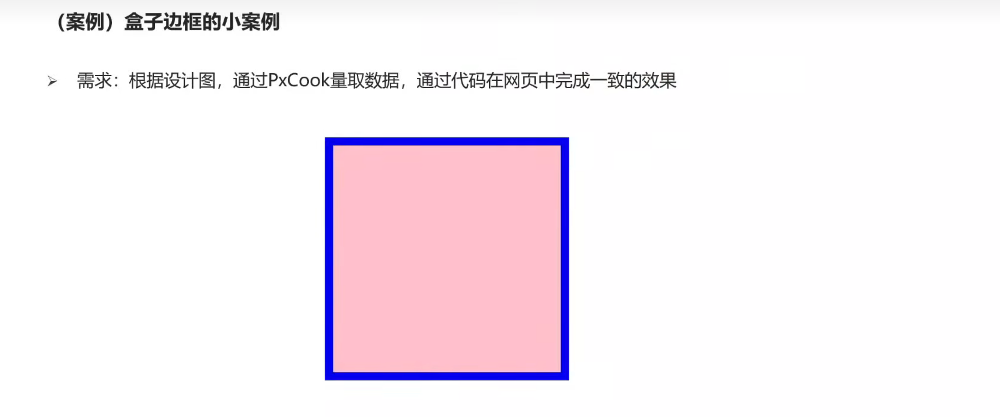
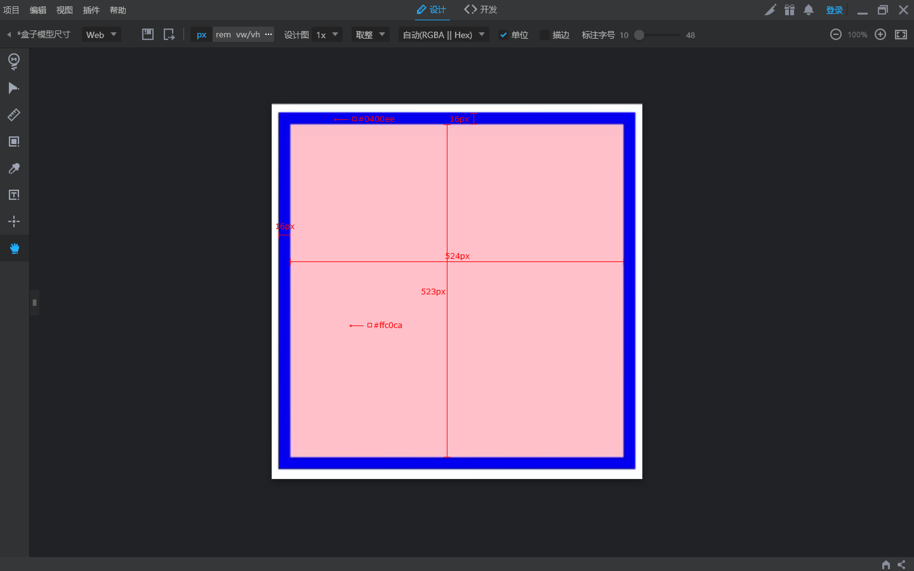
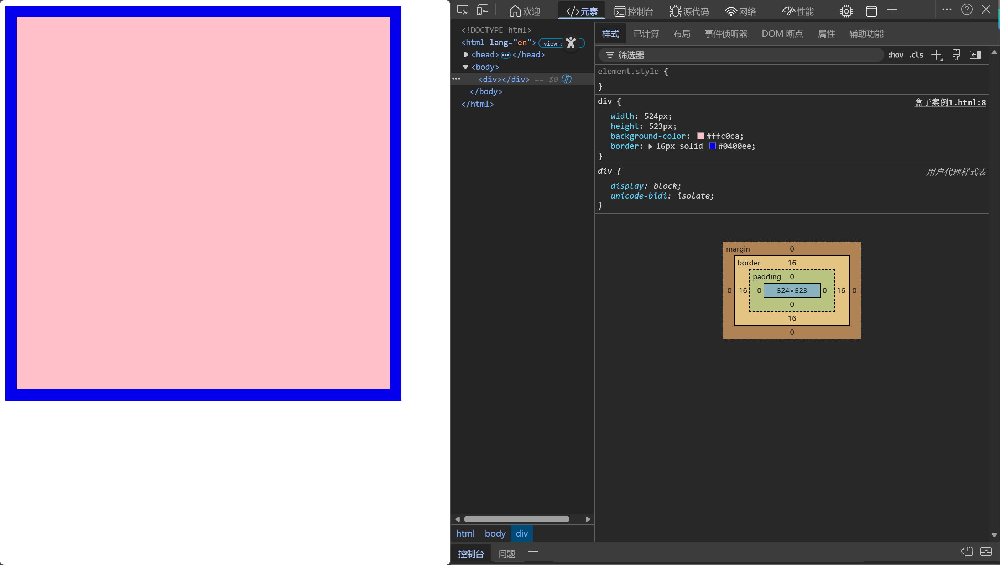
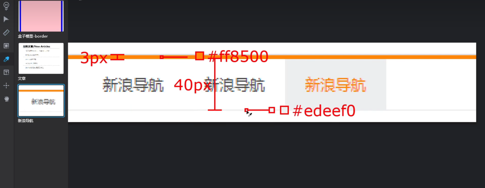
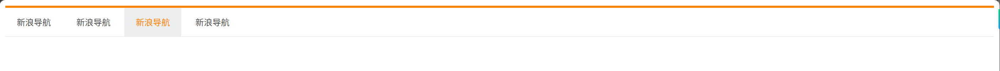
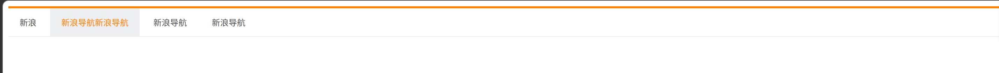
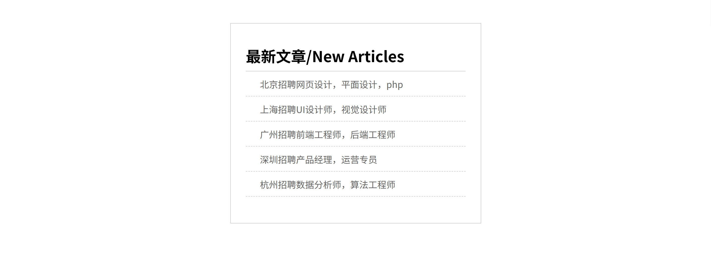

## 案例1-精准还原盒子模型
### 要求


### 步骤
1. 截图进入pxcook测量尺寸和颜色


2. 代码：
```html
<!DOCTYPE html>
<html lang="en">
<head>
    <meta charset="UTF-8">
    <meta name="viewport" content="width=device-width, initial-scale=1.0">
    <title>Document</title>
    <style>
        div {
            width: 524px;
            height: 523px;
            background-color: #ffc0ca;
            border: 16px solid #0400ee;
        }
    </style>
</head>
<body>
    <div></div>
</body>
</html>
```

### 效果



## 案例2-新浪导航
### 要求
1. 需求:根据设计图，通过PxCook量取数据，通过代码在网页中完成一致的效果


2. 布局顺序： 从外往内，从上往下
3. 每一个盒子的样式:
- 宽高
- 辅助的背景颜色
- 盒子模型的部分: border、padding、margin
- 其他样式:color、font-、text-  ...

### 步骤
1. 用pxcook精准测量：（示例，图中没量完所有需要）

2. 代码：
```html
<!DOCTYPE html>
<html lang="en">
<head>
    <meta charset="UTF-8">
    <meta name="viewport" content="width=device-width, initial-scale=1.0">
    <title>Document</title>
    <style>
        .box {
            height: 40px;
            background-color: #fff;
            border-top: 3px solid #ff8500 ;
            border-bottom: 1px solid #edeef0;
        }

        .box a {
            width: 80px;
            display: inline-block;
            height: 40px;
            /* 一开始建议先加上bgc，这样才能清楚的看到盒子的位置 */
            /* background-color: #edeef0; */
            text-align: center;
            /* 行高等于高：让文字垂直居中 */
            line-height: 40px;  
            /* 量一下字体的高度 */
            font-size: 12px;
            color: #4c4c4c;
            text-decoration: none;
        }
        a:hover {
            background-color: #edeef0;
            color: #ff8400;
        }
    </style>
</head>
<body>
    <div class="box">
        <a href="#">新浪导航</a>
        <a href="#">新浪导航</a>
        <a href="#">新浪导航</a>
        <a href="#">新浪导航</a>
    </div>
</body>
</html>
```

### 效果



## 案例3-新浪导航优化
用padding来替换width，就能适配不同长度的字，而不是硬性固定
### 代码
```html
<!DOCTYPE html>
<html lang="en">
<head>
    <meta charset="UTF-8">
    <meta name="viewport" content="width=device-width, initial-scale=1.0">
    <title>Document</title>
    <style>
        .box {
            height: 40px;
            background-color: #fff;
            border-top: 3px solid #ff8500 ;
            border-bottom: 1px solid #edeef0;
        }

        .box a {
            /* width: 80px; */
            padding:0 16px;
            display: inline-block;
            height: 40px;
            text-align: center;
            line-height: 40px;  
            font-size: 12px;
            color: #4c4c4c;
            text-decoration: none;
        }
        a:hover {
            background-color: #edeef0;
            color: #ff8400;
        }
    </style>
</head>
<body>
    <div class="box">
        <a href="#">新浪</a>
        <a href="#">新浪导航新浪导航</a>
        <a href="#">新浪导航</a>
        <a href="#">新浪导航</a>
    </div>
</body>
</html>
```

### 效果



## 案例4-新闻列表
### 代码
```html
<!DOCTYPE html>
<html lang="en">
<head>
    <meta charset="UTF-8">
    <meta name="viewport" content="width=device-width, initial-scale=1.0">
    <title>Document</title>
    <style>

        * {
            margin: 0 auto;
            padding: 0;
            /* 所有标签都可能自带padding或border，都内减模式 */
            box-sizing: border-box;
        }

        .news {
            width: 500px;
            height: 400px;
            border: 1px solid #cccccc;
            margin: 50px auto;
            /* 一般下边内边距会省略 */
            padding: 42px 30px 0;
        }

        .news h2 {
            font-size: 30px;
            border-bottom: 1px solid#cccccc;
            padding-bottom: 9px;
        }

        /* 去掉列表的点点符号 */
        .news ul {
            list-style: none;
        }

        .news li {
            height: 50px;
            line-height: 50px;
            border-bottom: 1px dashed #cccccc;
            padding-left: 28px;
        }

        .news a {
            text-decoration: none;
            color: #666;
            font-size: 18px;
        }
    </style>
</head>
<body>
    <!-- 从外到内 -->
     <div class="news">
        <h2>最新文章/New Articles</h2>
        <ul>
            <li><a href="#">北京招聘网页设计，平面设计，php</a></li>
            <li><a href="#">上海招聘UI设计师，视觉设计师</a></li>
            <li><a href="#">广州招聘前端工程师，后端工程师</a></li>
            <li><a href="#">深圳招聘产品经理，运营专员</a></li>
            <li><a href="#">杭州招聘数据分析师，算法工程师</a></li>
        </ul>
     </div>
</body>
</html>
```

### 效果：



